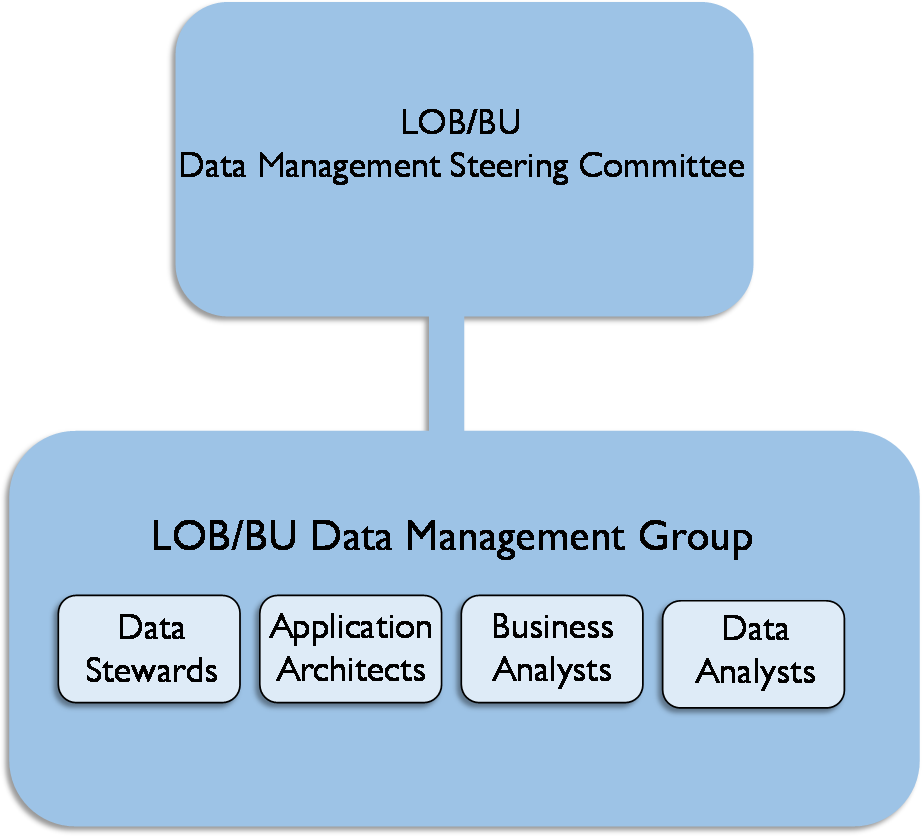
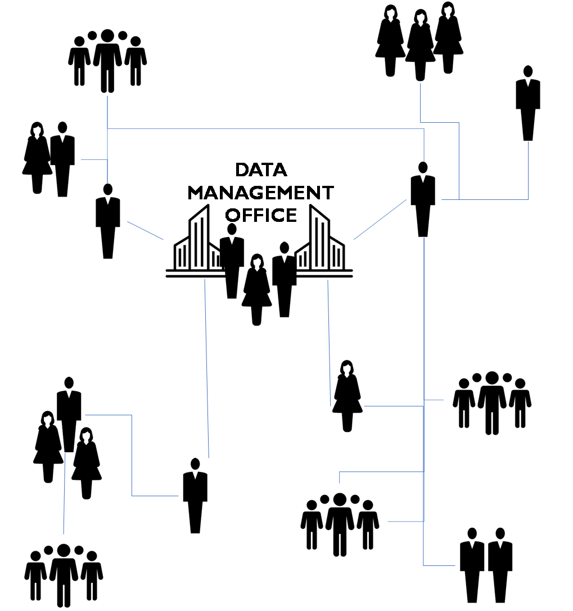
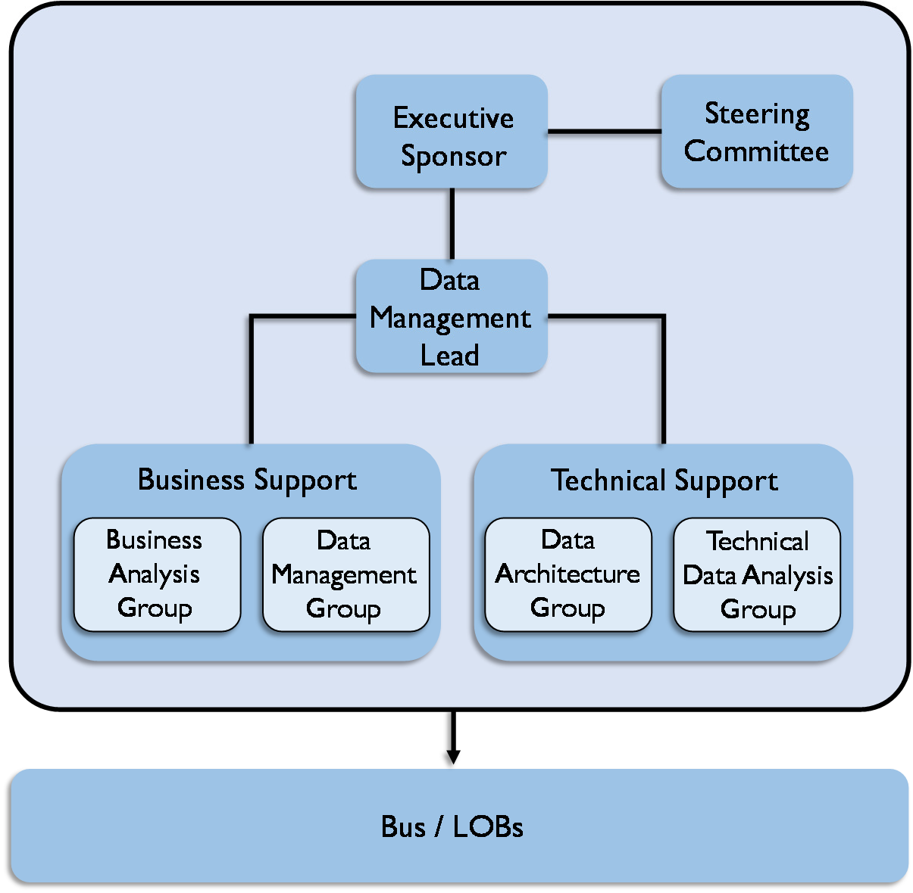
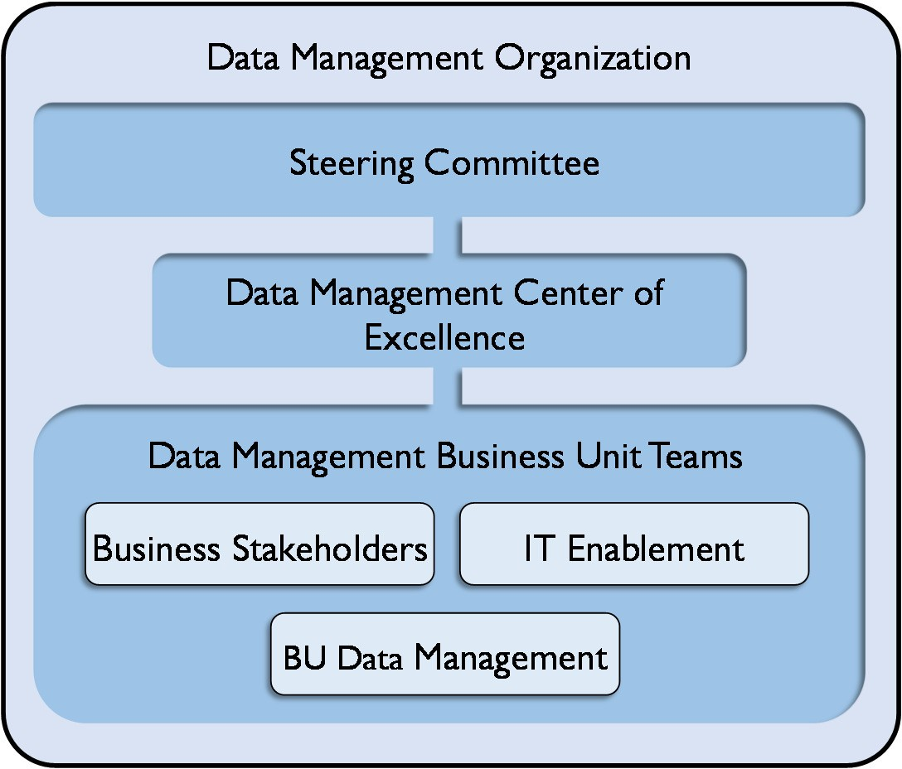
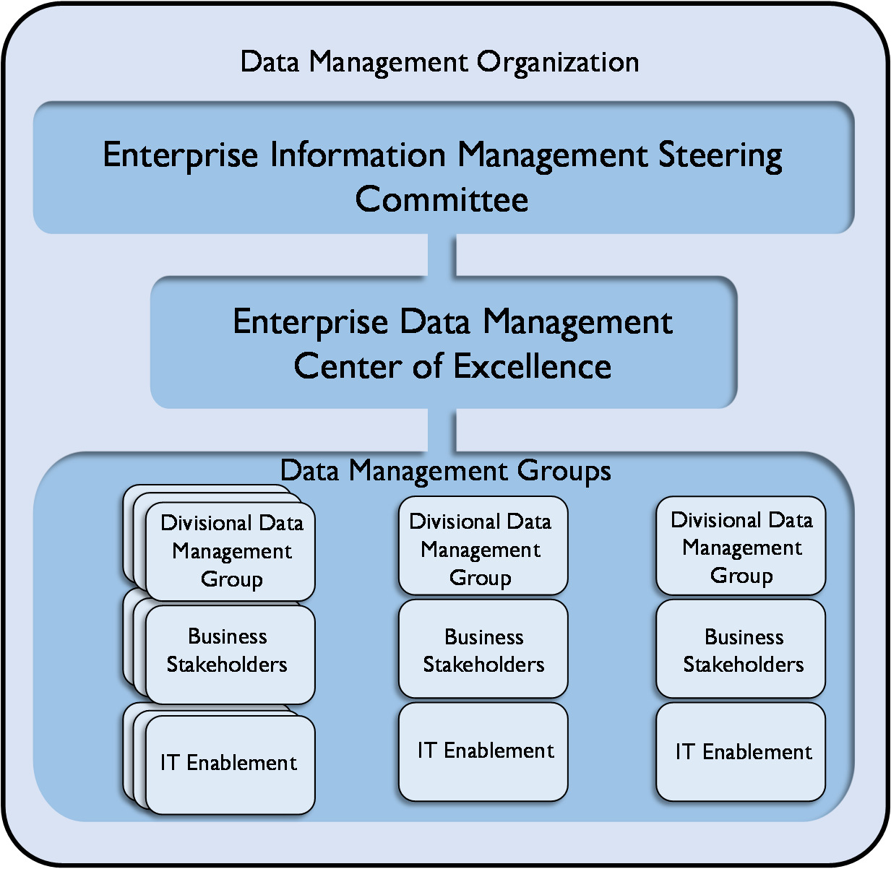
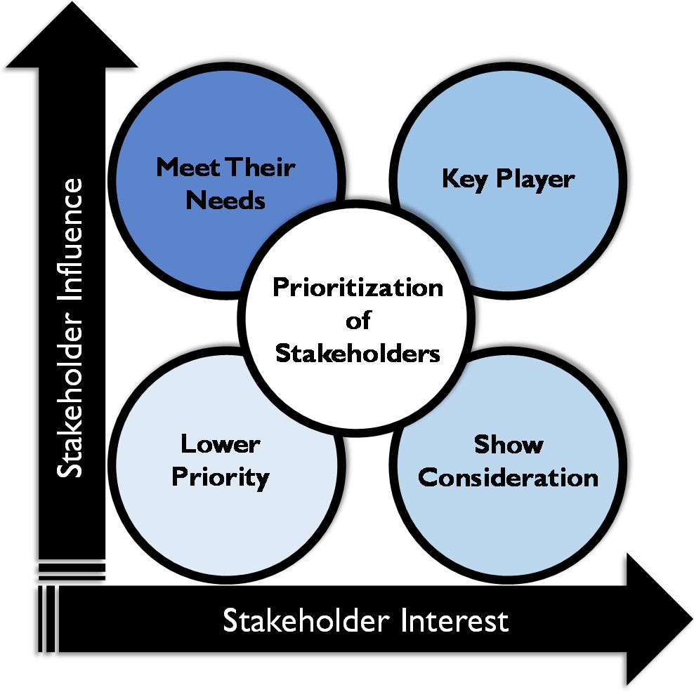
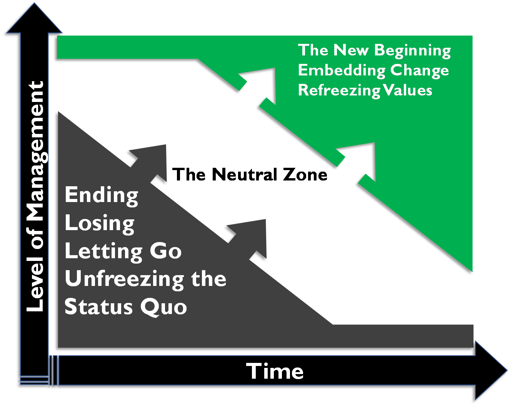
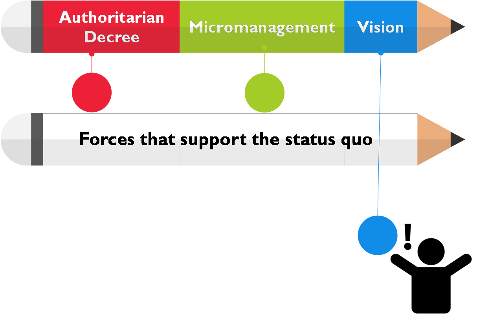
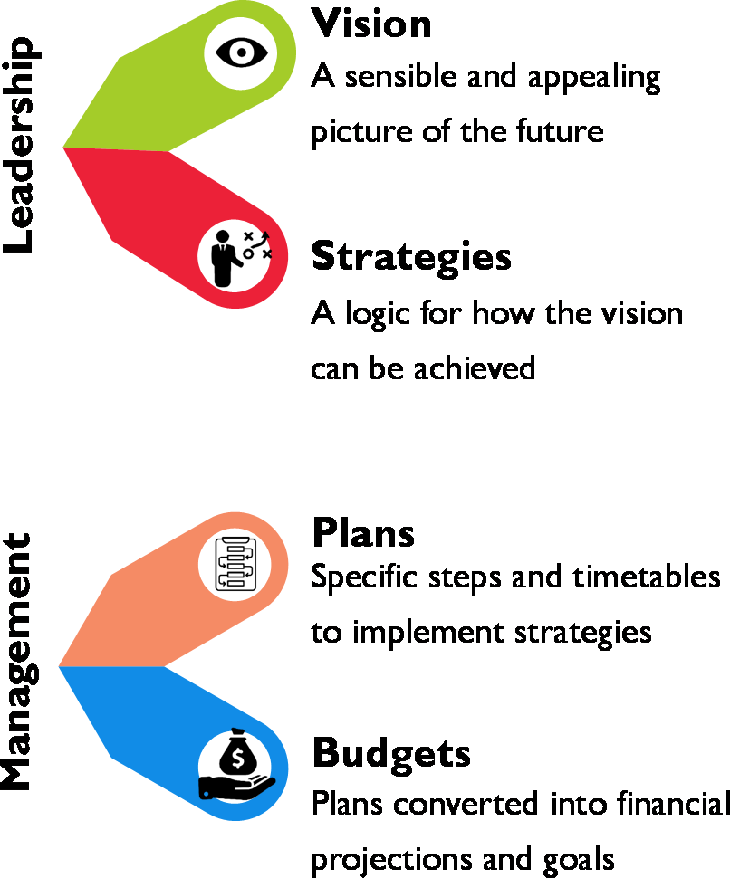

# CHAPTER 16 - Data Management Organization and Role Expectations 

##### Introduction

> he data landscape is quickly evolving and with it, organizations need
> to evolve the ways they manage and govern data. Most organizations
> today are faced with an increasing volume of data captured through a
> wide range of processes in a range of formats. The increase in volume
> and variety adds
>
> complexity to data management. At the same time, data consumers now
> demand quick and easy access to data. They want to be able to
> understand data and use it to address critical business questions in a
> timely manner. Data management and data governance organizations must
> be flexible enough to work effectively in this evolving environment.
> To do so, they need to clarify basic questions about ownership,
> collaboration, accountability, and decision-making.
>
> This section will describe a set of principles that should be
> considered when putting together a data management or data governance
> organization. It refers to both data governance and data management
> because data governance provides the guidance and business context for
> the activities executed by the Data Management Organization. There is
> no perfect organizational structure for either. While common
> principles should be applied to organizing around data governance and
> data management, much of the detail will depend on the drivers of that
> enterprise's industry and the corporate culture of the enterprise
> itself.

##### Understand Existing Organization and Cultural Norms

> Awareness, ownership, and accountability are the keys to activating
> and engaging people in data management initiatives, policies, and
> processes. Before defining any new organization or attempting to
> improve an existing one, it is important to understand current state
> of component pieces, related to culture, the existing operating model,
> and people. See Figure 106. For example:

-   **The role of data in the organization**: What key processes are
    data-driven? How are data requirements defined and understood? How
    well-recognized is the role that data plays in organizational
    strategy?

######## 551 {#section-17 .unnumbered}

> 5 5 2 • D MBOK 2

-   How are decisions made?

-   Who makes them?

-   How are committees used?

-   Who currently manages data?

> Culture
>
> Operating Model

-   Centralized

-   Decentralized

-   Hybrid/Federated

-   Data Management Owner

-   Data Governance Owner

-   Subject Matter Experts

-   Leadership

#### People {#people .unnumbered}

> Figure 106 Assess Current State to Create an Operating Model

-   **Cultural norms about data**: Are there potential cultural
    obstacles to implementing or improving management and governance
    structures?

-   **Data management and data governance practices**: How and by whom
    is data-related work executed? How and by whom are decisions about
    data made?

-   **How work is organized and executed**: For example, what is the
    relation between project-focused and operational execution? What
    committee structures are in place that can support the data
    management effort?

-   **How reporting relationships are organized**: For example, is the
    organization centralized or decentralized, hierarchical or flat?

-   **Skill levels**: What is the level of data knowledge and data
    management knowledge of SMEs and other

> stakeholders, from line staff to executives?
>
> After forming a picture of current state, assess the level of
> satisfaction with current state in order to gain insight into the
> organization's data management needs and priorities. For example:

-   Does the organization have the information it needs to make sound,
    timely business decisions?

-   Does the organization have confidence in its revenue reports?

-   Can it track the organizational key performance indicators?

-   Is the organization in compliance with all laws regarding management
    of data?

> Most organizations that seek to improve their data management or
> governance practices are in the middle of the capability maturity
> scale (i.e., they are neither 0's nor 5's on the CMM scale). (See
> Chapter 15.) To craft a relevant Data Management Organization, it is
> important to understand and accommodate the existing company culture
> and organizational norms. If the Data Management Organization is not
> aligned to the existing decision- making and committee constructs, it
> will be challenging to sustain it over time. Therefore, it makes sense
> to evolve these organizations, rather than imposing radical changes.
>
> A Data Management Organization should align with a company's
> organizational hierarchy and resources. Finding the right people
> requires an understanding of both the functional and the political
> role of data
>
> DATA MAN AGE MENT OR GAN IZATIO N AND ROLE E XP ECTATION S • 5 5 3
>
> management within an organization. The aim should be cross-functional
> participation from the various business stakeholders. To accomplish
> this:

-   Identify employees currently performing data management functions;
    recognize and involve them first. Hire additional resources only as
    data management and governance needs grow.

-   Examine the methods the organization is using to manage data and
    determine how processes can be improved. Determine how much change
    is likely to be required to improve data management practices.

-   Roadmap the kinds of changes that need to take place from an
    organizational perspective to better meet requirements.

##### Data Management Organizational Constructs

> A critical step in Data Management Organization design is identifying
> the best-fit operating model for the organization. The operating model
> is a framework articulating roles, responsibilities, and
> decision-making processes. It describes how people and functions will
> collaborate.
>
> A reliable operating model helps create accountability by ensuring the
> right functions within the organization are represented. It
> facilitates communication and provides a process to resolve issues.
> While it forms the basis for the organizational structure, the
> operating model is not an org chart -- it is not about putting names
> in boxes, but about describing the relationship between the component
> pieces of the organization.
>
> This section will present a high-level overview of the pros and cons
> of decentralized, network, hybrid, federated, and centralized
> operating models.

####### Decentralized Operating Model

> In a decentralized model, data management responsibilities are
> distributed across different lines of business and IT (see Figure
> 107). Collaboration is committee-based; there is no single owner. Many
> Data Management programs start as grass root efforts to unify the data
> management practices across an organization and therefore have a
> decentralized structure.
>
> The benefits of this model include its relatively flat structure and
> its alignment of data management to lines of business or IT. This
> alignment generally means there is a clear understanding of data
> requirements. It is also relatively easy to implement or improve.
>
> The drawbacks include the challenge of having many participants
> involved with governance bodies and in decision-making. It is
> generally harder to implement collaborative decisions than centralized
> edicts. Decentralized models are generally less formal and because of
> this, they can be harder to sustain over time. To be successful, they
> need to have ways to enforce consistency of practices. This can be
> difficult to coordinate. It is also often difficult to define data
> ownership with a decentralized model.
>
> 5 5 4 • D MBOK 2

{width="3.0733333333333333in"
height="2.7866666666666666in"}

> Figure 107 Decentralized Operating Model

####### Network Operating Model

> {width="3.3966655730533684in"
> height="3.616665573053368in"}Decentralized informality can be made
> more formal through a documented series of connections and
> accountabilities via a RACI (Responsible, Accountable, Consulted, and
> Informed) matrix. This is called a networked model because it operates
> as a series of known connections between people and roles and can be
> diagrammed as a 'network.' (See Figure 108.)
>
> Figure 108 Network Operating Model
>
> DATA MAN AGE MENT OR GAN IZATIO N AND ROLE E XP ECTATION S • 5 5 5
>
> A network model's benefits are similar to those of a decentralized
> model (flat structure, alignment, quick set up). The addition of a
> RACI helps create accountability without impacting the organizational
> charts. The additional drawback is the need to maintain and enforce
> expectations related to the RACI.

####### Centralized Operating Model

> {width="4.016666666666667in"
> height="3.933333333333333in"}The most formal and mature data
> management operating model is a centralized one (see Figure 109). Here
> everything is owned by the Data Management Organization. Those
> involved in governing and managing data report directly to a data
> management leader who is responsible for Governance, Stewardship,
> Metadata Management, Data Quality Management, Master and Reference
> Data Management, Data Architecture, Business Analysis, etc.
>
> Figure 109 Centralized Operating Model
>
> The benefit of a centralized model is that it establishes a formal
> executive position for data management or data governance. There is
> one person at the top. Decision-making is easier because
> accountability is clear. Within the organization, data can be managed
> by type or subject area. The drawback is that implementation of a
> centralized model generally requires significant organizational
> change. There is also a risk that formal separation of the data
> management role moves it away for core business processes and can
> result in knowledge being lost over time.
>
> A centralized model generally requires a new organization. The
> question arises: Where does the Data Management Organization fit
> within the overall enterprise? Who leads it and to whom does the
> leader report? It
>
> 5 5 6 • D MBOK 2
>
> is becoming more common for a Data Management Organization *not* to
> report to the CIO because of the desire to maintain a business, rather
> than IT, perspective on data. These organizations are also commonly
> part of a shared services or operations team or part of the Chief Data
> Officer's organization. (See Section 6.1.)

####### Hybrid Operating Model

> {width="3.6266666666666665in"
> height="3.0933333333333333in"}As its name implies, the hybrid
> operating model encompasses benefits of both the decentralized and
> centralized models (see Figure 110). In a hybrid model, a centralized
> data management Center of Excellence works with decentralized business
> unit groups, usually through both an executive steering committee
> representing key lines of business and a set of tactical working
> groups addressing specific problems.
>
> Figure 110 Hybrid Operating Model
>
> In this model, some roles remain decentralized. For example, Data
> Architects may stay within an Enterprise Architecture group; lines of
> business may have their own Data Quality teams. Which roles are
> centralized and which stay decentralized can vary widely, depending
> largely on organizational culture.
>
> The primary benefit of a hybrid model is that it establishes
> appropriate direction from the top of the organization. There is an
> executive accountable for data management and/or governance. Business
> Unit teams have broad accountability and can align to business
> priorities to provide greater focus. They benefit from the support of
> a dedicated data management Center of Excellence that can help bring
> focus to specific challenges.
>
> The challenges include getting the organization set up, since doing so
> generally requires additional headcount to staff a Center of
> Excellence. Business Unit teams may have different priorities, and
> these will need to be managed from an enterprise perspective. In
> addition, there are sometimes conflicts between the priorities of the
> central organization and those of the decentralized organizations.
>
> DATA MAN AGE MENT OR GAN IZATIO N AND ROLE E XP ECTATION S • 5 5 7

####### Federated Operating Model

> {width="4.11in" height="4.01in"}A
> variation on the hybrid operating model, the federated model provides
> additional layers of centralization / decentralization, which are
> often required in large global enterprises. Imagine an enterprise Data
> Management Organization with multiple hybrid data management models
> delineated based on division or region. (See Figure 111.)
>
> Figure 111 Federated Operating Model
>
> A federated model provides a centralized strategy with decentralized
> execution. Therefore, for large enterprises it may be the only model
> that can work. A data management executive who is accountable across
> the organization runs the enterprise Center of Excellence. Of course,
> different lines of business are empowered to meet requirements based
> on their needs and priorities. Federation enables the organization to
> prioritize based on specific data entities, divisional challenges, or
> regional priorities.
>
> The main drawback is complexity. There are a lot of layers, and there
> needs to be a balance between autonomy for lines of business and the
> needs of the enterprise. This balance can impact enterprise
> priorities.

####### Identifying the Best Model for an Organization

> The operating model is a starting point for improving data management
> and data governance practices. Introducing it requires an
> understanding of how it may impact the current organization and how it
> will likely
>
> 5 5 8 • D MBOK 2
>
> need to evolve over time. Since the operating model will serve as the
> structure through which policies and processes will be defined,
> approved, and executed, it is critical to identify the best fit for an
> organization.
>
> Assess whether the current organizational structure is centralized,
> decentralized, or a combination, hierarchical or relatively flat.
> Characterize how independent divisions or regions are. Do they operate
> almost self- sufficiently? Are their requirements and goals very
> different from each other? Most importantly, try to determine how
> decisions are made (e.g., democratically or by fiat), as well as how
> they are implemented.
>
> The answers should give a starting point to understand the
> organization's location on the spectrum between decentralized and
> centralized.

####### DMO Alternatives and Design Considerations

> Most organizations start with a decentralized model before they move
> toward a formal Data Management Organization (DMO). As an organization
> sees the impact of improvements in data quality, it may start to
> formalize accountability through a data management RACI matrix and
> evolve into a network model. Over time, synergies between the
> distributed roles will become more obvious and economies of scale will
> be identified that will pull some roles and people into organized
> groups. Eventually, this can morph into a hybrid or federated model.
>
> Some organizations don't have the luxury of going through this
> maturity process. They are forced to mature quickly based on a market
> shock or new government regulations. In such a case, it is important
> to proactively address the discomfort associated with the
> organizational change if it is to be successful and sustainable. (See
> Chapter 17.)
>
> Whichever model is chosen, remember that simplicity and usability are
> essential for acceptance and sustainability. If the operating model
> fits the culture of a company, then data management and proper
> governance can be embedded in operations and aligned with strategy.
> Keep these tips in mind when constructing an Operating Model:

-   Determine the starting point by assessing current state

-   Tie the operating model to organization structure

-   Take into account:

    -   Organization Complexity + Maturity

    -   Domain Complexity + Maturity

    -   Scalability

-   Get executive sponsorship -- a **must** for a sustainable model

-   Ensure that any leadership forum (steering committee, advisory
    council, board) is a decision-making body

-   Consider pilot programs and waves of implementation

-   Focus on high-value, high-impact data domains

-   Use what already exists

-   Never take a One-Size-Fits-All approach

> DATA MAN AGE MENT OR GAN IZATIO N AND ROLE E XP ECTATION S • 5 5 9

##### Critical Success Factors

> Ten factors have been consistently shown to play a key role in the
> success of effective Data Management Organizations, regardless of
> their structure:

1.  Executive sponsorship

2.  Clear vision

3.  Proactive change management

4.  Leadership alignment

5.  Communication

6.  Stakeholder engagement

7.  Orientation and training

8.  Adoption measurement

9.  Adherence to guiding principles

10. Evolution not revolution

####### Executive Sponsorship

> Having the right executive sponsor ensures that stakeholders affected
> by a Data Management program receive the necessary guidance to
> transition efficiently and effectively through the changes needed to
> put the new data- focused organization together and sustain it for the
> long term. The executive sponsor should understand and believe in the
> initiative. He or she must be able to effectively engage other leaders
> in support of the changes.

####### Clear Vision

> A clear vision for the Data Management Organization, along with a plan
> to drive it, is critical to success. Organizational leaders must
> ensure that all stakeholders who are affected by data management --
> both internal and external -- understand and internalize what data
> management is, why it is important, and how their work will affect and
> be affected by it.

####### Proactive Change Management

> Managing the change associated with creating a Data Management
> Organization requires planning for, managing, and sustaining change.
> Applying organizational change management to the establishment of a
> Data Management Organization addresses the people challenges and
> increases the likelihood that desired Data Management Organization is
> sustainable over time. (See Chapter 17.)
>
> 5 6 0 • D MBOK 2

####### Leadership Alignment

> Leadership alignment ensures that there is agreement on -- and unified
> support for -- the need for a Data Management program and that there
> is agreement on how success will be defined. Leadership alignment
> includes both the alignment between the leaders' goals and the data
> management outcomes and value *and* alignment in purpose amongst the
> leaders.
>
> If leaders are not aligned with each other, they will end up sending
> mixed messages that can lead to resistance and eventually derail the
> change. Therefore, it is critical to assess -- and regularly re-assess
> -- leaders at all levels to identify disconnects and take steps to
> quickly address them.

####### Communication

> Communication should start early and continue openly and often. The
> organization must ensure that stakeholders have a clear understanding
> of what data management is and why it is important to the company,
> what is changing, and what changes in behavior are required. People
> can't improve the way they manage data if they don't know what they
> are supposed to do differently. Creating a story around the data
> management initiative and building key messages around it helps these
> processes.
>
> Messages must be consistent, underscoring the importance of data
> management. In addition, they should be customized according to
> stakeholder group. For example, the level of education or amount of
> training needed by different groups concerning data management will
> vary. Messages should be repeated as needed and continually tested
> over time to ensure they are effectively getting out there and that
> awareness and understanding are building.

####### Stakeholder Engagement

> Individuals, as well as groups, affected by a data management
> initiative will react differently to the new program and their role
> within it. How the organization engages these stakeholders -- how they
> communicate with, respond to, and involve them -- will have a
> significant impact on the success of the initiative.
>
> A stakeholder analysis helps the organization better understand those
> affected by data management changes. By taking that information and
> mapping stakeholders according to level of influence within the
> organization and level of interest in (or affect due to) the data
> management implementation, the organization can determine the best
> approach to engaging different stakeholders in the change process.
> (See Section 5.3.)

####### Orientation and Training

> Education is essential to making data management happen, although
> different groups will require different types and levels of education.
>
> DATA MAN AGE MENT OR GAN IZATIO N AND ROLE E XP ECTATION S • 5 6 1
>
> Leaders will need orientation to the broader aspects of data
> management and the value to the company. Data stewards, owners, and
> custodians (i.e., those on the frontlines of change) will require
> in-depth understanding of the data management initiative. Focused
> training will allow them to perform their roles effectively. This
> means training on new policies, processes, techniques, procedures, and
> even tools.

####### Adoption Measurement

> It is important to build metrics around the progress and adoption of
> the data management guidelines and plan to know that the data
> management roadmap is working and that it will continue working. Plan
> to measure:

-   Adoption

-   Amount of improvement, or the delta from a previous state

-   The enabling aspects of data management -- how well does data
    management influence solutions with measurable results?

-   Improved processes, projects

-   Improved identification and reaction to risk

-   The innovation aspect of data management -- how well does data
    management fundamentally change how business is conducted?

-   Trusted analytics

> The enabling aspect of data management could focus on the improvement
> of data-centric processes, such as month-end closing, identification
> of risk, and efficiency of project execution. The innovation aspect of
> data management could focus on improvement in decision-making and
> analytics through improved and trusted data.

####### Adherence to Guiding Principles

> A guiding principle is a statement that articulates shared
> organizational values, underlies strategic vision and mission, and
> serves as a basis for integrated decision-making. Guiding principles
> constitute the rules, constraints, overriding criteria, and behaviors
> by which an organization abides in its daily activities in the long
> term. Regardless of whether there is a decentralized or centralized
> operating model, or anything in between, it is critical to establish
> and agree upon guiding principles so that all participants behave in
> synchronistic ways. The guiding principles serve as the reference
> points from which all decisions will be made. Establishing them is an
> important first step in creating a Data Management program that
> effectively drives changes in behavior.

####### Evolution Not Revolution

> In all aspects of data management, the philosophy of 'evolution not
> revolution' helps to minimize big changes or large-scale high-risk
> projects. It is important to establish an organization that evolves
> and matures over time. Incrementally improving the way that data is
> managed and prioritized by business objectives will ensure that

5.  6 2 • D MBOK 2

> new policies and processes are adopted and behavioral change is
> sustained. Incremental change is also much easier to justify so it is
> easier to gain stakeholder support and buy-in, and get those critical
> participants involved.

##### Build the Data Management Organization

####### Identify Current Data Management Participants

> When implementing the operating model, start with teams already
> engaged in data management activities. This will minimize the effect
> on the organization and will help to ensure that the focus of the team
> is data, not HR or politics.
>
> Start by reviewing existing data management activities, such as who
> creates and manages data, who measures data quality, or even who has
> 'data' in their job title. Survey the organization to find out who may
> already be fulfilling needed roles and responsibilities. Such
> individuals may hold different titles. They are likely part of a
> distributed organization and not necessarily recognized by the
> enterprise. After compiling a list of 'data people,' identify gaps.
> What additional roles and skill sets are required to execute the data
> strategy? In many cases, people in other parts of the organization
> have analogous, transferrable skill sets. Remember, people already in
> the organization bring valuable knowledge and experience to a data
> management effort.
>
> Once an inventory is complete, and people are assigned to the roles,
> review their compensation and align it with the expectations of data
> management. Likely, the Human Resources department will get involved
> to validate the titles, roles, compensation, and performance
> objectives. Ensure that the roles are assigned to the right people at
> the right level within the organization, so that when they are
> involved in decision-making, they have the credibility to make
> decisions that stick.

####### Identify Committee Participants

> No matter which operating model an organization chooses, some
> governance work will need to be done by a Data Governance Steering
> Committee and by working groups. It is important to get the right
> people on the Steering Committee and to use their time well. Keep them
> well-informed and focused on the ways that improved data management
> will help them reach business objectives, including strategic goals.
>
> Many organizations are reluctant to start yet another committee since
> there are so many already existing. It is often easier to take
> advantage of existing committees to advance data management topics
> than it is to start a new one. But take this route cautiously. The
> main risk in using an existing committee is that data management may
> not get the attention it requires, especially in the early stages. The
> process to staff either a senior steering committee or a more tactical
> working group requires conducting stakeholder analysis and, through
> that, identifying executive sponsors.
>
> DATA MAN AGE MENT OR GAN IZATIO N AND ROLE E XP ECTATION S • 5 6 3

####### Identify and Analyze Stakeholders

> A stakeholder is any person or group who can influence or be affected
> by the Data Management program. Stakeholders can be internal to or
> external to the organization. They include individual SMEs, senior
> leaders, teams of employees, committees, customers, government or
> regulatory agencies, brokers, agents, vendors, etc. Internal
> stakeholders can come from IT, operations, compliance, legal, HR,
> finance or other lines of business. External stakeholders can be
> influential, and it is important that their needs be accounted for by
> the Data Management Organization.
>
> A stakeholder analysis can help the organization determine the best
> approach to engaging participants in the data management process and
> leveraging their roles within the operating model. Insight gained from
> the analysis is also helpful in determining how to best allocate time
> and other limited resources. The earlier this analysis is conducted,
> the better, since the more the organization is able to anticipate
> reactions to change, the more it can plan for them. A stakeholder
> analysis will help answer questions like:

-   Who will be affected by data management?

-   How will roles and responsibilities shift?

-   How might those affected respond to the changes?

-   What issues and concerns will people have?

> The analysis will result in a list of stakeholders, their goals and
> priorities, and why those goals are important to them. Figure out what
> actions are needed for stakeholders based on the analysis. Pay
> particular attention to what needs to be done to bring along critical
> stakeholders, those that can make or break an organization's data
> management success, especially its initial priorities. Consider:

-   Who controls critical resources

-   Who could block data management initiatives, either directly or
    indirectly

-   Who could influence other critical constituents

-   How supportive stakeholders are of the upcoming changes

> Figure 112 provides a simple map to help prioritize stakeholders based
> on their influence, their level of interest in the program, or the
> degree to which the program will impact them.

####### Involve the Stakeholders

> After identifying the stakeholders and a good Executive Sponsor, or a
> short list from which to choose, it is important to clearly articulate
> why each of the stakeholders should be involved. They may not jump at
> the chance. The person or team driving the data management effort
> should articulate the reasons each stakeholder is necessary to the
> success of the program. This means understanding their personal and
> professional goals, and being able to link the output from data
> management processes to their goals, so they can see a direct
> connection. Without an understanding of this direct connection, they
> may be willing to help out in the short term, but they will not
> provide long-term support or assistance.
>
> 5 6 4 • D MBOK 2

{width="3.2933333333333334in"
height="3.2866666666666666in"}

> Figure 112 Stakeholder Interest Map

##### Interactions Between the DMO and Other Data-oriented Bodies

> Once the operating model is established and participants are
> identified, it is time to move the people into the newly authorized
> roles. Operationalizing the organization means establishing the
> committees and engaging with stakeholders. In a centralized model,
> most of the data management activity will be controlled within one
> organization. With a decentralized or network model, though, the Data
> Management Organization will need to work with other groups that have
> a significant impact on the way that data is managed. Those groups are
> typically:

-   Chief Data Officer Organization

-   Data Governance Bodies

-   Data Quality

-   Enterprise Architecture

####### The Chief Data Officer

> While most companies recognize at some level that data is a valuable
> corporate asset, only a few have appointed a Chief Data Officer (CDO)
> to help bridge the gap between technology and business and evangelize
> an enterprise-wide data management strategy at a senior level. This
> role is on the rise, however, with Gartner estimating that half of all
> regulated companies will employ a CDO by 2017 (Gartner, 2015).
>
> DATA MAN AGE MENT OR GAN IZATIO N AND ROLE E XP ECTATION S • 5 6 5
>
> While the requirements and functions of a CDO are specific to each
> company's culture, organizational structure, and business needs, many
> CDOs tend to be part business strategist, adviser, data quality
> steward and all around data management ambassador.
>
> In 2014, Dataversity published research outlining common mandates for
> a CDO.^103^ These included:

-   Establishing an organizational data strategy

-   Aligning data-centric requirements with available IT and business
    resources

-   Establishing data governance standards, policies and procedures

-   Providing advice (and perhaps services) to the business for
    data-dependent initiatives, such as business analytics, Big Data,
    data quality, and data technologies

-   Evangelizing the importance of good information management
    principles to internal and external business stakeholders

-   Oversight of data usage in analytics and Business Intelligence
    Dataversity's findings also highlighted shifting focuses across
    different industries.

> Regardless of industry, it is common for a Data Management
> Organization to report up through the CDO. In a more decentralized
> operating model, the CDO is responsible for the data strategy, but
> resources that are in IT, operations, or other lines of business
> *execute* that strategy. Some DMOs are established initially with the
> CDO just determining the strategy, and over time other aspects of data
> management, governance, and analytics are folded under the CDO
> umbrella as efficiencies and economies of scale are identified.

####### Data Governance

> Data Governance is the organizing framework for establishing the
> strategy, objectives, and policy for effectively managing corporate
> data. It consists of the processes, policies, organization, and
> technologies required to manage and ensure the availability,
> usability, integrity, consistency, auditability, and security of data.
> Since a Data Governance Program consists of the inter-workings of
> strategy, standards, policies and communication regarding data, it has
> a synergistic relationship with data management. Governance provides a
> framework for data management to engage and align with the business
> priorities and stakeholders.
>
> Within a centralized model, the Data Governance Office can report to
> the Data Management Organization or vice versa. When a Data Management
> program is focused on establishing policies and guidelines needed to
> manage data as an asset, the Data Governance Office can act as the
> lead, and the Data Management Organization reports to (or is matrixed
> to) the Data Governance Office. This occurs many times in highly
> regulated environments where the emphasis is on policy and
> accountability.
>
> Even in a very decentralized model, there should be a tight
> partnership between the Data Governance Office, which creates the
> guidelines and policies for how data should be managed, and the Data
> Management Organization that implements them. John Ladley succinctly
> clarifies this relationship: data governance is about
>
> 103 [http://bit.ly/2sTf3Cy.](http://bit.ly/2sTf3Cy)
>
> 5 6 6 • D MBOK 2
>
> 'Doing the right things' and data management is about 'Doing things
> right' (Ladley, 2012). They are two sides of the equation needed to
> produce valuable data. In this way, data governance provides the
> marching orders for data management.
>
> Most importantly, there needs to be an understanding of this synergy
> and agreement upon roles, responsibilities, and accountabilities that
> support the guidelines of data governance and the efficiencies of data
> management. Participants in a Data Governance Working Group can be
> drawn from a Data Management Organization, and a Data Management
> Organization can use the mandate and 'air cover' provided by the
> governance oversight.

####### Data Quality

> Data Quality Management is a key capability of a data management
> practice and organization. Many Data Management Organizations start
> with a focus on the quality of data because there is a desire to
> measure and improve the quality of data across the organization. It is
> possible to address Data Quality within a line of business, or even
> within an application, without having to involve other groups or
> manage cross-functional complexities. However, as a data quality
> practice matures, the organization will benefit from a unified
> approach to data quality; for example, by establishing a Center of
> Excellence. The goal shifts to improving the quality of data that is
> shared across lines of business or applications, often with a focus on
> Master Data Management.
>
> It is common that a Data Management Organization develops organically
> out of a Data Quality initiative as the investment in improving data
> quality adds value across the company, and efforts associated with
> improving quality expand into other disciplines like Master,
> Reference, and Metadata Management.
>
> A Data Quality program can evolve into similar operating models as an
> over-arching Data Management program, although it is rare for Data
> Quality functions to become completely centralized in any sizable
> company because there is most often aspects of data quality that are
> executed on a line-of-business or application level. Because a Data
> Quality program can be decentralized, networked, or a hybrid (using a
> Center of Excellence approach), align the Data Quality operating model
> to that of the overall Data Management Organization, in order to use
> consistent stakeholders, relationships, accountabilities, standards,
> processes, and even tools.

####### Enterprise Architecture

> An Enterprise Architecture group designs and documents the master
> blueprints for an organization to articulate and optimize how to meet
> its strategic objectives. The disciplines within an Enterprise
> Architecture practice include:

-   Technology Architecture

-   Application Architecture

-   Information (or Data) Architecture

-   Business Architecture

> DATA MAN AGE MENT OR GAN IZATIO N AND ROLE E XP ECTATION S • 5 6 7
>
> Data Architecture is a key capability of an effective Data Management
> Organization. Therefore, Data Architects can sit in either group, with
> a dotted line to the other group.
>
> When Data Architects sit within a Data Management Organization,
> typically they interface with the rest of their architecture peers via
> Architecture Review Boards (ARB), committees that review and give
> guidance on the way that architecture standards are implemented or
> affected by projects and programs. An ARB can approve or disapprove
> new projects and systems based on their level of adherence to
> architectural standards.
>
> When an organization does not have Data Architects, Data Management
> can interface with the Architecture organization in a few ways:

-   **Through Data Governance**: Since both Data Management and
    Enterprise Architecture participate in a Data Governance program,
    the governance working group and committee structure can provide a
    platform for aligning goals, expectations, standards, and
    activities.

-   **Through the ARB**: As data management projects are brought to the
    ARB, the Architecture group would provide guidance, feedback, and
    approvals.

-   **Ad-hoc**: If there are no formal committees, then the Data
    Management Lead should periodically meet with the Architecture Lead
    to ensure there is shared knowledge and understanding of projects
    and processes that impact the other party. Over time, the difficulty
    of managing this ad hoc process will likely lead to the development
    of a formal role or committee to facilitate discussions and
    decisions.

> If there were Data Architects, then they would represent architecture
> in governance discussions and would lead the discussions in the ARB.

####### Managing a Global Organization

> Global companies face complex data management challenges based on the
> volume and variety of country- specific laws and regulations,
> especially those regarding the privacy and security of certain types
> of data. Add these issues to the typical management challenges of a
> global organization (distributed work force, systems, time zones, and
> languages), and the task of efficiently and effectively managing data
> can seem like an endless exercise of herding cats.
>
> Global organizations need to pay special attention to:

-   Adhering to standards

-   Synchronizing processes

-   Aligning accountability

-   Training and communication

-   Monitoring and measuring effectively

-   Developing economies of scale

-   Reducing duplication of effort

> 5 6 8 • D MBOK 2
>
> As Data Management programs and Organizations become more global, the
> networked or federated models become more attractive where
> accountabilities can be aligned, standards can be followed, and
> regional variations can still be accommodated.

##### Data Management Roles

> Data management roles can be defined at the functional or individual
> level. Names for the roles will differ between organizations and some
> organizations will have greater or lesser need for some of the roles.
>
> All IT roles can be mapped to points in the data lifecycle, so they
> all impact the management of data, whether directly (as with a Data
> Architect who designs a data warehouse) or indirectly (as with a Web
> Developer who programs a website). Likewise, many business roles
> create, access, or manipulate data. Some roles, such as Data Quality
> Analyst, require a mix of technical skills and business knowledge. The
> functions and roles described below focus on those that are directed
> engaged in the management of data.

####### Organizational Roles

> IT Data Management Organizations provide a range of services from
> data, application, and technical architecture to database
> administration. A centralized Data Management Services Organization is
> focused solely on data management. This team may include a DM
> Executive, other DM Managers, Data Architects, Data Analysts, Data
> Quality Analysts, Database Administrators, Data Security
> Administrators, Metadata Specialists, Data Modelers, Data
> Administrators, Data Warehouse Architects, Data Integration
> Architects, and Business Intelligence Analysts.
>
> A federated Data Management Services approach will include a set of IT
> units, each focused on a facet of data management. Especially in large
> organizations, IT functions are often decentralized. For example, each
> business function may have its own team of Software Developers. A
> hybrid approach is also taken. For example, while each business
> function may have its own developers, the DBA function may be
> centralized.
>
> Business functions focused on data management are most often
> associated with Data Governance or Enterprise Information Management
> teams. For example, Data Stewards are often part of a Data Governance
> Organization. Such an organization will facilitate Data Governance
> bodies, such as the Data Governance Council.

####### Individual Roles

> Individual roles may be defined under business or IT. Some are hybrid
> roles that require knowledge of systems and business processes.
>
> DATA MAN AGE MENT OR GAN IZATIO N AND ROLE E XP ECTATION S • 5 6 9

1.  *Executive Roles*

> Data Management executives may be on the business or technology side
> of the house. Chief Information Officer and Chief Technology Officer
> are well-established roles in IT. The concept of Chief Data Officer on
> the business-side has gained a lot of credibility in the past decade
> and many organizations have hired CDOs.

2.  *Business Roles*

> Business roles focus largely on data governance functions, especially
> stewardship. Data Stewards are usually recognized subject matter
> experts who are assigned accountability for Metadata and data quality
> of business entities, subject areas, or databases. Stewards play
> different roles, depending on organizational priorities. The initial
> focus of stewardship is often on defining business terms and valid
> values for their subject areas. In many organizations, Stewards also
> define and maintain data quality requirements and business rules for
> assigned data attributes, help identify and resolve data issues, and
> provide input into data standards, policies, and procedures. Stewards
> may function at the enterprise, business unit, or functional level.
> Their role may be formal ('data steward' is part of the title) or
> informal (they steward data, but have another job title).
>
> In addition to Data Stewards, Business Process Analysts and Process
> Architects contribute to ensuring that business process models and the
> actual processes that create data are sound and support downstream
> uses.
>
> Other business-based knowledge workers, such as business analyst
> consumers of data and information who add value to the data for the
> organization, contribute to the overall management of data.

3.  *IT Roles*

> IT Roles include different types of architects, developers at
> different levels, database administrators, and a range of supporting
> functions.

-   **Data Architect**: A senior analyst responsible for data
    architecture and data integration. Data Architects may work at the
    enterprise level or a functional level. Data Architects may
    specialize in data warehousing, data marts, and their associated
    integration processes.

-   **Data Modeler**: Responsible for capturing and modeling data
    requirements, data definitions, business rules, data quality
    requirements, and logical and physical data models.

-   **Data Model Administrator**: Responsible for data model version
    control and change control.

-   **Database Administrator**: Responsible for the design,
    implementation, and support of structured data assets and the
    performance of the technology that makes data accessible.

-   **Data Security Administrator**: Responsible for ensuring controlled
    access to data requiring different levels of protection.

> 5 7 0 • D MBOK 2

-   **Data Integration Architect**: A senior data integration developer
    responsible for designing technology to integrate and improve the
    quality of enterprise data assets.

-   **Data Integration Specialist**: A software designer or developer
    responsible for implementing systems to integrate (replicate,
    extract, transform, load) data assets in batch or near-real-time.

-   **Analytics / Report Developer**: A software developer responsible
    for creating reporting and analytical application solutions.

-   **Application Architect**: Senior developer responsible for
    integrating application systems.

-   **Technical Architect**: Senior technical engineer responsible for
    coordinating and integrating the IT infrastructure and the IT
    technology portfolio.

-   **Technical Engineer**: Senior technical analyst responsible for
    researching, implementing, administering, and supporting a portion
    of the information technology infrastructure.

-   **Help Desk Administrator**: Responsible for handling, tracking, and
    resolving issues related to use of information, information systems,
    or the IT infrastructure.

-   **IT Auditor**: An internal or external auditor of IT
    responsibilities, including data quality and data security.

    1.  *Hybrid Roles*

> Hybrid roles require a mix of business and technical knowledge.
> Depending on the organization, people in these roles may report
> through the IT or business side.

-   **Data Quality Analyst**: Responsible for determining the fitness of
    data for use and monitoring the ongoing condition of the data;
    contributes to root cause analysis of data issues and helps the
    organization identify business process and technical improvements
    that contribute to higher quality data.

-   **Metadata Specialist**: Responsible for integration, control, and
    delivery of Metadata, including administration of Metadata
    repositories.

-   **Business Intelligence Architect**: A senior Business Intelligence
    analyst responsible for the design of the Business Intelligence user
    environment.

-   **Business Intelligence Analyst / Administrator**: Responsible for
    supporting effective use of Business Intelligence data by business
    professionals.

-   **Business Intelligence Program Manager**: Coordinates BI
    requirements and initiatives across the corporation and integrates
    them into a cohesive prioritized program and roadmap.

> DATA MAN AGE MENT OR GAN IZATIO N AND ROLE E XP ECTATION S • 5 7 1

##### Works Cited / Recommended

> Aiken, Peter and Juanita Billings. *Monetizing Data Management:
> Finding the Value in your Organization\'s Most Important Asset*.
> Technics Publications, LLC, 2013. Print.
>
> Aiken, Peter and Michael M. Gorman. *The Case for the Chief Data
> Officer: Recasting the C-Suite to Leverage Your Most Valuable Asset*.
> Morgan Kaufmann, 2013. Print.
>
> Anderson, Carl. *Creating a Data-Driven Organization*. O\'Reilly
> Media, 2015. Print.
>
> Arthur, Lisa. *Big Data Marketing: Engage Your Customers More
> Effectively and Drive Value*. Wiley, 2013. Print.
>
> Blokdijk, Gerard. *Stakeholder Analysis - Simple Steps to Win,
> Insights and Opportunities for Maxing Out Success*. Complete
> Publishing, 2015. Print.
>
> Borek, Alexander et al. *Total Information Risk Management: Maximizing
> the Value of Data and Information Assets*. Morgan Kaufmann, 2013.
> Print.
>
> Brestoff, Nelson E. and William H. Inmon. *Preventing Litigation: An
> Early Warning System to Get Big Value Out of Big Data*. Business
> Expert Press, 2015. Print.
>
> Collier, Ken W. Agile *Analytics: A Value-Driven Approach to Business
> Intelligence and Data Warehousing*. Addison- Wesley Professional,
> 2011. Print. Agile Software Development Ser.
>
> Dean, Jared. *Big Data, Data Mining, and Machine Learning: Value
> Creation for Business Leaders and Practitioners*. Wiley, 2014. Print.
> Wiley and SAS Business Ser.
>
> Dietrich, Brenda L., Emily C. Plachy and Maureen F. Norton. *Analytics
> Across the Enterprise: How IBM Realizes Business Value from Big Data
> and Analytics*. IBM Press, 2014. Print.
>
> Freeman, R. Edward. *Strategic Management: A Stakeholder Approach*.
> Cambridge University Press, 2010. Print.
>
> Gartner, Tom McCall, contributor. "Understanding the Chief Data
> Officer Role." 18 February 2015.
> [http://gtnr.it/1RIDKa6.](http://gtnr.it/1RIDKa6)
>
> Gemignani, Zach, et al. *Data Fluency: Empowering Your Organization
> with Effective Data Communication*. Wiley, 2014. Print.
>
> Gibbons, Paul. *The Science of Successful Organizational Change: How
> Leaders Set Strategy, Change Behavior, and Create an Agile Culture*.
> Pearson FT Press, 2015. Print.
>
> Harrison, Michael I. *Diagnosing Organizations: Methods, Models, and
> Processes*. 3rd ed. SAGE Publications, Inc, 2004. Print. Applied
> Social Research Methods (Book 8).
>
> Harvard Business Review, John P. Kotter et al. *HBR\'s 10 Must Reads
> on Change Management*. Harvard Business Review Press, 2011. Print.
> HBR\'s 10 Must Reads.
>
> Hatch, Mary Jo and Ann L. Cunliffe. *Organization Theory: Modern,
> Symbolic, and Postmodern Perspectives*. 3rd ed. Oxford University
> Press, 2013. Print.
>
> Hiatt, Jeffrey and Timothy Creasey. *Change Management: The People
> Side of Change*. Prosci Learning Center Publications, 2012. Print.
>
> Hillard, Robert. *Information-Driven Business: How to Manage Data and
> Information for Maximum Advantage*. Wiley, 2010. Print.
>
> Hoverstadt, Patrick. *The Fractal Organization: Creating sustainable
> organizations with the Viable System Model*. Wiley, 2009. Print.
>
> Howson, Cindi. *Successful Business Intelligence: Unlock the Value of
> BI and Big Data*. 2nd ed. Mcgraw-Hill Osborne Media, 2013. Print.
>
> 5 7 2 • D MBOK 2
>
> Kates, Amy and Jay R. Galbraith. *Designing Your Organization: Using
> the STAR Model to Solve 5 Critical Design Challenges*. Jossey-Bass,
> 2007. Print.
>
> Kesler, Gregory and Amy Kates. *Bridging Organization Design and
> Performance: Five Ways to Activate a Global Operation Model*.
> Jossey-Bass, 2015. Print.
>
> Little, Jason. *Lean Change Management: Innovative practices for
> managing organizational change*. Happy Melly Express, 2014. Print.
>
> National Renewable Energy Laboratory. *Stakeholder Analysis
> Methodologies Resource Book*. BiblioGov, 2012. Print. Prokscha,
> Susanne. *Practical Guide to Clinical Data Management*. 2nd ed. CRC
> Press, 2006. Print.
>
> Schmarzo, Bill. *Big Data MBA: Driving Business Strategies with Data
> Science*. Wiley, 2015. Print. Soares, Sunil. *The Chief Data Officer
> Handbook for Data Governance*. Mc Press, 2015. Print.
>
> Stubbs, Evan. *The Value of Business Analytics: Identifying the Path
> to Profitability*. Wiley, 2011. Print. Tompkins, Jonathan R.
> *Organization Theory and Public Management*. Wadsworth Publishing,
> 2004. Print.
>
> Tsoukas, Haridimos and Christian Knudsen, eds. *The Oxford Handbook of
> Organization Theory: Meta-theoretical Perspectives*. Oxford University
> Press, 2005. Print. Oxford Handbooks.
>
> Verhoef, Peter C., Edwin Kooge and Natasha Walk. *Creating Value with
> Big Data Analytics: Making Smarter Marketing Decisions*. Routledge,
> 2016. Print.
>
> Willows, David and Brian Bedrick, eds. *Effective Data Management for
> Schools*. John Catt Educational Ltd, 2012. Print. Effective
> International Schools Ser.
>
# CHAPTER 1 7

## Data Management and Organizational Change Management {#data-management-and-organizational-change-management .unnumbered}

##### Introduction

> or most organizations, improving data management practices requires
> changing how people work together and how they understand the role of
> data in their organizations, as well as the way they use data and
> deploy technology to support organizational processes. Successful data
> management practices
>
> require, among other factors:

-   Learning to manage on the horizontal by aligning accountabilities
    along the Information Value chain

-   Changing focus from vertical (silo) accountability to shared
    stewardship of information

-   Evolving information quality from a niche business concern or the
    job of the IT department into a core value of the organization

-   Shifting thinking about information quality from 'data cleansing and
    scorecards' to a more

> fundamental organizational capability

-   Implementing processes to measure the cost of poor data management
    and the value of disciplined data management

> This level of change is not achieved through technology, even though
> appropriate use of software tools can support delivery. It is instead
> achieved through a careful and structured approach to the management
> of change in the organization. Change will be required at all levels.
> It is critical to manage and coordinate change to avoid dead-end
> initiatives, loss of trust, and damage to the credibility of the
> information management function and its leadership.
>
> Data management professionals who understand formal change management
> will be more successful in bringing about changes that will help their
> organizations get more value from their data. To do so, it is
> important to understand:

-   Why change fails

-   The triggers for effective change

-   The barriers to change

-   How people experience change

######## 573 {#section-18 .unnumbered}

> 5 7 4 • D MBOK 2

##### Laws of Change

> Experts in organizational change management recognize a set of
> fundamental 'Laws of Change' that describe why change is not easy.
> Recognizing these at the beginning of the change process enables
> success.

-   **Organizations don't change, people change**: Change does not
    happen because a new organization is announced or a new system is
    implemented. It takes place when people behave differently because
    they recognize the value in doing so. The process of improving data
    management practices and implementing formal data governance will
    have far-reaching effects on an organization. People will be asked
    to change how they work with data and how they interact with each
    other on activities involving data.

-   **People don't resist change. They resist being changed**:
    Individuals will not adopt change if they see it as arbitrary or
    dictatorial. They are more likely to change if they have been
    engaged in defining the change and if they understand the vision
    driving the change, as well as when and how change will take place.
    Part of change management for data initiatives involves working with
    teams to build organizational understanding of the value of improved
    data management practices.

-   **Things are the way they are because they got that way**: There may
    be good historic reasons for things being the way they are. At some
    point in the past, someone defined the business requirements,
    defined the process, designed the systems, wrote the policy, or
    defined the business model that now requires change. Understanding
    the origins of current data management practices will help the
    organization avoid past mistakes. If staff members are given a voice
    in the change, they are more likely to understand new initiatives as
    improvements.

-   **Unless there is push to change, things will likely stay the
    same**: If you want an improvement, something must be done
    differently. As Einstein famously said: "You can't solve a problem
    with the level of thinking that created it in the first place."

-   **Change would be easy if it weren't for all the people**: The
    'technology' of change is often easy. The challenge comes in dealing
    with the natural variation that arises in people.

> Change requires Change Agents, people who pay attention to the people
> and not just the systems. Change Agents actively listen to employees,
> customers, and other stakeholders to catch problems before they arise
> and execute the change more smoothly.
>
> Ultimately, change requires a clear VISION of Change Goals
> communicated vividly and regularly to stakeholders to get engagement,
> buy-in, backing, and (importantly) continued support when challenges
> arise.
>
> DATA MAN AGE MENT A ND ORGA N IZAT ION AL CHA NG E MANA GEM ENT • 5 7
> 5

##### Not Managing a Change: Managing a Transition

> Change management expert William Bridges emphasizes the centrality of
> transition in the change management process. He defines *transition*
> as the psychological process that people go through to come to terms
> with the new situation. While many people think of change solely in
> terms of a new beginning, Bridges asserts that change involves moving
> through three distinct phases, starting with the ending of the
> existing state. Endings are difficult because people need to let go of
> existing conditions. People then enter the Neutral Zone, in which the
> existing state has not quite ended and the new state has not quite
> begun. Change is complete when the new state is established (see Table
> 34). Of these three, the Neutral Zone is the least predictable and
> most confusing, because it is a mix of old and new. If the people in
> the organization do not transition through the Neutral Zone, then the
> organization is at risk of slipping back into old habits and failing
> to sustain the change.
>
> Bridges maintains that the single biggest reason organizational
> changes fail is that people driving change rarely think about endings
> and therefore do not manage the impact of endings on people. He
> states: "Most organizations try to start with a beginning, rather than
> finishing with it. They pay no attention to endings. They do not
> acknowledge the existence of the neutral zone, and then wonder why
> people have so much difficulty with change" (Bridges, 2009).
>
> When experiencing a change, all individuals go through all three
> phases, but at different speeds. Progression depends on factors such
> as past experience, personal preferred style, the degree of
> involvement in recognizing the problem and developing possible
> solutions, and the extent to which they feel pushed towards a change
> rather than moving towards it voluntarily.
>
> Table 34 Bridges's Transition Phases

+--------------+-------------------------------------------------------+
| >            | > **Description**                                     |
| **Transition |                                                       |
| > Phase**    |                                                       |
+==============+=======================================================+
| The Ending   | -   When we acknowledge that there are things we need |
|              |     > to let go of.                                   |
|              |                                                       |
|              | -   When we recognize that we have lost something.    |
|              |                                                       |
|              | -   Example: Changing jobs -- even when an individual |
|              |     > chooses to change jobs, there are still losses  |
|              |     > such as losing close working friends.           |
+--------------+-------------------------------------------------------+
| The Neutral  | -   When the old way has finished but the new way     |
| Zone         |     > isn't here yet.                                 |
|              |                                                       |
|              | -   When everything is in flux and it feels like no   |
|              |     > one knows what they should be doing.            |
|              |                                                       |
|              | -   When things are confusing and disorderly.         |
|              |                                                       |
|              | -   Example: Moving to a new house. The first few     |
|              |     > days or even months after                       |
|              |                                                       |
|              | > moving, the new house is not home yet and things    |
|              | > are quite probably in turmoil.                      |
+--------------+-------------------------------------------------------+
| The New      | -   When the new way feels comfortable, right, and    |
| Beginning    |     > the only way.                                   |
|              |                                                       |
|              | -   Example: Having a baby. After a few months in the |
|              |     > neutral zone of turmoil, you come to a stage    |
|              |     > when you cannot imagine life without your new   |
|              |     > baby.                                           |
+--------------+-------------------------------------------------------+

> Bridges emphasizes that while the first task of the Change Manager is
> to understand the Destination (or VISION) and how to get there, the
> ultimate goal of transition management is to convince people that they
> need
>
> 5 7 6 • D MBOK 2
>
> {width="4.42in"
> height="3.5166666666666666in"}to start the journey. When managing
> change and transition, the role of the Change Agent, and of any
> manager or leader in the process, is to help people recognize that the
> process and the stages of a transition are perfectly natural.
>
> Figure 113 Bridges's Transition Phases
>
> The following checklist for managing transition summarizes key point
> managers should be aware of as they help people transition.

-   The Ending

    -   Help everyone to understand the current problems and why the
        > change is necessary.

    -   Identify who is likely to lose what. Remember that loss of
        > friends and close working colleagues is as important to some
        > as the loss of status and power is to others.

    -   Losses are subjective. The things one person grieves about may
        > mean nothing to someone

> else. Accept the importance of subjective losses. Don't argue with
> others about how they perceive the loss, and don't be surprised at
> other people's reactions to loss.

-   Expect and accept signs of grieving and acknowledge losses openly
    > and sympathetically.

-   Define what is over and what is not. People must make the break at
    > some time and trying to cling on to old ways prolongs
    > difficulties.

-   Treat the past with respect. People have probably worked extremely
    > hard in what may have

> been very difficult conditions. Recognize that and show that the work
> is valued.

-   Show how ending something ensures the things that matter to people
    > are continued and improved.

-   Give people information. Then do it again and again and again in a
    > variety of ways -- written

> information to go away and read, as well as the opportunity to talk
> and ask questions.
>
> DATA MAN AGE MENT A ND ORGA N IZAT ION AL CHA NG E MANA GEM ENT • 5 7
> 7
>
> o Use the stakeholder analysis to map out how best to approach
> different individuals -- understand how their perspectives might need
> to be engaged to initiate the change and what likely points of
> resistance might be.

-   The Neutral Zone

    -   Recognize this as a difficult phase (mix of old and new) but
        > that everyone must go through it.

    -   Get people involved and working together; give them time and
        > space to experiment and test new ideas.

    -   Help people to feel that they are still valued.

    -   Praise people with good ideas, even if not every good idea works
        > as expected. The Plan, Do, Study, Act (PDSA) model encourages
        > trying things out, and learning from each cycle.

    -   Give people information; do it again and again and again in a
        > variety of ways.

    -   Provide feedback about the results of the ideas being tested and
        > decisions made.

-   The New Beginning

    -   Do not force a beginning before its time.

    -   Ensure people know what part they are to play in the new system.

    -   Make sure policies, procedures, and priorities are clear; do not
        > send mixed messages.

    -   Plan to celebrate the new beginning and give the credit to those
        > who have made the change.

    -   Give people information; do it again and again in a variety of
        > ways.

##### Kotter's Eight Errors of Change Management

> In *Leading Change,* John P. Kotter, one of the most respected
> researchers in the field of Change Management, outlines eight reasons
> why organization fail to execute change. These provide perspective on
> issues that commonly arise in the context of information and data
> management.

####### Error #1: Allowing Too Much Complacency

> According to Kotter, the biggest mistake people make when trying to
> change organizations is plunging ahead without first establishing a
> high enough sense of urgency among their peers and superiors. (This is
> related to the need to drive up dissatisfaction with the status quo
> identified in the Gleicher formula; see Section 6.) Kotter's analysis
> provides valuable pointers for Change Managers looking to avoid the
> errors of others. Change Agents often:

-   Overestimate their ability to force big changes on the organization

-   Underestimate how difficult it can be to shift people out of their
    comfort zones

-   Don't see how their actions and approach might reinforce the status
    quo by driving up defensiveness

> 5 7 8 • D MBOK 2

-   Rush in where angels fear to tread -- kicking off change activities
    without sufficient communication of what change is required or why
    change is required (the Vision)

-   Confuse urgency with anxiety, which in turn leads to fear and
    resistance as stakeholders retrench (often quite literally) in their
    silos

> While it is tempting to think that in the face of organizational
> crisis, complacency would not be a problem, often the opposite is the
> case. Stakeholders often cling to the status quo in the face of too
> many (often conflicting) demands for change (which are often processed
> as 'if everything is important, then nothing is important').
>
> *4.1.1 Examples in Information Management Context*
>
> Table 35 describes examples of how complacency can manifest in an
> information management context:
>
> Table 35 Complacency Scenarios

+----------------------+-----------------------------------------------+
| > **Example          | > **How it might manifest**                   |
| > Scenario**         |                                               |
+======================+===============================================+
| Response to a        | "We're OK. We haven't been fined under the    |
| Regulatory Change    | current rules."                               |
+----------------------+-----------------------------------------------+
| Response to Business | "We've been supporting the business           |
| Change               | successfully for years. We'll be OK."         |
+----------------------+-----------------------------------------------+
| Response to          | "That new technology is unproven. Our current |
| Technology Change    | systems are stable and we                     |
|                      |                                               |
|                      | know how to work around issues."              |
+----------------------+-----------------------------------------------+
| Response to Problems | "We can assign a troubleshooting team to that |
| or Errors            | and patch the issues up.                      |
|                      |                                               |
|                      | There are bound to be some people available   |
|                      | in \[Insert name of Department or Team        |
|                      | here\]."                                      |
+----------------------+-----------------------------------------------+

####### Error #2: Failing to Create a Sufficiently Powerful Guiding Coalition

> Kotter identifies that major change is almost impossible without the
> active support from the head of the organization and without a
> coalition of other leaders coming together to guide the change.
> Leadership engagement is especially important in data governance
> efforts, as these require significant behavioral changes. Without
> commitment from top leaders, short-term self-interest will outweigh
> the argument for the long-term benefits of better governance.
>
> A Guiding Coalition is a powerful and enthusiastic team of volunteers
> from across the organization that helps to put new strategies into
> effect and transform the organization. A key challenge in developing a
> Guiding Coalition is identifying who needs to be involved. (See
> Section 5.2.)

####### Error #3: Underestimating the Power of Vision

> Urgency and a strong guiding team are useless without a clear,
> sensible vision of the change. The vision provides the context of the
> change effort. It helps people understand the meaning of any
> individual component. A well-defined and communicated vision can help
> drive the level of energy required to properly implement the
>
> DATA MAN AGE MENT A ND ORGA N IZAT ION AL CHA NG E MANA GEM ENT • 5 7
> 9
>
> change. Without a public statement of vision to guide decision-making,
> every choice risks becoming a debate and any action could derail the
> change initiative or undermine it.
>
> Vision is not the same thing as planning or program management. The
> vision is not the project plan or project charter or a detailed
> breakdown of all the components of the change.
>
> *A Vision is a Clear and Compelling Statement of where the Change is
> leading.*
>
> Communicating vision means connecting with people. For data management
> initiatives, the vision must articulate the challenges with existing
> data management practices, the benefits of improvement, and the path
> to get to a better future state.
>
> *4.3.1 Example in Information Management*
>
> All too often in information management, the vision for a particular
> project is presented as the implementation of a new technology. The
> technology, while important, is not the change and not the vision.
> What the organization can do with the technology constitutes the
> vision.
>
> For example, stating, "*We will implement a new integrated financial
> reporting and analytics suite built on \[insert name of technology
> here\] by the end of Quarter 1*" is a laudable and measurable goal.
> However, it does little to communicate a clear and compelling
> statement of where the change will lead.
>
> On the other hand, asserting, "*We will improve the accuracy and
> timeliness of financial reports and make them more readily available
> to all stakeholders. Improved understanding of how data flows into and
> out of our reporting processes will support trust in our numbers, save
> time, and reduce unnecessary stress during end-of- period processes.
> We will take our first step to achieve this by implementing \[System
> X\] by the end of Q1*" clarifies what will be done, and why it is
> being done. If you can point out the benefits of the change to the
> organization, you will build support for change.

####### Error #4: Under Communicating the Vision by a Factor of 10, 100, or 1000

> Even if everyone agrees that the current situation is unsatisfactory,
> people will still not change unless they perceive the benefits of
> change as a significant improvement over the status quo.
>
> Consistent, effective communication of the vision, followed by action,
> is critical to successful change management. Kotter advises that
> communication comes in both words and deeds. Congruence between the
> two is critical for success. Nothing kills a change effort as fast as
> a situation where people receive the message: 'Do as I say, not as I
> do.'
>
> 5 8 0 • D MBOK 2

####### Error #5: Permitting Obstacles to Block the Vision

> New initiatives fail when people feel disempowered by huge obstacles
> in their path, even when they fully embrace the need for and direction
> of the proposed change. As part of its transformation, the
> organization must identify and respond to different kinds of
> roadblocks:

-   **Psychological**: Roadblocks that exist in people's heads must be
    addressed based on their causes. Do they stem from fear, lack of
    knowledge, or some other cause?

-   **Structural**: Roadblocks due to organizational structures such as
    narrow job categories or performance appraisal systems that force
    people to choose between the Vision and their own self-interest must
    be addressed as part of the change management process. Change
    management should address structural incentives and disincentives to
    change.

-   **Active resistance**: What roadblocks exist due to people who
    refuse to adapt to the new set of circumstances and who make demands
    that are inconsistent with the Transformation? If key members of the
    organization make the right noises about the change vision but fail
    to alter their behaviors or reward the required behaviors or
    continue to operate in incompatible ways, the execution of the
    vision will falter and could fail.

> Kotter calls on "smart people" in organizations to confront these
> obstacles. If they do not, others will feel disempowered and change
> will be undermined.

####### Error #6: Failing to Create Short-Term Wins

> Real change takes time. Anyone who has ever embarked on a fitness
> regime or a weight-loss plan knows that the secret to keeping going is
> to have regular milestone targets that keep up momentum and motivation
> by marking progress. Anything that involves a long-term commitment and
> investment of effort and resources requires some element of early and
> regular feedback of success.
>
> Complex change efforts require short-term goals in support of
> long-term objectives. Meeting these goals allows the team to celebrate
> and maintain momentum. The key thing is to **create** the short-term
> win rather than merely hoping for it. In successful transformations,
> managers actively establish early goals, achieve these goals, and
> reward the team. Without systematic efforts to guarantee success,
> change is likely to fail.
>
> *4.6.1 Examples in Information Management Context*
>
> In an information management context, the short-term wins and goals
> often arise from the resolution of an identified problem. For example,
> if the development of a Business Glossary is a key deliverable of a
> data governance initiative, a short-term win might come from solving a
> problem related to inconsistent understanding of data (i.e., two
> business areas report different KPI results because they used
> different rules in their calculations).
>
> DATA MAN AGE MENT A ND ORGA N IZAT ION AL CHA NG E MANA GEM ENT • 5 8
> 1
>
> Identifying the problem, solving it, and linking the solution to the
> overall long-term vision for the change allow the team to celebrate
> that goal and demonstrate the vision in action. It also provides
> valuable collateral for communication about the vision and helps to
> reinforce the change message.

####### Error #7: Declaring Victory Too Soon

> All too often in Change projects, particularly ones stretching over
> several years, there is a temptation to declare success at the first
> major performance improvement. Quick wins and early wins are powerful
> tools to keep up momentum and morale. However, any suggestion that the
> job is done is usually a mistake. Until the changes are embedded in
> the culture of the organization new approaches are fragile and old
> habits and practices can reassert themselves. Kotter suggests that
> changing an entire company can take between three and ten years.
>
> *4.7.1 Example in Information Management Context*
>
> The classic example of 'Mission Accomplished' syndrome is the scenario
> where the implementation of a technology is viewed as the route to
> improving the management of information or resolving an issue with the
> quality or reliability of data. Once the technology has been deployed,
> it can be difficult to keep the project moving towards the goal,
> particularly if the overall vision has been poorly defined. Table 36
> captures several examples related to the consequences of declaring
> victory too soon.
>
> Table 36 Declaring Victory Too Soon Scenarios

+--------------------+-------------------------------------------------+
| > **Example        | > **How it might manifest**                     |
| > Scenario**       |                                                 |
+====================+=================================================+
| Addressing Data    | "We've bought a Data Quality tool. That's fixed |
| Quality            | that now."                                      |
|                    |                                                 |
|                    | -   No one in the organization is reviewing or  |
|                    |     > acting on data quality reports            |
+--------------------+-------------------------------------------------+
| Confusing          | "We've implemented the reporting stack for      |
| capability         | Regulation X. We are now compliant with the     |
| delivery with      | legislation."                                   |
| implementation and |                                                 |
| operation          | -   Regulatory requirement changes              |
|                    |                                                 |
|                    | -   Nobody is reviewing or acting on issues     |
|                    |     > identified in reporting                   |
+--------------------+-------------------------------------------------+
| Migration of data  | "All the data in System X is now in System Y."  |
|                    |                                                 |
|                    | -   Record counts match, but the data in System |
|                    |     > Y is incomplete, or                       |
|                    |                                                 |
|                    | > truncated due to failures in the migration    |
|                    | > process. Manual interventions needed          |
+--------------------+-------------------------------------------------+

####### Error \# 8: Neglecting to Anchor Changes Firmly in the Corporate Culture

> Organizations don't change, people change. Until new behaviors are
> embedded in to the social norms and shared values of an organization,
> they are subject to decay and degradation as soon as the focus of the
> change effort is removed. Kotter is clear: You ignore culture at your
> peril when engaging in any change activity.
>
> 5 8 2 • D MBOK 2
>
> The two keys to anchoring the change in the culture of the
> organization are:

-   Consciously showing people how specific behaviors and attitudes have
    influenced performance.

-   Taking sufficient time to embed the change of approach in the next
    generation of management.

    1.  *Example in Information Management Context*

> This risk highlights the importance of human factors in the overall
> change that might be implemented to bring about improvements in data
> governance execution, Metadata management and use, or data quality
> practices (to name but three).
>
> For example, an organization may have introduced a Metadata tagging
> requirement on all documentation to support automated classification
> and archiving processes in their content management system. Staff
> begin to comply in the first few weeks, but as time passes, they
> revert to old habits and do not correctly tag documents, leading to a
> massive backlog of unclassified records that needs to be reviewed
> manually to bring them into line with requirements of the technology
> solution.
>
> This highlights the simple fact that improvements in Information
> Management are delivered through a combination of processes, people,
> and technology. Very often that middle component is missed, leading to
> sub- optimal delivery and backsliding on progress made. It is
> important when introducing new technology or new processes to consider
> how the people will carry the change forward and sustain the gains.

##### Kotter's Eight Stage Process for Major Change

> In addition to the Eight Errors of Change Management, Kotter
> recognizes a set of common obstacles to change:

-   Inward focused cultures

-   Paralyzing bureaucracy

-   Parochial politics

-   Low levels of trust

-   Lack of team work

-   Arrogance

-   Lack of or failure of leadership

-   Fear of the unknown

> To combat these, he proposes an eight-step model for major change.
> Kotter's model provides a framework within which each of these issues
> can be addressed in a way that supports sustainable long-term change.
> Each step is associated with one of the fundamental errors that
> undermine transformation efforts.
>
> The first four steps of the model soften entrenched status quo
> positions. As Kotter says, this effort is only needed because change
> is not easy.
>
> DATA MAN AGE MENT A ND ORGA N IZAT ION AL CHA NG E MANA GEM ENT • 5 8
> 3
>
> The next three steps (5 to 7) introduce new practices and ways of
> working. The last step locks the changes in place and provides the
> platform for future gains and improvement.
>
> Kotter advises that there is no short cut in following these steps.
> All successful change efforts must go through all eight steps.
> Focusing on steps 5, 6, and 7 is tempting. However, that does not
> provide a solid foundation for sustaining the change (no vision, no
> Guiding Coalition, no dissatisfaction with the status quo). Likewise,
> it is important to reinforce each step of as you move through the
> process, using quick wins to bolster the vision and the communication
> and highlight the problems with the status quo.
>
> Figure 114 Kotter's Eight Stage Process for Major Change

####### Establishing a Sense of Urgency

> People will find a thousand ways to withhold cooperation from
> something they think is unnecessary. A clear and compelling sense of
> urgency is required to motivate a sufficient critical mass of people
> to support a change effort. Winning co-operation and collaboration
> requires a rallying call.
>
> The opposite of urgency is complacency. When complacency is high, it
> is difficult if not impossible to put together a sufficiently powerful
> group to create the change vision and guide the change effort. In rare
> instances, individuals can make some headway in the face of
> complacency but this is almost inevitably unsustainable.
>
> In the information management context, several factors can create a
> sense of urgency:

-   Regulatory changes

-   Threats to security of information

-   Risks to business continuity

-   Changes to business strategy

-   Mergers and acquisitions

-   Regulatory audit or litigation threats

-   Changes to technology

-   Changes to capability of competitors in the market

-   Media commentary about an organization's or an industry's
    information management issues

> 5 8 4 • D MBOK 2

1.  *Sources of Complacency*

> Kotter identifies nine reasons why organizations and people can be
> complacent. (See Figure 115)

-   In the absence of a visible crisis, it is difficult to raise a sense
    of urgency.

-   The trappings of success can drown out the urgency of some
    situations.

-   Measuring staff against low performance standards or standards that
    don't compare against external benchmarks or internal long-term
    trends.

-   Overly narrow functional goals, with different performance metrics
    for different functional units, can

> lead to a situation where no one is responsible when overall
> organizational performance is poor or suffering.

-   If internal planning and control systems are (or can be) rigged or
    gamed to make it easy for everyone to reach their goals, it is easy
    to be complacent.

-   If the only source of performance feedback is from the faulty
    internal systems, there is no sanity check of the correctness of
    complacency.

-   Where problems are identified or where external performance feedback
    is gathered, it is often attacked as being damaging to morale,
    hurtful to others, or likely to cause an argument. Rather than take
    the information as an input into an evaluation of organization
    performance, the culture is to 'kill the messenger'.

-   For very simple psychological reasons people don't accept things
    they don't want to hear. When evidence of a big problem appears,
    people will often ignore the information or reinterpret it in a less
    painful way.

-   Even in organizations where the first eight challenges are not
    significant, there is a risk that 'happy talk' from senior
    management or senior figures in the organization can create an
    unwarranted sense of security and success. Often this 'happy talk'
    is the result of a history of past successes. Past success can give
    individuals an ego and create an arrogant culture. Both factors can
    keep the sense of urgency low and hamper change.

> A good rule of thumb in any change initiative is never to
> underestimate the power of forces that might reinforce complacency and
> promote the status quo. The challenge of complacency must be
> addressed. An organization can't make any important decisions without
> tackling the real issues.

2.  *Pushing up the Urgency Level*

> To push up the urgency level requires removal of the sources of
> complacency or reduction of their impact. Creating a strong sense of
> urgency requires that leaders take bold or even risky actions. It is
> worth recalling how Deming admonished management to institute
> leadership as part of his 14 Points of Transformation.^104^
>
> 104 In *Out of the Crisis* (1982), W. Edwards Deming published his 14
> Points for Management Transformation.
> [http://bit.ly/1KJ3JIS.](http://bit.ly/1KJ3JIS)
>
> DATA MAN AGE MENT A ND ORGA N IZAT ION AL CHA NG E MANA GEM ENT • 5 8
> 5

> Figure 115 Sources of Complacency
>
> *Bold* means doing something that might cause short term pain, not
> just something that looks good in a marketing email. In other words,
> it requires an *adoption of the new philosophy* (to borrow again from
> Deming). Moves bold enough to reduce complacency tend to cause
> short-term conflict and anxiety. However, if the conflict and anxiety
> can be channeled towards the change vision then a leader can
> capitalize on the short-term discomfort to build the long-term goals.
>
> Bold moves are difficult in the absence of supported and supportive
> leadership. Cautious senior managers who are unable to increase the
> sense of urgency will reduce the ability of an organization to change.

3.  *Using Crisis with Care*

> One way to push up urgency levels is to latch on to a visible crisis.
> It is sometimes said that major change is not possible until the very
> economic survival of the organization is at risk. However, it is not
> necessarily that the
>
> 5 8 6 • D MBOK 2
>
> change comes even then. An economic or financial crisis in an
> organization can often result in scarce but necessary resources being
> difficult to come by to support the change vision.
>
> It is possible to create a perceived crisis by bombarding the
> organization with information about problems, potential problems,
> potential opportunities, or by setting ambitious goals that disrupted
> the status quo. Kotter suggests that it is often easier to create a
> problem that (coincidentally) you have the plan to address.

4.  *The Role of Middle and Lower-level Managers*

> Depending on the scale of the target for the change (e.g., a
> department or business unit versus an entire organization), the key
> players will be the managers in charge of that unit. They will need to
> be able to reduce complacency in the teams under their direct control.
> If they have enough autonomy, they may be able to do this regardless
> of the pace of change in the rest of the organization.
>
> If there is not sufficient autonomy, then a change effort in a small
> unit can be doomed from the start as the external forces of inertia
> come to bear. Often senior executives need to reduce those forces.
> However, middle or lower-level managers can drive this kind of change
> if they act in a strategic way. For example, if they use analysis to
> clearly show the impact of not making the required change on a key
> strategic project. This is particularly effective when the debate can
> be diffused by directing it onto an external group such as an external
> consultancy who may have helped with the analysis.

5.  *How Much Urgency is Enough?*

> A sense of urgency about a problem leads people to conclude that the
> status quo is unacceptable. To sustain transformation for the long
> term, support from a critical mass of managers is required. Kotter
> suggests 75%. However, creating too much urgency can be
> counterproductive. Too much urgency may result in competing visions of
> change or cause a focus on 'firefighting'.
>
> A sufficiently compelling sense of urgency will help get the change
> process started and give it momentum. Sufficient urgency will also
> help in getting the right level of leadership in the Guiding
> Coalition. Ultimately, the sense of urgency needs to be strong enough
> to prevent complacency from reasserting itself after initial successes
> are achieved. One key approach is to tap into the 'voice of the
> customer' and speak to external customers, suppliers, shareholders, or
> other stakeholders about their perspective on the level of urgency
> that is being created.

####### The Guiding Coalition

> No one person has all the answers, or all the insights necessary to
> create a vision, or has the right range and variation of connections
> to support the effective communication of a vision. For successful
> change, two specific scenarios must be avoided:
>
> DATA MAN AGE MENT A ND ORGA N IZAT ION AL CHA NG E MANA GEM ENT • 5 8
> 7

-   The Lone CEO / Lone Champion

-   The Low Credibility Committee

> The Lone CEO scenario puts the success or failure of the change effort
> in the hands of one person. The pace of change in most organization
> these days is such that one person cannot possibly manage it all. The
> pace of decision-making and communication slows, unless decisions are
> being taken without a full assessment of the issues. Either option is
> a recipe for failure.
>
> The Low Credibility Committee arises where a capable champion is given
> a 'task force' with representatives from a variety of functional
> departments (and perhaps some external consultants). What the task
> force lacks is sufficient representation (if any) from people at a
> senior level on the executive pecking order. If it is seen as
> "important but not *that* important" (again, because of the lack of
> commitment from top brass), people don't feel motivated to get a true
> understanding of the situation. Inevitably, the task force fails.
>
> It is essential to create a suitable Guiding Coalition that has the
> necessary management commitment to support the urgency of the need for
> change. In addition, the team has to support effective decision-making
> -- which requires high levels of trust within the team. A Guiding
> Coalition that works as a team can process more information faster. It
> also speeds the implementation of ideas because the decision-makers
> with power are truly informed and committed to key decisions.
>
> An effective Guiding Coalition has four key characteristics:

-   **Position Power**: Are enough key players on board, especially main
    line managers, so that those who are left out can't easily block
    progress?

-   **Expertise**: Are relevant points of view adequately represented so
    that informed and intelligent decisions will be made?

-   **Credibility**: Are enough people with good reputations in the
    organization on the team so that it will be taken seriously?

-   **Leadership**: Does the team have enough proven leaders on board to
    drive the change process?

> Leadership is a key concern. There must be a good balance between
> management and leadership skills on the Guiding Coalition. Management
> keeps the whole process under control. Leadership drives the change.
> One without the other will not achieve a sustainable result.
>
> Key issues that arise in the context of a building your Guiding
> Coalition include:
>
> *How many people do I need to help me define and guide this change?*
>
> The answer to this is a painfully consultant-like "It depends", but
> the size of the coalition relates to the size of the overall group
> being influenced. A balance needs to be struck between having a group
> that is too big and having a group that leaves key stakeholders
> feeling left 'outside the tent'.
>
> *Who should be involved or invited to join the Guiding Coalition?*
>
> The Guiding Coalition differs from a formal project or program
> steering committee in that it needs to provide a platform for
> influence throughout the organization. As such, the coalition needs to
> include representatives from
>
> 5 8 8 • D MBOK 2
>
> different stakeholder communities. However, it is not a general
> stakeholder requirements gathering forum either. Seek perspectives
> from people who may be impacted in the information value chain of the
> organization.
>
> One key attribute of the members of the Guiding Coalition is their
> ability to influence their peers, either through formal authority in
> the hierarchy or through their status and experience in the
> organization.
>
> Behavior is key in the Guiding Coalition.
>
> In the formulation of the Guiding Coalition, change leaders need to
> avoid behaviors that weaken the effectiveness, function, and reach of
> the team. For example, avoid:

-   **Naysaying**: Naysayers can hamper positive and open dialogue
    needed for the Guiding Coalition to develop creative ideas, to
    refine, implement, and evolve the change vision and identify
    opportunities for growth.

-   **Distraction**: Guiding Coalition team members need to be focused
    on the change activity. Unfocussed individuals can take the team off
    course, leading to delays or the failure to capitalize on early
    wins.

-   **Selfishness**: The Guiding Coalition's efforts move the
    organization as a whole and affect everyone. Hidden agendas must not
    be allowed to derail the team's efforts.

    1.  *The Importance of Effective Leadership in the Coalition*

> There is a difference between management and leadership. A Guiding
> Coalition with good managers but no leaders will not succeed. Missing
> leadership can be addressed by hiring from the outside, promoting
> leaders from within, and encouraging staff to step up to the challenge
> of leading.
>
> When putting your coalition together you need to be wary of what
> Kotter terms 'Egos', 'Snakes', and 'Reluctant Players'. 'Egos' are
> individuals who fill up the room and do not let others contribute.
> 'Snakes' are people who create and spread mistrust and distrust.
> 'Reluctant Players' are (usually) senior figures who see a moderate
> need for the change but don't fully grasp the urgency.
>
> Any of these personality types can hijack or undermine the change
> effort. Efforts should be made to keep them off the team or manage
> them closely to keep them on message.

2.  *Example in Information Management Context*

> In the context of an information management change initiative, the
> Guiding Coalition can help the organization identify opportunities to
> link initiatives in different areas that are engaged in different
> aspects of the same overall change.
>
> For example, in response to a regulatory requirement, a firm's
> in-house counsel may have begun to develop a map of data flows and
> processes in the organization. At the same time, a data warehousing
> initiative may have begun to map the lineage of data for verification
> of reporting accuracy and quality.
>
> DATA MAN AGE MENT A ND ORGA N IZAT ION AL CHA NG E MANA GEM ENT • 5 8
> 9
>
> A data governance change leader might bring the head of legal and the
> head of reporting together on their Guiding Coalition to improve
> documentation and control of information processes in the context of
> data governance. This in turn might require input from the front-line
> teams using and creating data to understand the impacts of any
> proposed changes.
>
> Ultimately, a good understanding of the information value chain will
> help identify potential candidates to include in the Guiding
> Coalition.

3.  *Building an Effective Team*

> An effective team is based on two simple foundations: trust and a
> common goal. An absence of trust is often caused by a lack of
> communications and other factors such as misplaced rivalry. The
> classic 'Business vs. IT' divide is a good example of where trust
> breaks down. To build trust, engage in team building activities that
> create and promote mutual understanding, respect, and caring. In
> achieving that mutual understanding, though, care should be taken to
> avoid 'Group Think'.

4.  *Combating Group Think*

> 'Group Think' is a psychological effect that arises in highly coherent
> and cohesive groups, particularly ones that are isolated from sources
> of information that might contradict their opinions, or those that are
> dominated by a leader who encourages people to agree with his or her
> position rather than opening up discussion.
>
> In Group Think, everyone goes along with a proposal even where they
> have reservations about it. Group Think is probably operating if:

-   No one raises objections

-   No alternatives are offered

-   Different perspectives are quickly dismissed and die forever

-   Information that might challenge the thinking is not actively sought
    To prevent Group Think it is important to:

-   Encourage all participants to follow the scientific method of
    gathering data to help understand the nature and causes of a problem

-   Develop a list of criteria for evaluating all decisions

-   Learn to work together efficiently so that Group Think is not the
    short cut to getting things done faster

-   Encourage brainstorming

-   Leaders should speak last

-   Actively search for outside knowledge and input into meetings

-   Once a solution has been identified, have the team develop not just
    one plan but also a 'Plan B' (which forces them to rethink
    assumptions in the original plan)

> 5 9 0 • D MBOK 2

5.  *Examples in Information Management Context*

> Group Think can arise in a variety of contexts. One potential area is
> the traditional 'Business vs IT divide', in which different parts of
> the organization are resistant to changes proposed by the other.
> Another potential scenario is where the organization's goal is to
> become data-driven with a focus on analytics and data gathering, which
> may result in privacy, security, or ethical issues in relation to
> information handling being discounted or deprioritized in the overall
> work plan.
>
> There are many reasons to apply data governance discipline in
> organizations. One key function is to ensure clarity about models and
> methods to be applied. This clarity will allow issues such as the
> Business / IT divide or balancing of competing priorities to be
> addressed appropriately and consistently.

6.  *Common Goals*

> If every member of the Guiding Coalition is pulling in a different
> direction, trust will break down.
>
> Typical goals that bind people are a commitment to excellence or a
> desire to see the organization perform at the highest level possible
> in a given area. These goals should not be confused with the vision
> for change but should be complementary to it.

####### Developing a Vision and Strategy

> A common mistake in change management efforts is to rely on either
> authoritarian decree or micromanagement to get the change moving.
> Neither approach is effective if the change situation is complex.
>
> If the goal is behavior change, unless the boss is very powerful,
> authoritarian decree approaches work poorly even in simple situations.
> Without 'the power of kings' behind it, an authoritarian decree is
> unlikely to break through all the forces of resistance. The Change
> Agents tend to be ignored, undermined, or worked around. Almost
> inevitably, some change resister will call the Change Agent's bluff to
> test the authority and clout behind the change process.
>
> Micromanagement tries to get around this weakness by defining in
> specific detail what employees should do and then monitoring
> compliance. This can overcome some of the barriers to change but will,
> over time, take increasing lengths of time as management have to spend
> more time detailing the work practices and methods for the new changed
> behaviors as the level of complexity associated with the change
> increases.
>
> The only approach that consistently allows Change Agents to break
> through the status quo is to base change on a clear and compelling
> vision that provides momentum.
>
> DATA MAN AGE MENT A ND ORGA N IZAT ION AL CHA NG E MANA GEM ENT • 5 9
> 1

{width="4.249998906386701in"
height="2.763333333333333in"}

> Figure 116 Vision Breaks Through Status Quo

1.  *Why Vision is Essential*

> A vision is a picture of the future with some implicit or explicit
> commentary about why people should strive to create that future. A
> good vision shares three important purposes: Clarification,
> motivation, and alignment.

-   **Clarification**: A good vision clarifies the direction of change
    and simplifies a range of more detailed decisions by setting key
    parameters. An effective vision (and supporting back up strategies)
    helps resolve issues that arise out of disagreements about direction
    or confusion about the motivation or drivers for the change. Endless
    debates can be avoided with a simple question: Is the planned action
    in line with the vision? Similarly, the vision can help clear the
    decks of clutter, allowing the team to focus efforts on priority
    projects that are contributing to the transformation effort.

-   **Motivation**: A clear vision motivates people to take steps in the
    right direction, even if the initial steps are personally painful.
    This is particularly true in organizations where people are being
    forced out of their comfort zones on a regular basis. When the
    future is depressing and demoralizing, the right vision can give the
    people an appealing cause to fight for.

-   **Alignment**: A compelling vision helps to align individuals and
    coordinate the actions of motivated people in an efficient way. The
    alternative is to have a flurry of detailed directives or endless
    meetings. Experience shows that without a shared sense of direction
    interdependent people can end up in cycles of constant conflict and
    nonstop meetings.

> 5 9 2 • D MBOK 2

2.  *The Nature of an Effective Vision*

> A vision can be mundane and simple. It doesn't need to be grand or
> overarching. It is one element in the system of tools and processes
> for change; this system also includes strategies, plans, budgets, and
> more. Nevertheless, a vision is a very important factor because it
> demands that teams focus on tangible improvements.
>
> A effective vision has several key characteristics:

-   **Imaginable**: It conveys a picture of what the future looks like.

-   **Desirable**: It appeals to the *long-term* interests of employees,
    customers, shareholders, and other stakeholders.

-   **Feasible**: It comprises realistic and attainable goals.

-   **Focused**: It is clear enough to provide guidance in
    decision-making.

-   **Flexible**: It is general enough to allow individuals to take the
    initiative and to allow for alternative plans and responses when
    conditions or constraints change.

-   **Communicable**: It is easy to share and to communicate in five
    minutes or less.

> The key test for the effectiveness of a vision is how easy it is to
> imagine it and for it to be desirable. A good vision can demand
> sacrifice but must keep the long-term interests of the people involved
> in scope. Visions that don't focus for the long term on the benefits
> to people are eventually challenged. Likewise, the vision must be
> rooted in the reality of the product or service market. In most
> markets, reality is that the end customer needs to be considered
> constantly.
>
> Key questions to ask are:

-   If this became real, how would it affect customers (internal and
    external)?

-   If this became real how would it affect shareholders? Will it make
    them happier? Will it deliver longer-term value for them?

-   If this became real, how would it affect employees? Would the work
    place be better, happier, less

> stressed, more fulfilling? Will we be able to become a better place to
> work in?
>
> Another key test is the strategic feasibility of the vision. A
> feasible vision is more than a wish. It may stretch resources and
> stretch capabilities but people recognize that is can be reached.
> Feasible does not mean easy, however. The vision must be challenging
> enough to force fundamental rethinking. Regardless of which stretch
> goals are set, the organization must ground that vision in a rational
> understanding of the market trends and the organization's capability.
>
> The vision must be focused enough to guide people but not so rigid
> that it handcuffs staff to increasingly irrational modes of behavior.
> Often the best approach is to aim for simplicity of vision while at
> the same time embedding enough specific hooks that the vision is still
> a valuable cornerstone and reference point for decision- making:
>
> *It is our goal to become the world leader in our industry within 5
> years. In this context, leadership means managing information more
> effectively to deliver greater revenues, more profit, and a more
> rewarding place for our people to work. Achieving this ambition will
> require a solid foundation of trust in our ability to make*
>
> DATA MAN AGE MENT A ND ORGA N IZAT ION AL CHA NG E MANA GEM ENT • 5 9
> 3
>
> *decisions, clarity in our internal and external communications, an
> improved understanding of the information landscape in which we
> operate, and rational investments in appropriate tools and
> technologies to support a data-driven culture and ethos. This culture
> will be trusted and admired by shareholders, customers, employees, and
> communities.*

1.  *Creating the Effective Vision*

> Kotter advises that creating an effective vision is an iterative
> process that must have several clear elements to be successful.

-   **First draft**: A single individual makes an initial statement
    reflecting their dreams and the needs of the market place.

-   **Role of the Guiding Coalition**: The Guiding Coalition reworks the
    first draft to fit the wider strategic perspective.

-   **Importance of teamwork**: The group process never works well
    without teamwork. Encourage people to engage and contribute.

-   **Role of the head and heart**: Both analytical thinking and 'blue
    sky dreaming' are required throughout the activity.

-   **Messiness of the process**: This won\'t be a straightforward
    procedure; there will be much debate, rework, and change. If there
    isn't, something is wrong with the vision or the team.

-   **Time frame**: The activity is not a one meeting deal. It can take
    weeks, months, or even longer. Ideally, the vision should be
    constantly evolving.

-   **End product**: A direction for the future that is desirable,
    feasible, focused, flexible, and can be conveyed in five minutes or
    less.

{width="2.6866666666666665in"
height="3.2333333333333334in"}

> Figure 117 Management/Leadership Contrast
>
> 5 9 4 • D MBOK 2

####### Communicating the Change Vision

> A vision only has power when those involved in the change activity
> have a common understanding of its goals and direction, a common
> outlook on the desired future. Problems that commonly arise with
> communicating the vision include:

-   **Failure to communicate,** or to communicate enough.

-   **Poor communication**: Cumbersome or unwieldy wording that hides
    the sense of urgency; as a result, people don't listen carefully.

-   **Not communicating far enough**: Managers are trained to
    communicate up and down. Leaders need to communicate out and into
    broader constituencies. This range of communication requires leaders
    to have a clear sense of the problem and how it can be solved.

> Another challenge is dealing with the questions that are about the
> vision, from stakeholders, the Guiding Coalition, and the team
> implementing the change itself. Often the Guiding Coalition spends a
> lot of time working out these questions and preparing answers to them
> only to dump them on the organization in one quick hit (an FAQ page,
> notes to a briefing). The resulting information overload clouds the
> vision, creates short-term panic and resistance.
>
> Given that, in the average organization, the change message will
> account for not much more than one-half of one percent of the total
> communication going to an employee it is clear that simply dumping
> information will not be effective. The message needs to be
> communicated in a way that increases its effectiveness and amplifies
> the communication.
>
> Kotter identifies seven key elements in effective communication of
> vision:

-   **Keep it simple**: Strip out the jargon, internal vocabulary, and
    complex sentences.

-   **Use metaphor, analogy, and example**: A verbal picture (or even a
    graphical one) can be worth a thousand words.

-   **Use multiple forums**: The message needs to be communicable across
    a variety of different forums from elevator pitch to broadcast memo,
    from small meeting to an all-hands briefing.

-   **Repeat, repeat, repeat**: Ideas have to be heard many times before
    they are internalized and understood.

-   **Lead by example**: Behavior from important people needs to be
    consistent with the vision. Inconsistent behavior overwhelms all
    other forms of communication.

-   **Explain seeming inconsistencies**: Loose ends and unaddressed
    disconnects undermine the credibility of all communication.

-   **Give and take**: Two-way communication is always more powerful
    than one-way communication.

    1.  *Examples in Information Management Context*

> In an information management context, the failure to define or
> communicate a clear and compelling vision for a change can often be
> seen in initiatives where a new technology or capability is being
> rolled out driven by a
>
> DATA MAN AGE MENT A ND ORGA N IZAT ION AL CHA NG E MANA GEM ENT • 5 9
> 5
>
> focus on technology deployment. In the absence of an understanding or
> appreciation of the potential information-handling benefits from the
> new technology or methods, there may be resistance on the part of
> stakeholders to adopt new ways of working.
>
> For example, if an organization is implementing Metadata-driven
> document and content management processes, business stakeholders may
> not engage with the up-front effort of understanding or applying
> Metadata tagging or classification of records if there is no clearly
> communicated vision of how this will be a benefit to the organization
> *and to them*. Absent that, the otherwise valuable initiative may get
> bogged down with lower than required levels of adoption and
> compliance.

2.  *Keeping it Simple*

> It is hard to emotionally connect with language that is unnatural,
> densely written, or difficult to understand.
>
> These examples illustrate the communication problems that can arise
> when the vision is not kept simple. The example below illustrates this
> point.
>
> *Our goal is to reduce our mean 'time to repair' parameter so that it
> is demonstrably lower than all major competitors in our target
> geographic and demographic markets. In a similar vein, we have
> targeted new- product development cycle times, order processing times,
> and other customer-related process vectors for change.*
>
> Translation: "*We're going to become faster than anyone in our
> industry at meeting customer needs.*"
>
> When the vision is articulated in a simple way, it is easier for
> teams, stakeholders, and customers to understand the proposed change,
> how it might affect them, and their role in it. This, in turn, helps
> them to more easily communicate it to their peers.

3.  *Use Many Different Forums*

> The communication of vision is usually more effective when different
> channels are used. There are various reasons for this, ranging from
> the fact that some channels can be overloaded with information or with
> 'baggage' of previous change initiatives, to the fact that different
> people interpret and process information differently. If people are
> being hit with the same message through different channels, it
> increases the likelihood that the message will be heard, internalized,
> and acted on. Related to this 'multi-channel / multi-format' approach
> is the need to keep repeating the vision and communicating progress.

4.  *Repetition, Repetition, Repetition*

> In many respects, change vision and change messages are like water in
> a river that encounters a boulder that must be overcome. The water
> does not burst through the dam immediately (unless it has a lot of
> force behind it,
>
> 5 9 6 • D MBOK 2
>
> in which case it tends to do so destructively) but over time, through
> iterative erosion the water wears down the boulder so it can flow
> around it.
>
> In the same way, change initiatives have to apply iterative retellings
> of the change vision in different forums and formats to engender a
> change that is 'sticky'. Which of these scenarios would be more
> effective?

-   Senior management put out a video message to all staff and a
    voicemail drop announcement to brief everyone on the change. Details
    on execution will follow from line managers. The intranet carries
    three articles over the next six months about the Vision, and there
    is a briefing session at the quarterly management conference
    (delivered at the end of the day). The plan includes six instances
    of communication with no fleshing out of details.

-   Senior management undertake to find four chances each day to have a
    change conversation and tie it back to the 'Big Picture'. They in
    turn task their direct reports with finding four chances, and with
    tasking their direct reports to find four chances. So, when Frank is
    meeting Product Development, he asks them to review their plans in
    the context of the Big Vision. When Mary is presenting a status
    update she ties it back to the contribution to the Vision. When
    Garry is presenting negative internal audit findings, he explains
    the impact in terms of the Vision. At each level of management, per
    manager there are countless opportunities for communication per year
    where the vision can be referenced. (This is also known as "Adopting
    the New Philosophy" and "Instituting Leadership", which are key
    points in W. Edwards Deming's 14 Points for Transformation in
    Quality Management.)

    1.  *Walking the Talk*

> There is no substitute for leadership by example. It makes the values
> and cultural aspects of the desired change tangible in a way that no
> amount of words can do. If for no other reason than that senior
> managers walking the talk engenders the development of stories about
> the vision and triggers discussion about the vision, this is an
> exceptionally powerful tool. The corollary is that telling people one
> thing and doing the opposite sends a clear message that the vision
> isn't that important and can be ignored when push comes to shove.
> Nothing undermines the change vision and efforts more than a senior
> member of the Guiding Coalition acting incongruently to the vision.

2.  *Example in Information Management Context*

> In information management context, failure to 'Walk the Talk' can be
> as simple as a senior manager sending files containing personal
> information about customers by an unsecured or unencrypted email
> channel in contravention of the information security policy, but
> receiving no sanction.
>
> It can also be as simple as the team leading an information governance
> initiative applying the principles and rigor they are asking the rest
> of the organization to adopt to their own activities, information
> handling, reporting, and responses to issues and errors.
>
> DATA MAN AGE MENT A ND ORGA N IZAT ION AL CHA NG E MANA GEM ENT • 5 9
> 7
>
> Consider the impact in the implementation of a Metadata management
> project if the team were to apply Metadata standards and practices to
> their own internal project records. If nothing else, it would help
> them to understand the practicalities of the change, but would also
> provide them with a good demonstration for others of the benefits of
> properly tagged and classified records and information.

3.  *Explaining Inconsistencies*

> Sometimes the inconsistency is unavoidable. It may be that, for
> tactical or operational reasons, or simply to get things moving within
> the overall organization system, a Change Agent might need to take an
> action that looks at variance with the stated vision. When this
> happens, it must be handled and addressed carefully to ensure the
> vision is sustained, even if a 'scenic route' is being taken. Examples
> of inconsistencies that can arise might include the use of external
> consultants when the organization is seeking to reduce costs or
> headcount. "Why is the organization bringing in these expensive suits
> when we're rationing printer paper?" people may ask. There are two
> ways to deal with apparent inconsistency. One of them is guaranteed to
> kill your vision. The other gives you a fighting chance of being able
> to keep things on track.
>
> The first option is to either ignore the question or react defensively
> and shoot the messenger. Invariably this winds up in an embarrassing
> climb down where the inconsistency is removed, and not always in a
> manner that is beneficial to the long-term objectives of the change.
> The second option is to engage with the question and explain the
> rationale for the inconsistency. The explanation must be simple,
> clear, and honest. For example, an organization bringing in
> consultants might respond like this:
>
> *We appreciate that it looks odd spending money on consultants when we
> are shaving costs everywhere else to achieve our vision of being lean,
> mean, and sustainably profitable. However, to make the savings
> sustainable we need to break out of old habits of thinking and learn
> new skills. That requires us investing in knowledge. And where we
> don't have that knowledge internally we must buy it in in the short
> term, and use that opportunity to build the knowledge up internally
> for the future. Every consultant is assigned to a specific project.
> And every project team has been tasked with learning as much as
> possible about their new function through shadowing the consultants
> and using them for formal training. In this way, we will make sure
> that we will have sustainable improvements into the future.*
>
> The key thing is to be explicit about the inconsistency and explicit
> about why the inconsistency is valid, and how long it will exist for
> if it is only a transient inconsistency.

4.  *Example in Information Management Context*

> Explaining inconsistencies is a very good example of the importance of
> data governance models that create agreed upon protocols for
> decision-making and promote the formal recognition and control of
> exceptions to rules.

5.  9 8 • D MBOK 2

> For example, if a governance standard requires that no testing should
> be done with live production data but a project requires this to
> verify data matching algorithms or to prove the effectiveness of data
> cleansing routines, then there must be a clear and explicit
> explanation of this variance from the expected standard. That is
> arrived at through appropriate governance controls. Where that project
> executes testing using live data *without* having appropriate
> approvals and risk assessments in place, then there should be a
> sanction ('walk the talk') or the basis for the non-application of the
> sanction should be equally clearly and explicitly explained.

1.  *Listen and Be Listened To*

> Stephen Covey advises people who want to be highly effective to "Seek
> first to understand, then to be understood." In other words, listen so
> that you will be listened to (Covey, 2013).
>
> Often the leadership team don't quite get the vision right, or they
> encounter a barrier or bottle neck that could have been avoided if
> they had been better informed. This lack of information leads to
> expensive errors and weakens the buy-in to and commitment to the
> Vision. Two-way conversations are an essential method of identifying
> and answering concerns people have about a change or about a vision
> for change. The Voice of the Customer is as important to the
> definition of and development of the vision as it is to any metric of
> quality in the data itself. And if every conversation is regarded as
> an opportunity to discuss the vision and to illicit feedback then,
> without having to formally tie people up in meetings, it is possible
> to have thousands of hours of discussion and to evolve the vision and
> how to execute it effectively.

2.  *Example in Information Management Context*

> In an information management context, two-way communication is best
> illustrated by a scenario where the IT function's view is that all
> data that is needed by key business stakeholders is available in a
> timely and appropriate manner, but business stakeholders are
> consistently expressing frustration at delays in getting information
> they require to do their jobs and so they have developed a cottage
> industry in spreadsheet-based reporting and data marts.
>
> A vision to improve the information management and governance
> capability that doesn't identify and address the gap in perception
> between the IT function's view of the information environment and the
> business stakeholders' perception of their information environment
> will inevitably falter and fail to gain the broad-based support needed
> to ensure effective and sustainable change is delivered.

##### The Formula for Change

> One of the most famous methods for describing the 'recipe' required
> for effective change, the Gleicher Formula, describes factors that
> need to be in place to overcome the resistance to change in the
> organization.
>
> DATA MAN AGE MENT A ND ORGA N IZAT ION AL CHA NG E MANA GEM ENT • 5 9
> 9
>
> 𝐶 = (𝐷 × 𝑉 × 𝐹) \> 𝑅
>
> According to the Gleicher Formula, Change (C) occurs when the level of
> dissatisfaction with the status quo (D) is combined with a vision of a
> better alternative (V) and some actionable first steps to get there
> (F) and the product of the three is enticing enough to overcome
> resistance (R) in the organization.
>
> Influencing any of the four variables in the Gleicher formula
> increases the effectiveness and success of the change effort. However,
> as with any complex machine, it is important to be aware of the risks
> inherent in pushing buttons and pulling levers:

-   Increasing dissatisfaction within the organization with the way
    things are working is a powerful tool and needs to be wielded with
    care lest it increases Resistance.

-   Developing a vision of the future will require a concrete and vivid
    vision of what people will do

> differently, what people will stop doing, or what they will start
> doing that they aren't doing now. Ensure that people can appreciate
> the new skills, attitudes, or work methods that will be required.
> Present these in a way that doesn't scare people away or create
> political barriers to the change by causing people to defend the
> status quo.

-   When describing the first steps to change, ensure they are
    achievable and explicitly tie them back to the vision.

-   Act to reduce resistance and avoid increasing resistance to change.
    To be blunt: Avoid alienating people. This requires a good
    understanding of the Stakeholders.

##### Diffusion of Innovations and Sustaining Change

> Ultimately, training and education must be put in place to deliver a
> sustainable information quality and data management change in an
> organization. Implementing change requires understanding how new ideas
> spread around the organization. This aspect of change is known as
> Diffusion of Innovations.
>
> Diffusion of Innovations is a theory that seeks to explain how, why,
> and at what rate new ideas and technology spread through cultures.
> Formulated in 1962 by Everett Rogers, it is related to the pop culture
> concept of the Idea Virus (<http://bit.ly/2tNwUHD)> as popularized by
> Seth Godin. Diffusion of Innovations has been applied consistently
> across a diverse range of fields from medical prescribing, to changes
> in farm husbandry methods, to the adoption of consumer electronics.
>
> The Diffusion of Innovations theory asserts that changes are initiated
> by a very small percentage (2.5%) of the total population, the
> Innovators, who tend (in the context of the society being examined) to
> be young, high in social class, and financially secure enough to
> absorb losses on bad choices. They have contact with technological
> innovators and a high risk tolerance. These are then followed by a
> further 13.5% of the population, Early Adopters, who share traits with
> Innovators, but are less tolerant of risk. Early Adopters understand
> how getting the choice right can help them maintain a central role in
> the society as people to be respected. Change is adopted next by the
> largest segments of the population, the Early and Late Majorities,

6.  0 0 • D MBOK 2

> which comprise 68% in total. Laggards are the last to adopt any
> specific innovation. (See Figure 118 and Table 37.)

100

75

50

25

> Innovators 2.5%
>
> Early Adopters 13.5%
>
> Early Majority 34%
>
> Late Majority 34%

0

> Laggards 16%
>
> Figure 118 Everett Rogers Diffusion of Innovations
>
> Table 37 Diffusion of Innovations Categories Adapted to Information
> Management^105^

+--------+-------------------------------------------------------------+
| > **A  | > **Definition (Information Management Perspective)**       |
| dopter |                                                             |
| > Cate |                                                             |
| gory** |                                                             |
+========+=============================================================+
| Inno   | Innovators are the first individuals to spot a better way   |
| vators | to tackle problems with the quality of information. They    |
|        | take risks trying to develop profiling of data, build       |
|        | tentative scorecards, and begin to put the symptoms         |
|        | experienced by the business into the language of            |
|        | Information Management. Often these innovators will use     |
|        | their own resources to get information and develop skills   |
|        | about best practices.                                       |
+--------+-------------------------------------------------------------+
| Early  | Early Adopters are the second fastest category of           |
| Ad     | individuals to adopt an innovation. These individuals have  |
| opters | the highest degree of opinion leadership among the other    |
|        | adopter categories. They are perceived as 'visionary'       |
|        | managers (or experienced managers, or managers responsible  |
|        | for emergent business strategy areas) who have realized     |
|        | information quality issues are a barrier to their success.  |
|        | Often they piggy back on the initial work of the Innovators |
|        | to develop their business case and begin to formalize       |
|        | information practices.                                      |
+--------+-------------------------------------------------------------+
| Early  | It takes the Early Majority significantly longer than the   |
| Ma     | Early Adopters to adopt an innovation. Early Majority tend  |
| jority | to be slower in the adoption process, have above average    |
|        | social status, contact with early adopters, and seldom hold |
|        | positions of opinion leadership in a system. They could be  |
|        | in the 'traditional core' areas of the organization where   |
|        | the impact of poor quality data is masked as the 'cost of   |
|        | business'.                                                  |
+--------+-------------------------------------------------------------+
| Late   | Individuals in the Late Majority approach an innovation     |
| Ma     | with a high degree of skepticism and after most society has |
| jority | adopted the innovation. Late Majority typically have below  |
|        | average social status, very little financial lucidity, in   |
|        | contact with others in late majority and early majority,    |
|        | very little opinion leadership. In Information Management   |
|        | terms, these can be areas of the organization where tight   |
|        | budgets might combine with skepticism about the proposed    |
|        | changes to generate resistance.                             |
+--------+-------------------------------------------------------------+
| La     | Laggards are the last to adopt an innovation. Individuals   |
| ggards | in this category show little to no opinion leadership. They |
|        | are typically averse to change-agents and tend to be        |
|        | advanced in age. Laggards tend to focus on 'traditions'. In |
|        | Information Management, terms these are often the people or |
|        | areas of the business who resist because the 'new thing'    |
|        | means having to do the 'old thing' differently or not at    |
|        | all.                                                        |
+--------+-------------------------------------------------------------+

> 105 © 2014 Daragh O Brien. Used with permission.
>
> DATA MAN AGE MENT A ND ORGA N IZAT ION AL CHA NG E MANA GEM ENT • 6 0
> 1

####### The Challenges to be Overcome as Innovations Spread

> Two key challenge areas exist with the spread of innovations through
> the organization. The first is breaking past the Early Adopter stage.
> This requires careful management of change to ensure that the Early
> Adopters can identify a sufficient level of dissatisfaction with the
> status quo that they will make and persist with the change. This step
> is needed to reach the 'Tipping Point' where the innovation is adopted
> by enough people that it begins to become mainstream.
>
> The second key challenge point is as the innovation moves out of the
> Late Majority stage into the Laggards stage. The team needs to accept
> that they cannot necessarily convert 100% of the population to the new
> way of doing things. A certain percentage of the group may continue to
> resist change and the organization will need to decide what to do
> about this element of the group.

####### Key Elements in the Diffusion of Innovation

> Four key elements need to be considered when looking at how an
> innovation spreads through an organization:

-   **Innovation**: An idea, practice, or object that is perceived as
    new by an individual or other unit of adoption

-   **Communication channels**: The means by which messages get from one
    individual to another

-   **Time**: The speed at which the innovation is adopted by members of
    the social system

-   **Social system**: The set of interrelated units that are engaged in
    joint problem solving to accomplish a common goal

> In the context of information management, an innovation could be
> something as simple as the idea of the role of a Data Steward and the
> need for Stewards to work cross-functionally on common data problems
> rather than traditional 'silo' thinking.
>
> The process by which that innovation is communicated, and the channels
> through which it is communicated most effectively, are the
> communication channels which must be considered and managed.
>
> Finally, the idea of the Social System as a set of interrelated units
> that are engaged towards a joint venture. This is reminiscent of the
> System as described by W. Edwards Deming which must be optimized as a
> whole rather than piece-by-piece in isolation. An innovation that
> doesn't spread outside of a single business unit or team is not a well
> diffused change.

####### The Five Stages of Adoption

> The adoption of any change tends to follow a five-step cycle. It
> starts with individuals becoming aware of the innovation (Knowledge),
> being persuaded as to the value of the innovation and its relevance to
> them (Persuasion), and reaching the point of making a Decision about
> their relation to the innovation. If they do not
>
> 6 0 2 • D MBOK 2
>
> reject the innovation, they then move Implement and finally Confirm
> the adoption of the innovation. (See Table 38 and Figure 119.)
>
> Of course, because an idea can always be Rejected rather than adopted,
> the Tipping Point of critical mass of the Early Adopters and Early
> Majority is important.
>
> Table 38 The Stages of Adoption (Adapted from Rogers, 1964)

+----------+-----------------------------------------------------------+
| > *      | > **Definition**                                          |
| *Stage** |                                                           |
+==========+===========================================================+
| K        | In the knowledge stage the individual is first exposed to |
| nowledge | an innovation but lacks information about the innovation. |
|          | During this stage the individual has not yet been         |
|          | inspired to find more information about the innovation.   |
+----------+-----------------------------------------------------------+
| Pe       | In the persuasion stage the individual is interested in   |
| rsuasion | the innovation and actively seeks information about the   |
|          | innovation.                                               |
+----------+-----------------------------------------------------------+
| Decision | In the Decision stage the individual weighs the           |
|          | advantages and disadvantages of using the innovation and  |
|          | decides whether to adopt or reject it. Rogers notes that  |
|          | the individualistic nature of this stage makes it the     |
|          | most difficult stage about which to acquire empirical     |
|          | evidence.                                                 |
+----------+-----------------------------------------------------------+
| Implem   | In the Implementation stage the individual employs the    |
| entation | innovation and determines its usefulness or searches for  |
|          | further information about it.                             |
+----------+-----------------------------------------------------------+
| Conf     | In the Confirmation stage, the individual finalizes       |
| irmation | his/her decision to continue using the innovation and may |
|          | end up using it to its fullest potential.                 |
+----------+-----------------------------------------------------------+

> Figure 119 The Stages of Adoption

####### Factors Affecting Acceptance or Rejection of an Innovation or Change

> People make largely rational choices when accepting or rejecting an
> innovation or change. Key to these is whether the innovation offers
> any relative advantage over the previous way of doing things.
>
> Consider the modern smartphone. It presented a clear advantage over
> previous smartphones because it was easy to use, stylish to look at,
> and has an App store where the product's capabilities could be
> extended quickly and
>
> DATA MAN AGE MENT A ND ORGA N IZAT ION AL CHA NG E MANA GEM ENT • 6 0
> 3
>
> easily. Likewise, implementation of data management tools,
> technologies, and techniques have relative advantages over manual
> rekeying of data, bespoke coding, or resource intensive manual data
> search and discovery activities.
>
> For example, in many organizations there can be resistance to simple
> document and content management changes such as tagging files with
> Metadata to provide context. However, the use of that Metadata in turn
> provides a relative advantage in terms of supporting security
> controls, retention schedules, and simple tasks such as information
> search and retrieval. Linking the hassle of tagging to the time saved
> either searching for information or dealing with issues where
> information is shared or disclosed without authorization can help
> demonstrate this relative advantage.
>
> Once individuals see that an improvement is proposed, they will ask
> whether the improvement is compatible with their life, their way of
> working, etc. Returning to the smartphone example, the fact that it
> blended a high quality mp3 player, email, phone, etc., meant that it
> was compatible with the lifestyle and ways of working of its target
> users.
>
> To understand compatibility, a consumer will (consciously or
> sub-consciously) consider several factors. For example, the complexity
> or simplicity of the change. If the innovation is too difficult to
> use, then it is less likely to be adopted. Again, the evolution of
> smartphone and tablet platforms is littered with failed attempts that
> didn't achieve the goal of a simple user interface. The ones that did
> so redefined the expectation of the market and inspired similar
> interfaces on other devices.
>
> *Trialability* refers to how easy it is for the consumer to experiment
> with the new tool or technology. Hence freemium offers for tools. The
> easier it is to 'kick the tires' the more likely the user will adopt
> the new tool or innovation. The importance of this is that it helps
> establish the understanding of relative advantage, the compatibility
> with the life style and culture of the organization, and the
> simplicity of the change. As a set of first steps towards a change
> vision, iterative prototyping and 'trying it out' with stakeholders is
> essential and can help cement the Guiding Coalition as well as
> ensuring early adopters are on-board.
>
> *Observability* is the extent that the innovation is visible. Making
> the innovation visible will drive communication about it through
> formal and personal networks. This can trigger negative reactions as
> well as positive reactions. Plan on how to handle negative feedback.
> The experience of seeing people using a new technology or working with
> information in a particular way (e.g., visualization of traditionally
> 'dry' numbers) can influence how to better communicate back the
> experience.

##### Sustaining Change

> Getting change started requires a clear and compelling vision and
> clear and immediate first steps, a sense of urgency or dissatisfaction
> with the status quo, a Guiding Coalition, and a plan to avoid the
> pitfalls and traps that Change Agents can fall into as they begin
> their change journey.
>
> 6 0 4 • D MBOK 2
>
> However, a common problem in information management initiatives (e.g.,
> Data Governance programs) is that they are initiated in response to a
> specific driver or to a particular symptom of sub-optimal capability
> in the organization. As the symptom is addressed, the sense of
> dissatisfaction and urgency lessens. It becomes harder to sustain
> political or financial support, particularly when competing with other
> projects.
>
> It is outside the scope of this work to provide detailed analysis or
> tools for how these complex issues might be addressed. However, in the
> context of a Body Of Knowledge it is appropriate to refer back to the
> change management principles outlined in this chapter to provide some
> insight as to how solutions might be found.

####### Sense of Urgency / Dissatisfaction

> It is important to maintain the sense of urgency. The corollary of
> this is to be alert to emerging areas of dissatisfaction in the
> organization and how the information management change might help
> support improvement.
>
> For example, the scope of a data governance initiative that has been
> implemented to support a data privacy regulatory requirement can be
> broadened to address information quality issues in relation to
> personal data. That can be related back to the primary scope of the
> initiative, as most data privacy regulations have a data quality
> component and provide a right of access to data to individuals, so
> there is a risk of poor quality data being exposed. However, it opens
> the vision of the data governance program up to include information
> quality methods and practices which can be implemented as a 'second
> wave' once the core data privacy governance controls are in place.

####### Framing the Vision

> A common mistake is to confuse project scope with change vision. Many
> projects may be required achieve the vision. It is important the
> vision be set in a way that allows broad based action and does not
> create a cul-de-sac for the change leaders once the initial 'low
> hanging fruit' projects are delivered.
>
> There is a difference between a vision that says:
>
> *We will implement a structured governance framework for personal data
> to ensure compliance with EU Data Privacy rules.*
>
> and one that says:
>
> *We will lead our industry in repeatable and scalable approaches and
> methods for managing our critical information assets to ensure
> profits, reduce risks, improve quality of service, and balance our
> ethical obligations as stewards of personal information.*
>
> The first is, more or less, an objective. The second provides
> direction for the organization.
>
> DATA MAN AGE MENT A ND ORGA N IZAT ION AL CHA NG E MANA GEM ENT • 6 0
> 5

####### The Guiding Coalition

> Restricting the membership of the Guiding Coalition to the most
> immediately affected stakeholders will restrict change effectiveness.
> As with vision, it is important not to confuse project steering groups
> who are overseeing the delivery of specific deliverables with the
> coalition who are guiding and evolving the vision for change in the
> organization.

####### Relative Advantage and Observability

> While the specific application or focus of a change initiative might
> be narrow, in most cases the principles, practices, and tools that are
> applied may be transferrable to other initiatives. Being able to
> demonstrate how the approach and methods can give a relative advantage
> to other initiatives in the organization can help extend the Guiding
> Coalition and identify new areas of urgency or dissatisfaction that
> the change initiative can support.
>
> For example, in a utility company, data quality profiling and
> score-carding methods and tools that are implemented for a single view
> of customer implementation may be directly transferrable to a
> regulatory billing compliance program. Linking the two would lend
> itself to an Enterprise Data Quality Scorecard and associated data
> governance and remediation initiatives, particularly where sub-optimal
> approaches such as manual data clean-up might be the default option
> for billing data.

##### Communicating Data Management Value

> Helping an organization understand the importance of data management
> often requires a formal organizational change management plan, as
> described in this chapter. Such a plan helps the organization
> recognize the value of its data and the contribution of data
> management practices to that value. Once a Data Management program is
> established, however, it is also necessary to cultivate ongoing
> support. Ongoing communication promotes understanding and sustains
> support. If communications are structured as a two-way channel, a
> communications plan can help strengthen partnerships by enabling
> stakeholders to share concerns and ideas. This kind of communications
> effort requires planning.

####### Communications Principles

> The purpose of any communication is to send a message to a receiver.
> When planning communications, one needs to account for the message,
> the media used to convey it, and the audiences for which it is
> intended. To support this basic structure, certain general principles
> apply to any formal communications plan, regardless of topic. These
> are very important when communicating about data management because
> many people do not understand the importance of data management to
> organizational success. An overall communications plan and each
> individual communication should:
>
> 6 0 6 • D MBOK 2

-   Have a clear objective and a desired outcome

-   Consist of key messages to support the desired outcome

-   Be tailored to the audience / stakeholders

-   Be delivered via media that are appropriate to the audience /
    stakeholders

> While communications may be on a range of topics, the general goals of
> communicating boil down to:

-   Informing

-   Educating

-   Setting goals or a vision

-   Defining a solution to a problem

-   Promoting change

-   Influencing or motivating action

-   Gaining feedback

-   Generating support

> Most importantly, in order to communicate clearly, it is necessary to
> have substantive messages to share with people. Overall communications
> about data management will be more successful if the data management
> team understands the current state of data management practices and
> has a vision and mission statement that connects improvement in data
> management practices directly to the strategic goals of the
> organization. Data management communications should strive to:

-   Convey the tangible and intangible value of data management
    initiatives

-   Describe how data management capabilities contribute to business
    strategy and results

-   Share concrete examples of how data management reduces costs,
    supports revenue growth, reduces risk, or improves decision quality

-   Educate people on fundamental data management concepts to increase
    the base of knowledge about data management within the organization

####### Audience Evaluation and Preparation

> Communications planning should include a stakeholder analysis to help
> identify audiences for the communications that will be developed.
> Based on results of the analysis, content can be then tailored to be
> relevant, meaningful, and at the appropriate level, based on the
> stakeholder needs. For example, if the goal of the communications plan
> is to gain sponsorship for an initiative, target the communications to
> the highest possible influencers, usually executives who want to know
> the bottom line benefit of any program they fund.
>
> Tactics for persuading people to act on communications include various
> ways of getting people to see how their interests align with the goals
> of the program.
>
> DATA MAN AGE MENT A ND ORGA N IZAT ION AL CHA NG E MANA GEM ENT • 6 0
> 7

-   **Solve problems**: Messages should describe how the data management
    effort will help solve problems pertinent to the needs of the
    stakeholders being addressed. For example, individual contributors
    have needs different from executives. IT has needs that are
    different from those of business people.

-   **Address pain points**: Different stakeholders will have different
    pain points. Accounting for these pain points in communications
    materials will help the audience understand the value of what is
    being proposed. For example, a compliance stakeholder will be
    interested in how a Data Management program will reduce risk. A
    marketing stakeholder will be interested in how the program helps
    them generate new opportunities.

-   **Present changes as improvements**: In most cases, introducing data
    management practices requires that people change how they work.
    Communications need to motivate people to desire the proposed
    changes. In other words, they need to recognize changes as
    improvements from which they will benefit.

-   **Have a vision of success**: Describing what it will be like to
    live in the future state enables stakeholders to understand how the
    program impacts them. Sharing what success looks and feels like can
    help the audience understand the benefits of the Data Management
    program.

-   **Avoid jargon**: Data management jargon and an emphasis on
    technical aspects will turn some people off and detract from the
    message.

-   **Share stories and examples**: Analogies and stories are effective
    ways to describe and help people remember the purposes of the Data
    Management program.

-   **Recognize fear as motivation**: Some people are motivated by fear.
    Sharing the consequences of not managing data (e.g., fines,
    penalties) is a way to imply the value of managing data well.
    Examples of how the lack of data management practices has negatively
    affected a business unit will resonate.

> Effective delivery of communications involves monitoring the
> listeners' reactions to the message. If a given tactic is not working,
> adapt and try a different angle.

####### The Human Element

> The facts, examples, and stories shared about a Data Management
> program, are not the only things that will influence stakeholder
> perceptions about its value. People are influenced by their
> colleagues, and leaders. For this reason, communication should use the
> stakeholder analysis to find where groups have like interests and
> needs. As support broadens for the data management effort, supporters
> can help share the message with their peers and leadership.
>
> 6 0 8 • D MBOK 2

####### Communication Plan

> A communication plan brings planning elements together. A good plan
> serves as a roadmap to guide the work towards the goals. The
> communication plan should include elements listed in Table 39.
>
> Table 39 Communication Plan Elements

+------------+---------------------------------------------------------+
| > *        | > **Description**                                       |
| *Element** |                                                         |
+============+=========================================================+
| Message    | The information that needs to be conveyed.              |
+------------+---------------------------------------------------------+
| Goal /     | The desired outcome of conveying a message or set of    |
| Objective  | messages (i.e., why the message                         |
|            |                                                         |
|            | needs to be conveyed).                                  |
+------------+---------------------------------------------------------+
| Audience   | Group or individual targeted by the communication. The  |
|            | plan will have different objectives                     |
|            |                                                         |
|            | for different audiences.                                |
+------------+---------------------------------------------------------+
| Style      | Both the level of formality and the level of detail in  |
|            | messages should be tailored to the audience. Executives |
|            | need less detail than teams responsible for             |
|            | implementation of                                       |
|            |                                                         |
|            | projects. Style is also influenced by organizational    |
|            | culture.                                                |
+------------+---------------------------------------------------------+
| Channel,   | The means and format through which the message will be  |
| Method,    | conveyed (e.g., web page, blog,                         |
| Medium     |                                                         |
|            | email, one-on-one meetings, small group or large group  |
|            | presentations, lunch and learn sessions, workshops,     |
|            | etc.) Different media have different effects.           |
+------------+---------------------------------------------------------+
| Timing     | How a message is received may be influenced by when it  |
|            | is received. Employees are more likely to read an email |
|            | that comes out first thing Monday morning than one that |
|            | comes out last thing on Friday afternoon. If the        |
|            | purpose of a communication is to gain support in        |
|            | advance to a budget cycle, then it should be timed in   |
|            | relation to the budget cycle.                           |
|            |                                                         |
|            | Information about impending changes to processes should |
|            | be shared in a timely manner and in advance of a change |
|            | taking place.                                           |
+------------+---------------------------------------------------------+
| Frequency  | Most messages need to be repeated in order to ensure    |
|            | all stakeholders hear them. The communications plan     |
|            | should schedule the sharing of messages so that         |
|            | repetition is helpful in getting the message across and |
|            | does not become an annoyance. In addition, ongoing      |
|            | communications (for example, a newsletter) should be    |
|            | published based on an agreed-to                         |
|            |                                                         |
|            | schedule.                                               |
+------------+---------------------------------------------------------+
| Materials  | The communications plan should identify any materials   |
|            | that need to be created to execute the plan. For        |
|            | example, short and long versions of presentation and    |
|            | other written communications, elevator speeches,        |
|            | executive summaries, and marketing materials like       |
|            |                                                         |
|            | posters, mugs, and other means of visual branding.      |
+------------+---------------------------------------------------------+
| Com        | The communications plan should identify the person or   |
| municators | people who will deliver communications. Often the       |
|            | person delivering the message has a profound influence  |
|            | on the target audience. If the data management sponsor  |
|            | or other executive delivers a message, stakeholders     |
|            | will have a different response than if a lower level    |
|            | manager delivers it.                                    |
|            |                                                         |
|            | Decisions about who will communicate which messages to  |
|            | which stakeholders should be                            |
|            |                                                         |
|            | based on the goals of the message.                      |
+------------+---------------------------------------------------------+
| Expected   | The communications plan should anticipate how different |
| Response   | stakeholder groups, and sometimes how individual        |
|            | stakeholders, will respond to communications. This work |
|            | can be accomplished by anticipating questions or        |
|            | objections and formulating responses. Thinking          |
|            |                                                         |
|            | through potential responses is a good way to clarify    |
|            | goals and build robust messages to support them.        |
+------------+---------------------------------------------------------+
| Metrics    | The communications plan should include measures of its  |
|            | own effectiveness. The goal is to ensure that people    |
|            | have understood and are willing and able to act on the  |
|            | messages in the plan. This can be accomplished through  |
|            | surveys, interviews, focus groups, and other feedback   |
|            | mechanisms. Changes in behavior are the ultimate test   |
|            | of a communications                                     |
|            |                                                         |
|            | plan's success.                                         |
+------------+---------------------------------------------------------+
| Budget and | The communications plan must account for what resources |
|            | are needed to carry out goals                           |
| Resource   |                                                         |
| Plan       | within a given budget.                                  |
+------------+---------------------------------------------------------+

> DATA MAN AGE MENT A ND ORGA N IZAT ION AL CHA NG E MANA GEM ENT • 6 0
> 9

####### Keep Communicating

> A Data Management program is an ongoing effort, not a one-time
> project. Communications efforts that support the program need to be
> measured and sustained for ongoing success.
>
> New employees are hired and existing employees change roles. As
> changes happen, communication plans need to be refreshed. Stakeholder
> needs change over time as Data Management programs mature. Time is
> needed for people to absorb messages, and hearing messages multiple
> times helps stakeholders to retain this knowledge. The methods of
> communication and messages will also need to be adapted over time as
> understanding grows.
>
> The competition for funding never goes away. One goal of a
> communications plan is to remind stakeholders of the value and
> benefits of the Data Management program. Showing progress and
> celebrating successes is vital to gaining continued support for the
> effort.
>
> Effective planning and ongoing communication will demonstrate the
> impact that data management practices have had on the organization
> over time. Over time, knowledge of data's importance changes the
> organization's way of thinking about data. Successful communication
> provides a better understanding that data management can generate
> business value from information assets and have a long lasting impact
> on the organization.

##### Works Cited / Recommended

> Ackerman Anderson, Linda and Dean Anderson. *The Change Leader\'s
> Roadmap and Beyond Change Management*. Two Book Set. 2nd ed. Pfeiffer,
> 2010. Print.
>
> Ackerman Anderson, Linda, Dean Anderson. *Beyond Change Management:
> How to Achieve Breakthrough Results Through Conscious Change
> Leadership*. 2nd ed. Pfeiffer, 2010. Print.
>
> Ackerman Anderson, Linda, Dean Anderson. The *Change Leader\'s
> Roadmap: How to Navigate Your Organization\'s Transformation*. 2nd ed.
> Pfeiffer, 2010. Print.
>
> Barksdale, Susan and Teri Lund. *10 Steps to Successful Strategic
> Planning*. ASTD, 2006. Print. 10 Steps.
>
> Becker, Ethan F. and Jon Wortmann. *Mastering Communication at Work:
> How to Lead, Manage, and Influence*. McGraw- Hill, 2009. Print.
>
> Bevan, Richard. *Changemaking: Tactics and resources for managing
> organizational change*. CreateSpace Independent Publishing Platform,
> 2011. Print.
>
> Bounds, Andy. *The Snowball Effect: Communication Techniques to Make
> You Unstoppable*. Capstone, 2013. Print. Bridges, William. *Managing
> Transitions: Making the Most of Change*. Da Capo Lifelong Books, 2009.
> Print.
>
> Center for Creative Leadership (CCL), Talula Cartwright, and David
> Baldwin. *Communicating Your Vision*. Pfeiffer, 2007. Print.
>
> Contreras, Melissa. *People Skills for Business: Winning Social Skills
> That Put You Ahead of The Competition*. CreateSpace Independent
> Publishing Platform, 2013. Print.
>
> Covey, Stephen R. Franklin Covey Style Guide: *For Business and
> Technical Communication*. 5th ed. FT Press, 2012.Print.
>
> 6 1 0 • D MBOK 2
>
> Covey, Stephen R. *The 7 Habits of Highly Effective People: Powerful
> Lessons in Personal Change*. Simon and Schuster, 2013. Print.
>
> Franklin, Melanie. *Agile Change Management: A Practical Framework for
> Successful Change Planning and Implementation*. Kogan Page, 2014.
> Print.
>
> Garcia, Helio Fred. Power of Communication: The: Skills to Build
> Trust, Inspire Loyalty, and Lead Effectively. FT Press, 2012. Print.
>
> Godin, Seth and Malcolm Gladwell. *Unleashing the Ideavirus*. Hachette
> Books, 2001.
>
> Harvard Business School Press. *Business Communication*. Harvard
> Business Review Press, 2003. Print. Harvard Business Essentials.
>
> *HBR's 10 Must Reads on Change Management*. Harvard Business Review
> Press, 2011. Print.
>
> Hiatt, Jeffrey, and Timothy Creasey. *Change Management: The People
> Side of Change*. Prosci Learning Center Publications, 2012. Print.
>
> Holman, Peggy, Tom Devane, Steven Cady. *The Change Handbook: The
> Definitive Resource on Today\'s Best Methods for Engaging Whole
> Systems*. 2nd ed. Berrett-Koehler Publishers, 2007. Print.
>
> Hood, J H. *How to book of Interpersonal Communication: Improve Your
> Relationships*. Vol. 3. WordCraft Global Pty Limited, 2013. Print.
> "How to" Books.
>
> Jones, Phil. *Communicating Strategy*. Ashgate, 2008. Print.
>
> Kotter, John P. *Leading Change*. Harvard Business Review Press, 2012.
> Print.
>
> Locker, Kitty, and Stephen Kaczmarek. *Business Communication:
> Building Critical Skills*. 5th ed. McGraw-Hill/Irwin, 2010. Print.
>
> Luecke, Richard. *Managing Change and Transition*. Harvard Business
> Review Press, 2003. Print. Harvard Business Essentials.
>
> Rogers, Everett M. *Diffusion of Innovations*. 5th Ed. Free Press,
> 2003. Print.

## Acknowledgements {#acknowledgements .unnumbered}

> eveloping the second edition of the DAMA-DMBOK has been a labor of
> love for many people. The work started late in 2011 with the first
> revision of the Framework Paper, released in 2012. The DAMA- DMBOK
> Editorial Committee devoted many hours to produce the draft DMBOK2.
> They include:
>
> **Patricia Cupoli** (DAMA Philadelphia) was the editor-in-chief for
> the majority of this work, finding authors and helping them develop
> their chapters. Sadly, Pat passed away in Summer 2015, while still
> engaged in the project.
>
> **Deborah Henderson** (IRMAC -- Toronto DAMA affiliate), Program
> Director for the DAMA-DMBOK products since their inception in 2005,
> was a dedicated sponsor of the project, and worked to ensure its
> completion after Pat's passing.
>
> **Susan Earley** (DAMA Chicago), who drafted the DAMA-DMBOK2
> framework, was the primary editor for the DMBOK2 draft. She edited and
> organized content and incorporated the extensive public comments from
> DAMA Members.
>
> **Eva Smith** (DAMA Seattle), Collaboration Tool Manager, handled
> logistics, including enabling DAMA members to access and comment on
> chapters.
>
> **Elena Sykora** (IRMAC -- Toronto DAMA affiliate), Bibliographer
> Researcher, compiled the DMBOK2's comprehensive bibliography.
>
> The Editorial Committee also appreciated the particular support of
> Sanjay Shirude, Cathy Nolan, Emarie Pope, and Steve Hoberman.
>
> **Laura Sebastian-Coleman** (DAMA New England), DAMA Publications
> Officer and Production Editor, shaped, polished, and finalized the
> manuscript for publication. In this effort, she was guided by an
> advisory committee that included Peter Aiken, Chris Bradley, Jan
> Henderyckx, Mike Jennings, Daragh O Brien, and myself, with lots of
> help from Lisa Olinda. Special thanks also go to Danette McGilvray.
>
> DMBOK2 would not have been possible without the primary contributing
> authors who gave substance to the vision defined in the Framework. All
> contributors are volunteers who shared not only their knowledge but
> also their time. They are credited for their contributions below. The
> many DAMA Members who provided feedback on chapters are listed as
> well.
>
> DAMA International, the DAMA International Foundation, and the DAMA
> Chapter Presidents' Council sponsored the DMBOK project. Their vision,
> insight, patience, and continued support enabled this project to be
> successful.
>
> Finally, we want to recognize the families of all the volunteers on
> this project, who gave of their personal time to complete this work.
>
> Sue Geuens, President, DAMA International

######## 611 {#section-19 .unnumbered}

> 6 1 2 • D MBOK 2
>
> **Primary Contributors**

+------+------------------------------+--------------------------------+
| **   | > **Chapter**                | > **Primary Contributors**     |
| \#** |                              |                                |
+======+==============================+================================+
| 1    | Introduction: Data           | Editorial Advisory Committee,  |
|      | Management                   | DMBOK editors, Chris Bradley,  |
|      |                              | Ken Kring                      |
+------+------------------------------+--------------------------------+
| 2    | Data Handling Ethics         |                                |
+------+------------------------------+--------------------------------+
| 3    | Data Governance and          | John Ladley, Mark Cowan,       |
|      | Stewardship                  | Sanjay Shirude                 |
+------+------------------------------+--------------------------------+
| 4    | Data Architecture            | Håkan Edvinsson                |
+------+------------------------------+--------------------------------+
| 5    | Data Modeling and Design     | Steve Hoberman                 |
+------+------------------------------+--------------------------------+
| 6    | Data Storage and Operations  | Sanjay Shirude                 |
+------+------------------------------+--------------------------------+
| 7    | Data Security                | David Schlesinger, CISSP       |
+------+------------------------------+--------------------------------+
| 8    | Data Integration and         | April Reeve                    |
|      | Interoperability             |                                |
+------+------------------------------+--------------------------------+
| 9    | Documents and Content        | Pat Cupoli                     |
+------+------------------------------+--------------------------------+
| 10   | Reference and Master Data    | Gene Boomer, Mehmet Orun       |
+------+------------------------------+--------------------------------+
| 11   | Data Warehouse and Business  | Martin Sykora, Krish Krishnan, |
|      | Intelligence                 | John Ladley, Lisa Nelson       |
+------+------------------------------+--------------------------------+
| 12   | Metadata                     | Saad Yacu                      |
+------+------------------------------+--------------------------------+
| 13   | Data Quality                 | Rossano Tavares                |
+------+------------------------------+--------------------------------+
| 14   | Big Data and Data Science    | Robert Abate, Martin Sykora    |
+------+------------------------------+--------------------------------+
| 15   | Data Management Maturity     | Mark Cowan, Deborah Henderson  |
|      | Assessment                   |                                |
+------+------------------------------+--------------------------------+
| 16   | Data Management              | Kelle O'Neal                   |
|      | Organizations and Roles      |                                |
+------+------------------------------+--------------------------------+
| 17   | Data Management and          | Micheline Casey, Andrea        |
|      | Organizational Change        | Thomsen, Daragh O              |
|      |                              |                                |
|      | Management                   | Brien                          |
+------+------------------------------+--------------------------------+
|      | Bibliography                 | Elena Sykora                   |
+------+------------------------------+--------------------------------+

> **Reviewers and Commenters**
>
> The following people provided valuable feedback at various stages of
> the DMBOK2:

+---------------------+-----------------------+------------------------+
| Khalid Abu Shamleh  | > Mike Beauchamp      | > Susan Burk           |
+=====================+=======================+========================+
| Gerard Adams        | > Chan Beauvais       | > William Burkett      |
+---------------------+-----------------------+------------------------+
| James Adman         | > Glen Bellomy        | > Beat Burtscher       |
+---------------------+-----------------------+------------------------+
| Afsaneh Afkari      | > Stacie Benton       | > Ismael Caballero     |
+---------------------+-----------------------+------------------------+
| Zaher Alhaj         | > Leon Bernal         | > Peter Campbell       |
+---------------------+-----------------------+------------------------+
| Shahid Ali          | > Luciana Bicalho     | > Betty (Elizabeth)    |
|                     |                       | > Carpenito            |
+---------------------+-----------------------+------------------------+
| Suhail Ahmad        | > Pawel Bober         | > Hazbleydi Cervera    |
| AmanUllah           |                       |                        |
+---------------------+-----------------------+------------------------+
| Nav Amar            | > Christiana Boehmer  | > Indrajit Chatterjee  |
+---------------------+-----------------------+------------------------+
| Samuel Kofi Annan   | > Stewart Bond        | > Bavani Chaudhary     |
+---------------------+-----------------------+------------------------+
| Ivan Arroyo         | > Gene Boomer         | > Denise Cook          |
+---------------------+-----------------------+------------------------+
| Nicola Askham       | > Taher Borsadwala    | > Nigel Corbin         |
+---------------------+-----------------------+------------------------+
| Juan Azcurra        | > Antonio Braga       | > James Dawson         |
+---------------------+-----------------------+------------------------+
| Richard Back        | > Ciaran Breen        | > Elisio Henrique de   |
|                     |                       | > Souza                |
+---------------------+-----------------------+------------------------+
| Carlos Barbieri     | > LeRoy Broughton     | > Patrick Derde        |
+---------------------+-----------------------+------------------------+
| Ian Batty           | > Paul Brown          | > Tejas Desai          |
+---------------------+-----------------------+------------------------+
| Steve Beaton        | > Donna Burbank       | > Swapnil Deshmukh     |
+---------------------+-----------------------+------------------------+

ACKNO W LEDGE MENT S • 6 1 3

+-------------------+----------------------------+---------------------+
| Cynthia Dionisio  | > Nicholene Kieviets       | > Susana Navarro    |
+===================+============================+=====================+
| Shaun Dookhoo     | > Jon King                 | > Gautham Nayak     |
+-------------------+----------------------------+---------------------+
| Janani Dumbleton  | > Richard King             | > Erkka Niemi       |
+-------------------+----------------------------+---------------------+
| Lee Edwards       | > Bruno Kinoshita          | > Andy O\'Hara      |
+-------------------+----------------------------+---------------------+
| Jane Estrada      | > Yasushi Kiyama           | > Katherine         |
|                   |                            | > O\'Keefe          |
+-------------------+----------------------------+---------------------+
| Adrianos          | > Daniel Koger             | > Hirofumi Onozawa  |
| Evangelidis       |                            |                     |
+-------------------+----------------------------+---------------------+
| William Evans     | > Katarina Kolich          | > Mehmet Orun       |
+-------------------+----------------------------+---------------------+
| Mario Faria       | > Onishi Koshi             | > Matt Osborn       |
+-------------------+----------------------------+---------------------+
| Gary Flye         | > Edwin Landale            | > Mark Ouska        |
+-------------------+----------------------------+---------------------+
| Michael Fraser    | > Teresa Lau               | > Pamela Owens      |
+-------------------+----------------------------+---------------------+
| Carolyn Frey      | > Tom LaVerdure            | > Shailesh Paliwal  |
+-------------------+----------------------------+---------------------+
| Alex Friedgan     | > Richard Leacton          | > Mikhail Parfentev |
+-------------------+----------------------------+---------------------+
| Lowell Fryman     | > Michael Lee              | > Melanie Parker    |
+-------------------+----------------------------+---------------------+
| Shu Fulai         | > Martha Lemoine           | > John Partyka      |
+-------------------+----------------------------+---------------------+
| Ketan Gadre       | > Melody Lewin             | > Bill Penney       |
+-------------------+----------------------------+---------------------+
| Oscar Galindo     | > Chen Liu                 | > Andres Perez      |
+-------------------+----------------------------+---------------------+
| Alexandre Gameiro | > Manoel Francisco Dutra   | > Aparna Phal       |
|                   | > Lopes Jr                 |                     |
+-------------------+----------------------------+---------------------+
| Jay Gardner       | > Daniel Lopez             | > Jocelyn Sedes     |
+-------------------+----------------------------+---------------------+
| Johnny Gay        | > Karen Lopez              | > Mark Segall       |
+-------------------+----------------------------+---------------------+
| Sue Geuens        | > Adam Lynton              | > Ichibori Seiji    |
+-------------------+----------------------------+---------------------+
| Sumit Gupta       | > Colin Macguire           | > Brian Phillippi   |
+-------------------+----------------------------+---------------------+
| Gabrielle         | > Michael MacIntyre        | > R. Taeza Pittman  |
| Harrison          |                            |                     |
+-------------------+----------------------------+---------------------+
| Kazuo Hashimoto   | > Kenneth MacKinnon        | > Edward Pok        |
+-------------------+----------------------------+---------------------+
| Andy Hazelwood    | > Colin Maguire            | > Emarie Pope       |
+-------------------+----------------------------+---------------------+
| Muizz Hassan      | > Zeljko Marcan            | > David Quan        |
+-------------------+----------------------------+---------------------+
| David Hay         | > Satoshi Matsumoto        | > K Rajeswar Rao    |
+-------------------+----------------------------+---------------------+
| Clifford Heath    | > George McGeachie         | > April Reeve       |
+-------------------+----------------------------+---------------------+
| Jan Henderyckx    | > Danette McGilvray        | > Todd Reyes        |
+-------------------+----------------------------+---------------------+
| Trevor Hodges     | > R. Raymond McGirt        | > Raul Ruggia-Frick |
+-------------------+----------------------------+---------------------+
| Mark Horseman     | > Scott McLeod             | > Scott Sammons     |
+-------------------+----------------------------+---------------------+
| Joseph Howard     | > Melanie Mecca            | > Pushpak Sarkar    |
+-------------------+----------------------------+---------------------+
| Monica Howat      | > Ben Meek                 | > John Schmidt      |
+-------------------+----------------------------+---------------------+
| Bill Huennekens   | > Steve Mepham             | > Nadine Schramm    |
+-------------------+----------------------------+---------------------+
| Mark Humphries    | > Klaus Meyer              | > Toshiya Seki      |
+-------------------+----------------------------+---------------------+
| Zoey Husband      | > Josep Antoni Mira        | > Rajamanickam      |
|                   | > Palacios                 | > Senthil Kumar     |
+-------------------+----------------------------+---------------------+
| Toru Ichikura     | > Toru Miyaji              | > Sarang Shah       |
+-------------------+----------------------------+---------------------+
| Thomas Ihsle      | > Ademilson Monteiro       | > Gaurav Sharma     |
+-------------------+----------------------------+---------------------+
| Gordon Irish      | > Danielle Monteiro        | > Vijay Sharma      |
+-------------------+----------------------------+---------------------+
| Fusahide Ito      | > Subbaiah Muthu Krishnan  | > Stephen Sherry    |
+-------------------+----------------------------+---------------------+
| Seokhee Jeon      | > Mukundhan Muthukrishnan  | > Jenny Shi         |
+-------------------+----------------------------+---------------------+
| Jarred Jimmerson  | > Robert Myers             | > Satoshi Shimada   |
+-------------------+----------------------------+---------------------+
| Christopher       | > Dean Myshrall            | > Sandeep Shinagare |
| Johnson           |                            |                     |
+-------------------+----------------------------+---------------------+
| Wayne Johnson     | > Krisztian Nagy           | > Boris Shuster     |
+-------------------+----------------------------+---------------------+
| Sze-Kei Jordan    | > Kazuhiro Narita          | > Vitaly Shusterov  |
+-------------------+----------------------------+---------------------+
| George Kalathoor  | > Mohamad Naser            | > Abi               |
|                   |                            | > Sivasubramanian   |
+-------------------+----------------------------+---------------------+

+-----------------------+----------------------+----------------------+
| 6 1 4 • D MBOK 2      |                      |                      |
+=======================+======================+======================+
| Alicia Slaughter      | > Akira Takahashi    | > Roy Verharen       |
+-----------------------+----------------------+----------------------+
| Eva Smith             | > Steve Thomas       | > Karel Vetrovsky    |
+-----------------------+----------------------+----------------------+
| Tenny Soman           | > Noriko Watanabe    | > Gregg Withers      |
+-----------------------+----------------------+----------------------+
| José Antonio Soriano  | > Joseph Weaver      | > Michael Wityk      |
| Guzmán                |                      |                      |
+-----------------------+----------------------+----------------------+
| Donald Soulsby        | > Christina Weeden   | > Marcin Wizgird     |
+-----------------------+----------------------+----------------------+
| Erich Stahl           | > Alexander Titov    | > Benjamin           |
|                       |                      | > Wright-Jones       |
+-----------------------+----------------------+----------------------+
| Jerry Stembridge      | > Steven Tolkin      | > Teresa Wylie       |
+-----------------------+----------------------+----------------------+
| James Stevens         | > Toshimitsu Tone    | > Hitoshi Yachida    |
+-----------------------+----------------------+----------------------+
| Jan Stobbe            | > Juan Pablo Torres  | > Saad Yacu          |
+-----------------------+----------------------+----------------------+
| Santosh Subramaniam   | > David Twaddell     | > Hiroshi Yagishita  |
+-----------------------+----------------------+----------------------+
| Motofusa Sugaya       | > Thijs van der      | > Harishbabu         |
|                       | > Feltz              | > Yelisetty          |
+-----------------------+----------------------+----------------------+
| Venkat Sunkara        | > Elize van der      | > Taisei Yoshimura   |
|                       | > Linde              |                      |
+-----------------------+----------------------+----------------------+
| Alan Sweeney          | > Peter van          |                      |
|                       | > Nederpelt          |                      |
+-----------------------+----------------------+----------------------+
| Martin Sykora         | > Peter Vennel       |                      |
+-----------------------+----------------------+----------------------+

## Index {#index .unnumbered}

> Abstraction category, 165 Abuse
>
> Intentional, 239
>
> Unintentional, 239
>
> Access, 249
>
> Access controls, 200 Access to data, 238 ACID, 179
>
> Administrative and Audit Duties Risk, 254 Adware, 243
>
> Affiliation management, 365
>
> Aiken, Peter, 39
>
> Aiken's pyramid, 40
>
> American National Standards Institute, 144 Amsterdam Information
> Model, The, 34--35, 35
>
> Analytical model, 521--22
>
> ANSI Standard 859, 326
>
> Anti-virus software, 256
>
> Apache Mahout, 521
>
> Application coupling, 281
>
> Application DBA, 174
>
> Application security requirements, 261 Architects, 101
>
> Architectural design diagrams, 115 Architecture, 97
>
> Architecture designs, 116
>
> Architecture framework, 102 Architecture initiation projects, 118
> Archiving process, 189, 279
>
> ARMA GARP® principles, 340, 343
>
> ARMA International, 306
>
> Assessments, 79--80
>
> Asset, 20
>
> Asset management software, 115 Asset tracking, 213 Asynchronous data
> flow, 277 Authoritarian decree, 590
>
> Authority list, 312
>
> Backup and recovery activities, 327 Backup files, 198
>
> Backup software, 198
>
> BASE, 179
>
> Basel II Accord, 247
>
> Batch change data capture, 393 Batch data integration, 276, 291
>
> Batch interaction, 275--76
>
> Belmont Principles, 52 Bias
>
> Data processing and, 58--59 Types of, 58--59
>
> Bi-Directional metadata architecture, 433 Big data, 497--99, 502--4
>
> Cloud storage and, 520 Principles of, 500
>
> Sources of, 504
>
> Tools for, 517--18 Big data modeling, 522
>
> Big data strategy, 511--12 Black Hat hackers, 242 Blockchain
> databases, 177
>
> Bot, 229
>
> Brandeis, Louis, 53
>
> Brewer's Theorem, 180
>
> Bridges, William, 575--76 Bridges's Transition Phases, 575
>
> Bring-your-own-devices (BYOD), 325
>
> Business alignment, 80
>
> Business bias, 59
>
> Business continuity group, 198 Business Continuity Plan, 197, 281, 327
>
> Business data steward, 77, 342
>
> Business glossary, 90, 92, 427, 580
>
> Business growth, 220
>
> Business intelligence, 57, 63, 384
>
> Portfolio for, 398
>
> Self-service, 408
>
> Tools for, 403
>
> Business intelligence and analytic functions, 40 Business metadata,
> 422--23
>
> Business performance management, 405 Business rules, 289
>
> Critical data and, 474--75 Data integration and, 295
>
> Business vocabulary, 154
>
> BYOA. See Bring Your Own Apps
>
> BYOD. See Bring-your-own-devices (BYOD) C, 71
>
> CAD / CAM. See Computer assisted design and manufacturing
>
> Canada Bill 198, 49, 316
>
> Canadian Privacy law (PIPEDA), 54--55, 236
>
> Candidate Identification, 363 Canonical data model, 279--80 CAP
> Theorem, 180
>
> Capacity and growth projections, 190 CDMP, 65
>
> CDO Organizational touch points, 81 Centralized databases, 175
>
> Change
>
> Capacity to, 80
>
> Checklist for managing, 576--77 Laws of, 574
>
> Sustaining, 603
>
> Change management, 573
>
> Change agent, 574, 577, 590, 597
>
> Change data, 190 Change data capture, 276 Change management
>
> Communication and, 590
>
> Complacency and, 577
>
> Errors of, 577--78, 582
>
> Transition and, 575--77
>
> Vision for, 578
>
> Change Management Institute, 85

######## 615 {#section-20 .unnumbered}

> 6 1 6 • D MBOK 2
>
> Change managers, 575, 577
>
> Change vision, 604 Charts and graphs, 57 Chief data officer, 81
>
> Chief information officer, 32 Chisholm, Malcolm, 350, 351
>
> Class words, 161
>
> Classification schemes, 313
>
> Cloud computing, 177, 265
>
> Cloud storage, 520
>
> Cloud-based integration, 285
>
> CobiT. See Control objectives for information and related technology.
>
> Collaborative readiness, 80
>
> Collection, 319
>
> Columnar Appliance Architecture, 519 Columnar-based databases, 181
>
> Column-oriented databases, 186--87 Commercial of the Shelf (COTS), 479
> Communication interrogatives, 103
>
> Communication plan, 605--6, 608
>
> Competitive advantage, 18, 237
>
> Complacency, 578, 584
>
> Completeness category, 165
>
> Complex event processing solutions (CEP), 284, 292 Compliance
> activities, 255--56
>
> Computer assisted design and manufacturing, 189 Computer worm, 244
>
> Confidentiality classification, 248 Confidentiality data restrictions,
> 235 Configuration management, 409 Configuration management tools, 427
> Consistency category, 166
>
> Content
>
> Capturing, 326
>
> Definition of, 307
>
> Lifecycle of, 307
>
> Content delivery channels, 330 Content delivery methods, 308 Content
> handling polices, 324 Content information architecture, 325 Content
> lifecycle, 307
>
> Content management, 307, 324 Content management software, 311
>
> Content Management System (CMS), 323, 330, 332
>
> Content metadata, 307--8
>
> Content modeling, 308
>
> Context diagram, 36
>
> Big data and data science, 499 Components of, 37--39
>
> Data architecture, 100
>
> Data governance and stewardship, 69 Data modeling, 124
>
> Data quality, 451
>
> Data security, 219
>
> Data warehouse/business intelligence, 382 Defined, 37
>
> Documents and content, 304 Knowledge area, 37
>
> Metadata, 419
>
> Reference and master data, 348 Contractual restrictions, 237
>
> Control activity, 38
>
> Control objectives for information and related technology, 71
> Controlled vocabulary, 309, 311, 313, 333
>
> Coordinating data steward, 77
>
> Corporate Information Factory (CIF), 386--88, 388
>
> Correctness category, 165
>
> Covey, Stephen, 598
>
> Critical data, 474--75
>
> Critical Risk Data (CRD), 224 Cross-reference data sets, 354 CRUD, 258
>
> Cultural change, 119
>
> Customer relationship management (CRM), 84, 366, 368 DAMA Data
> Management Function Framework, 35--39, 42 DAMA Functional Area
> Dependencies, 41
>
> DAMA International, 64
>
> DAMA International's Certified Data Management Professional (CDMP)
> certification, 65
>
> DAMA Knowledge Areas, 40 DAMA Wheel, The, 35, 40, 43, 44
>
> DAMA's mission, 44
>
> DAMA-DMBOK, 35--39, 43--46
>
> Data
>
> Analysis, 514
>
> As an asset, 17, 20, 23, 52 Business acceptance of, 411--12 Critical,
> 454
>
> Ethical approach to, 20 Ethical principles of, 52--53 Monetary value
> of, 24 Ownership of, 56
>
> Risks and, 28, 30
>
> Sensitive, 217--20
>
> Storage containers for, 201 Types of, 29
>
> Understanding of, 18--20
>
> Value of, 24--25
>
> Data access, 197
>
> Data access control, 249 Data acquisition, 361--62
>
> Data administration, 170
>
> Data aggregation, 60 Data analysis tools, 485
>
> Data and enterprise architecture, 109 Data and information
> relationship, 20, 33
>
> Data architects, 101, 567
>
> Data architecture, 45, 98, 110
>
> Goals of, 99
>
> Implementation guidelines and, 117--18 Data architecture artifacts, 90
>
> Data architecture governance, 119 Data as a service (DaaS), 285 Data
> asset, 91
>
> Data asset valuation, 77--79 Data attribute, 155
>
> Data audits, 213
>
> Data availability, 227 Data capture
>
> Change, 276
>
> Data category, 166
>
> Data cleansing, 471
>
> Data consistency, 249
>
> Data consumers, 399
>
> Data dictionary, 402, 429
>
> Data discovery, 287
>
> Data enhancement, 471--72
>
> Data exchange specification design, 290 Data Exchange Standards, 286
>
> Data Federation, 285
>
> Data flows, 107--9

INDE X • 6 1 7

> Diagram, 108
>
> Integration, 291
>
> Data governance, 45, 53, 64, 67, 73
>
> Goals of, 71--72
>
> Guiding principles for, 71, 73, 305, 421
>
> Implementation of, 88
>
> Issue management, 86 Issue management for, 85
>
> Organizational culture and, 93 Orgnizations and, 79
>
> Procedures for, 87
>
> Readiness assessments and, 79--80 Regulatory compliance and, 70--71
> Tools and techniques for, 92
>
> Data governance and data management, 72 Data Governance Community of
> Interest, 91
>
> Data governance council, 32, 83, 84, 86, 90, 91, 93, 248 Data
> governance operating framework, 83
>
> Data governance organization parts, 74 Data governance organizations,
> 73, 91 Data governance program, 43
>
> Implementation guidelines for, 93 Measurement and, 94
>
> Data governance scorecard, 93 Data governance standards, 88--90
>
> Data Governance Steering Committees, 93 Data governance strategy, 31,
> 82
>
> Data governance team, 445 Data handling
>
> Current state and, 61 Improvement strategies and, 62 Risk reduction
> and, 61--62
>
> Data handling ethics, 49, 51
>
> Data insights, 500, 517
>
> Data integration, 59--60, 299
>
> Near-real time, 277
>
> Profiling and, 288
>
> Synchronous, 277--78
>
> Data integration & interoperability (DII), 45, 269--71, 272,
>
> 286
>
> Data integration activities, 286--89
>
> Data integration processes, 372, 376, 392--94 Data integration
> solutions
>
> Business rules and, 295 Design of, 289
>
> Mapping sources and, 290
>
> Data integration tools, 402--3, 403, 428
>
> Data integrity, 226
>
> Data issue escalation path, 86 Data lake, 505
>
> Data lifecycle, 28--29, 41, 287 Data lifecycle key activities, 29 Data
> lineage, 264, 287, 298 Data loading requirements, 201 Data loss, 211
>
> Data management, 17, 30--31, 67
>
> Challenges of, 20
>
> Consumers for, 38 Data quality and, 25
>
> Enterprise perspective and, 27 Goals of, 18
>
> Initiatives and, 84
>
> Inputs and, 38
>
> Metadata and, 417--19
>
> Participants in, 38 Specialized hardware for, 182
>
> Data management activities Control, 38
>
> Development, 38
>
> Operational, 38
>
> Planning, 38
>
> Data management framework, 33
>
> Data management implementation roadmap, 32 Data management maturity,
> 80
>
> Data management plan, 605
>
> Data management practices, 89, 573
>
> Assessment of, 80
>
> Data management procedures Components, 89
>
> Data management professionals, 17, 573 Data management program, 609
>
> Human resources and, 607
>
> Data management program charter, 32 Data management scope statement,
> 32 Data management strategy, 31--33, 94
>
> Components of, 32
>
> Deliverables from, 32
>
> Data map, 318, 337
>
> Data marking, 60
>
> Data marts, 392
>
> Data mashups, 511
>
> Data masking methods, 60, 227, 228, 253
>
> Data migration, 208--9, 292
>
> Data mining, 507--8
>
> Data mining snooping, 58 Data model
>
> Integration in, 164
>
> Versioning of, 164
>
> Data model management, 360 Data model repositories, 115 Data modeler,
> 160
>
> Data modeling, 45, 123--26
>
> Goals of, 125
>
> Standards for, 161, 162
>
> Data modeling tools, 115, 209, 295, 430, 485 Data models

Evaluation of, 515

Data movement, 272

> Data naming standards, 161
>
> Data operations and storage activities, 193--96 Data orchestration,
> 291
>
> Data parsing process, 472 Data patches, 469
>
> Data policy, 77, 83
>
> Data privacy laws, 53--56 Data processing errors, 193 Data producer,
> 162
>
> Data producing applications, 292
>
> Data product development lifecycle, 400--401 Data professionals, 63,
> 162
>
> Data profiling processes, 288, 470, 476
>
> Data profiling tools, 295, 485
>
> Data quality, 25--26, 46, 449--52, 453--54
>
> Goals of, 452--53
>
> ISO standards for, 461--62 Measurement of, 479--81 Reporting processes
> on, 484 Statistics about, 25
>
> System design and, 468 Data quality analysis, 80 Data quality
> assessment, 475
>
> Data quality business rules, 25--26
>
> 6 1 8 • D MBOK 2
>
> Data quality dimension, 454--60 Data quality goals, 477
>
> Data quality improvement Cultural change and, 492--93
>
> Implementation guidelines for, 490--91 Risk assessment and, 491
>
> Data quality improvement lifecycle, 462--64 Data quality issues
>
> Causes of, 465--70
>
> Corrective actions and, 486--87 Data entry and, 466
>
> Data processing and, 468 Leadership and, 465--67 Manual data patches
> and, 469
>
> Operating procedures for, 481--83 Preventive actions and, 486
>
> Data quality metrics, 494 Data quality policy, 493--94
>
> Data quality program governance, 493 Data quality strategy, 474
>
> Data recovery plan, 197 Data recovery software, 198 Data regulations,
> 220, 248
>
> Data remediation, 60, 397
>
> Data replication process, 191, 202
>
> Data retention plan, 193, 286
>
> Data risks, 70
>
> Data rule templates, 485 Data scaling, 191
>
> Data science, 497--502, 514 Data science tools, 517--18 Data security,
> 45, 193, 217--20
>
> Bill of Rights, 252
>
> Business requirements, 217--20, 245
>
> Goals of, 222
>
> Monitoring of, 226, 253--55
>
> Outsourcing, 264
>
> Password for, 234
>
> Regulatory requirements for, 246 Requirements for, 225
>
> Risk assessment and, 262--63 Data Security Bill of Rights, 252 Data
> security governance, 265 Data security management
>
> Four A's of, 225
>
> Guiding principles for, 222 Data security policy, 247--48, 251 Data
> security practices, 262
>
> Data security requirements, 218 Data security restrictions, 234--37
> Data security risks, 220
>
> Data security standards, 245, 248 Data security vocabulary, 229--32
> Data services, 291
>
> Data sharing agreements, 298, 377 Data source governance, 413
>
> Data sources, 512--13
>
> Evaluation of, 370--72
>
> Ingesting, 512--13
>
> Data standardization, 473
>
> Data Standards Steering Committee, 89
>
> Data stewards, 76--77, 90, 247, 252, 255, 263, 356, 371
>
> Coordinating, 77
>
> Executive, 76

Data stewardship, 75

Committee for, 86

> Team for, 86, 91
>
> Data storage and operations, 45 Data storage areas, 391--92 Data
> storage environment, 201 Data storage goals, 171, 181 Data storage
> governance, 213 Data storage metrics, 212
>
> Data storage systems, 184--89 Data strategy, 32
>
> Components of, 32
>
> Ownership of, 32
>
> Data structures, 290
>
> Data technology requirements, 194 Data transformation, 397, 473 Data
> transformation engine, 294 Data validation, 213, 362
>
> Data valuation, 24--25
>
> Data vault, 393
>
> Data virtualization, 285
>
> Data virtualization servers, 294
>
> Data visualization, 510--11, 516, 520
>
> Data warehouse, 381--83, 384
>
> Approaches to, 385
>
> Batch change data capture for, 393 Critical success factors for, 523
> Development tracks for, 396 Goals of, 383
>
> Governance in, 411 Historical data and, 392--93 Population of, 397
>
> Requirements of, 394
>
> Data warehousing, 46, 385 Critical success factors, 410
>
> Database, 172
>
> Hierarchical, 184
>
> Multidimensional, 185
>
> Temporal, 185
>
> Types of, 175
>
> Database abstraction, 172 Database access control, 200
>
> Database administrator (DBA), 170, 173, 194, 195, 196, 201,
>
> 211--12
>
> Database as a service (DaaS), 178 Database availability
>
> Factors affecting, 204 Loss factors of, 204 Online criteria for, 204
>
> Database backup, 198
>
> Database catalogs, 428
>
> Database execution, 205 Database log techniques, 393 Database
> management
>
> Organizational change and, 211--12 Database management system (DBMS),
> 185 Database management technology
>
> Naming conventions and, 210 Script files and, 210
>
> Software for, 194
>
> Tools, 209
>
> Database management tools, 209 Database monitoring tools, 209 Database
> Organization Spectrum, 184 Database performance
>
> Monitoring to improve, 205 Tuning to improve, 173
>
> Database processes

INDE X • 6 1 9

> Archiving, 189
>
> Capacity and growth projections of, 190 Change data within, 190
>
> Purging, 191
>
> Replication of, 191
>
> Resiliency of, 192
>
> Retention of, 193
>
> Sharding of, 193
>
> Database processing, 179 Database storage systems, 196 Database
> support, 169, 196
>
> Database systems administration tasks, 199 Database technology
>
> Managing, 194--96
>
> Monitoring of, 195
>
> Support of, 170 Databases
>
> Alternative environments for, 207 Centralized, 175
>
> Columnar-based, 181
>
> Column-oriented, 186--87 Data loading and, 201
>
> Development environment and, 182 Distributed, 175
>
> Flat file, 187
>
> Key-value pair, 188
>
> Multimedia, 187
>
> Non-relational, 186
>
> Object/Multimedia, 187
>
> Processes of, 189--93
>
> Relational, 185
>
> Spatial, 187
>
> Specialized, 188
>
> Triplestore, 188
>
> Types of, 184--89 Usage patterns of, 196
>
> Databases process, 189--93
>
> Data-centric organization, 73 DBA. See Database administrator
>
> Decision support systems (DSS), 381 Default passwords, 241
>
> Definitions category, 166 Deming, W. Edward, 51 Denormalization, 150
>
> Design review, 163
>
> Destination (VISION), 575 Detection and recovery risk, 254 Developer
> support tools, 209 Developers, 183
>
> Development activity, 38
>
> Development DBAs, 174
>
> Development environment, 182, 183 Device access policies, 325
>
> Dewey Decimal System, 313 Dice, 406
>
> Diffie-Hellman Key Agreement, 227 Diffusion of Innovations theory, 599
> Digital asset management (DAM), 318, 331
>
> DII governance, 297--98
>
> DII solutions, 293
>
> Dimensional data warehouse, 388--90 Directory, 428, 429, 430
>
> Disaster Recovery Plan, 327 Disasters, 192
>
> Discovery, 80, 287, 318--20
>
> Disk storage, 181
>
> Distributed databases, 175
>
> Distributed file-based solutions technologies, 519--20 DMBOK Pyramid,
> 39--40
>
> Document / record, 315 Audit of, 329
>
> Management of, 328
>
> Retention of, 328
>
> Document and content knowledge, 305--6 Document and content
> management, 45, 303
>
> Regulatory compliance and, 304--5 Document library system, 330
>
> Document management, 305, 315--17, 323, 331 Document management
> system, 330
>
> Document management tool, 93 Document repository, 331
>
> Document sanitization, 262
>
> Drill down, 407
>
> Dublin Core, 309
>
> DW usage metrics, 413 DW/BI architecture, 395
>
> Dynamic data masking method, 228
>
> ECM. See Enterprise Content Management Systems ECM readiness
> assessment, 338
>
> E-discovery, 305, 336
>
> Key Performance Indicators (KPIs) and, 343--44 E-discovery assessment,
> 339
>
> EDM. See Enterprise Data Model
>
> EDRM. See Electronic Discovery Reference Model (EDRM) Electronic data
> interchange (EDI), 266
>
> Electronic Discovery Reference Model (EDRM), 318 Electronic documents,
> 318
>
> Electronic point of sale (EPOS) apps, 309 Electronic records, 305, 323
>
> Electronic technology and business growth, 221 ELT. See
> Extract-Load-Transform
>
> ELT Process Flow, 275
>
> Encryption, 226, 227, 241, 258, 262
>
> English, Larry, 457
>
> Enrichment, 362
>
> Enterprise application integration model (EAI), 283 Enterprise
> architectural framework, 102--4 Enterprise architecture, 98, 109, 110,
> 265
>
> Enterprise asset, 17
>
> Enterprise Content Management (ECM), 307 Cultural change and, 339
>
> Guidelines for, 337
>
> Key Performance Indicators (KPIs) and, 344 Enterprise data
> architecture, 119--23
>
> Enterprise data architecture steering committee, 90 Enterprise data
> governance council, 74
>
> Enterprise data model, 90, 105--7, 106 Enterprise data warehouse, 385
> Enterprise integration tool, 296--97 Enterprise message format, 279
>
> Enterprise perspective and data management, 27 Enterprise resource
> planning (ERP), 84, 201, 271, 368
>
> Enterprise service bus (ESB), 281, 283, 294
>
> Enterprise standards, 289
>
> Entity resolution, 362
>
> Environmental factors hexagon, 35, 36 Equivalent term relationship,
> 311 ERP. See Enterprise resource planning
>
> Ethical data handling, 49, 51, 60--61, 61--62, 62, 64
>
> Ethical data management, 49, 57 Ethical Risk Model, 64
>
> Ethical risks, 59
>
> 6 2 0 • D MBOK 2
>
> Ethics, 49
>
> ETL data flows, 291 ETL process flow, 274 ETL processes, 485
>
> EU Basel II Accord, 247 EU Privacy Directives, 236
>
> European Convention of Human Rights, 53 European Data Protection
> Supervisor, 52 Event processing method, 284, 292
>
> Event-driven data integration, 277
>
> Everett Rogers Diffusion of Innovations, 600 Excessive privileges, 238
>
> Executive data stewards, 76 Extensible markup interface, 334
> Extensible markup language, 334 External data, 202
>
> Extract- Load-Transform (ELT), 274 Extract process, the, 273
>
> Extract-Transform-Load (ETL), 205, 273, 275
>
> Faceted taxonomies, 311, 313
>
> Family Educational Rights and Privacy Act, 237 FASB. See Financial
> Accounting Standards Board Fast data integration, 278
>
> Federal Rules of Civil Procedure, 316 Federal Trade Commission, 55
> Federated architectures, 176 Federation provisions data, 176
>
> FERPA. See Family Educational Rights and Privacy Act Financial
> Accounting Standards Board, 87
>
> Financial assets, 23 Financial master data, 367
>
> Financially sensitive data, 237 Firewalls, 230, 257
>
> Flash memory, 182 Flat file databases, 187
>
> Folksonomies, 309, 313
>
> Frameworks. See Data management frameworks Freedom of speech, 56
>
> GASB. See Government Accounting Standards Board (U.S.) General Data
> Protection Regulation, 54
>
> Generally Accepted Recordkeeping Principles, 338 Geographic
> classification, 356
>
> Geographic information systems (GIS), 325 Geo-statistical reference
> data, 356
>
> Geuens, Sue, 40
>
> Gleicher formula, 577
>
> Glossary, 90
>
> Godin, Seth, 599
>
> Golden record, 358--59
>
> Goodwill, 20
>
> Governance. See also Data Governance Government Accounting Standards
> Board (U.S.), 87 Graphical design applications, 115
>
> Group Think, 589 Guiding principles
>
> Data governance, 71, 73, 305, 421 Data security management, 222
>
> Hacking/Hacker, 241
>
> Hadoop, 519
>
> Hash algorithms, 177
>
> Hash encryption, 227
>
> Health Information Protection and Portability Act (U.S.), 49
> Healthcare Information Portability and Accountability Act
>
> (HIPAA), 254
>
> Hierarchical database organization, 184 Hierarchical relationship, 312
>
> Hierarchical Storage Management System, 187 Hierarchical taxonomy, 312
>
> High Risk Data (HRD), 224 Historical data, 392--93
>
> HOLAP. See Hybrid online analytical processing Hot backups, 198
>
> Hub-and-spoke data pattern, 279
>
> Hub-and-spoke interaction model, 280--81 Hybrid online analytical
> processing, 407 Identity, 56
>
> Identity management technology, 257 Identity resolution, 364
>
> IM. See Instant messaging (IM) Image processing technology, 331--32
> Imhoff, Claudia, 386
>
> Inconsistencies Explaining, 597--98
>
> In-database algorithm, 520
>
> Indexing, 157
>
> Industry reference data, 356 Industry-based regulations, 237
>
> Information and Communication Technology Research, 52 Information and
> data relationship, 20
>
> Information architecture, 320
>
> Information asset, 30 Information asset tracking, 213 Information
> consumer, 162
>
> Information content architecture, 329 Information Council, 342
>
> Information economy, 17
>
> Information gaps, 30, 91
>
> Information governance, 340--42
>
> Information Governance Maturity Model (IGMM), 338 Information
> Governance Reference Model (IGRM), 341 Information management change
> initiative, 588 Information management context, 596
>
> Information management disciplines, 52 Information quality change, 599
> Information security
>
> Data classification and, 220 Techniques for managing, 258--59 Tools
> used in, 256--58 Vocabulary for, 223--24
>
> Information Security and Corporate Counsel, 255 Information security
> team, 224--25
>
> Information Systems Planning (ISP) method, 109 Information technology
> and data management, 30--31
>
> Information technology infrastructure library (ITIL), 194, 199
> In-Memory databases (IMDB), 181
>
> Inmon, Bill, 385
>
> Innovation, 601
>
> Instant messaging (IM), 244 Integration cloud-based system, 285
> Integration testing, 183
>
> Intentional abuse, 239
>
> Interaction, 280--81, 290
>
> Hub-and-spoke, 280--81
>
> point-to-point, 280 Publish and subscribe, 281
>
> Internal integration requirements, 285 Intrusion detection system
> (IDS), 240, 257
>
> Intrusion prevention system (IPS), 239, 240, 257 Islands of data, 249
>
> ISO 15489, 316
>
> ISO 8000, 461
>
> ISO State Code, 354

INDE X • 6 2 1

> Issues management, 86--87
>
> IT governance, 71
>
> ITIL. See Information technology infrastructure library (ITIL) JSON.
> See JavaScript Object Notation (JSON) Justice/Fairness ethical
> principle, 58
>
> Key exchange, 227
>
> Key performance indicators (KPIs), 343 Key-value, 144
>
> Key-value pair database, 188 Kimball, Ralph, 388
>
> K-Means clustering, 514
>
> knowledge, 18
>
> Kohonen M, 508
>
> Kotter, John P., 578, 581, 582, 584, 586, 593
>
> Lambda architecture design, 181 Latency, 275
>
> Laws of change, 574
>
> Leader's Data Manifesto, The, 31, 450
>
> Leadership, 588
>
> Leadership alignment, 560 Legal master data, 367
>
> Legitimate database privileges abuse, 238--39 Licensing agreements
> compliance, 213 Lifecycle management, 41, 323
>
> List, 353--54
>
> Litigation playbook, 336
>
> Load processes, 274, 401 Location master data, 368
>
> Log shipping vs. mirroring, 192 Logical data names, 161
>
> Lone CEO scenario, 587 Loosely-coupled systems, 177
>
> Loshin, David, 351
>
> Low Credibility Committee, 587 Machine learning, 506--7, 507 Machine
> readable catalog, 331 Malicious hacker, 242
>
> Malware, 242
>
> Managed database hosting, 178 Management lifecycle, 316
>
> Managers, 586
>
> Mapping management tools, 429 Mapping process, 275
>
> MapQuest, 189
>
> MapReduce, 176
>
> MARC. See Machine Readable Catalog Market timing, 57
>
> Martin, James, 109
>
> Mashups, 511
>
> Massively parallel processing (MPP), 517, 518--19
>
> Master data, 347--48, 357 Business drivers and, 349 Governance policy
> and, 373
>
> Master data ID management, 365 Master data integration, 369
>
> Master data management (MDM), 70, 359--61, 370--71, 372
>
> Goals of, 349--50
>
> Tools and techniques of, 375
>
> Master data sharing architecture, 370, 376 Matching. See Candidate
> identification Matching workflows, 364
>
> Media monitoring, 507 Medically sensitive data, 237 Menlo Report, 52
>
> Messaging interaction, 394
>
> Metadata, 19, 27, 46, 221, 417
>
> Categorization and, 324
>
> Content, 307--8
>
> Data quality and, 461 Data risks and, 418 Definition of, 417
>
> Delivery mechanisms for, 439 Directory of, 429
>
> Impact analysis of, 441--43 Importance of, 417--19
>
> Integration of, 439
>
> Managed environment for, 436 Management of, 308
>
> Repository for, 426, 440 Repository model for, 437 Scope of, 434
>
> Sources of, 425--26
>
> Types of, 422--24
>
> Unreliable, 60
>
> Unstructured data and, 307, 424--25
>
> Uses of, 440
>
> Metadata architecture, 431, 433
>
> Centralized, 431
>
> Distributed, 432
>
> Metadata environment, 444
>
> Metadata governance, 445
>
> Metadata initiatives, 445
>
> Metadata leveraging, 420 Metadata management system, 436 Metadata
> management tools, 440 Metadata registries (MDR), 210 Metadata registry
> standard, 424 Metadata repository, 402
>
> Metadata repository metamodel, 437 Metadata repository model, 258,
> 296, 436--37
>
> Metadata requirements, 435--36
>
> Metadata standards, 437, 446
>
> Metadata stores, 430
>
> Metadata strategy, 434
>
> Phases, 435
>
> Risk assessment and, 444 Metadata tags, 443
>
> Metadata, 447
>
> Metrics, 94, 259
>
> Data protection, 261
>
> Security, 259--60
>
> Security awareness, 260
>
> Micro-controlled vocabulary, 311
>
> Micromanagement, 590
>
> Misleading visualizations, 57 Mission accomplished syndrome, 581
> Models and diagrams
>
> Clarity of, 116--17 Moderate risk data (MRD), 224
>
> MOLAP. See Multi-dimensional online analytical processing Monitoring
> authentication, 253
>
> Morris, Henry, 405
>
> Multidimensional database technologies, 185 Multidimensional
> eXpression, 185
>
> Multi-dimensional online analytical processing, 407 Multi-master
> replication, 191
>
> Multimedia database, 187
>
> Multi-temporal database, 185
>
> National Information Exchange Model (NIEM), 286 Near real-time model,
> 295
>
> Near-real-time data, 394
>
> Network storage administrators (NSAs), 196
>
> 6 2 2 • D MBOK 2
>
> Network taxonomy, 313
>
> Network-based audit appliance, 254 Neutral zone, 575
>
> NIST risk management framework, 225 Node, 172
>
> Non-relational database, 186
>
> NoSQL, 124, 129, 130, 136, 137, 143, 144, 152, 154, 165,

188, 196, 334

Nullability, 165

> Obfuscation data, 60, 227, 228
>
> Object to processing of personal data, 54 Observability, 603
>
> OCM. See Organizational change management (OMC) OCR software, 330
>
> ODBC. See Open Database Connectivity OLAP. See Online analytical
> processing
>
> OLTP. See Online transaction processing (OLTP) Online analytical
> processing, 405
>
> Online data
>
> Ethical uses of, 56
>
> Online freedom of speech, 56
>
> Online transaction processing (OLTP), 189 Ontology, 102, 314, 355
>
> Open Database Connectivity, 172
>
> Open Geospatial Consortium standard, 187 Operating framework, 71
>
> Operational activity, 38
>
> Operational analytics, 510 Operational data store (ODS), 392
> Operational metadata, 423
>
> Operational reports, 387, 395, 404
>
> Orchestration data, 291
>
> Orchestration process, 282 Organization
>
> Cultural change and, 119 Data-centric, 73
>
> Organization for Economic Co-operation and Development (OECD), 53
>
> Organizational behavior, 92
>
> Organizational change management (OCM), 85--86 Organizations and
> cultural change, 263, 297 Outsourcing and data security, 264
>
> OWL. See W3C Web Ontology Language Ownership of data, 56
>
> Party master data, 366--67 Password, 234, 257
>
> Payment Card Industry Data Security Standard (PCI-DSS), 87, 237, 247
>
> PCI contractual obligations, 236
>
> PCI-DSS. See Payment Card Industry Data Security Standard (PCI-DSS)
>
> Performance metrics, 119--23
>
> Performance testing, 183
>
> Perimeter, 230
>
> Persistent data masking method, 227 Personal data, 54
>
> Personal health information (PHI), 237 Personal Information Protection
> and Electronic
>
> Documentation Act, 49
>
> Personally private information (PPI), 236 PGP (Pretty Good Privacy),
> 227 Phishing, 242
>
> Physical assets, 23 Physical data names, 161 Pick lists, 311
>
> PIPEDA. See Personal Information Protection and Electronic
> Documentation Act
>
> Pivot, 407
>
> Planning activity, 38
>
> PMO. See Project management office POC. See Proof of concept
>
> Point-to-point interaction model, 280 Policies and content handling,
> 324 Policy
>
> Data security, 247
>
> Political governance, 73
>
> Polyhierarchy, 313
>
> Portability, 54
>
> Predictive algorithms, 59
>
> Predictive analytics, 508--9, 515
>
> Predictive Model Markup Language (PMML), 521 Predictive models, 514
>
> Pre-production environments, 182
>
> Prescriptive analytics, 509
>
> Preservation, 319
>
> PRISM, 161
>
> Privacy law Canadian, 54--55
>
> Private-key encryption, 227 Privileges
>
> Legitimate database, 238--39
>
> Unauthorized, 239
>
> Procedural DBAs, 174
>
> Process controls, 282
>
> Product data in manufacturing execution systems (MES), 368 Product
> data management (PDM), 368
>
> Product lifecycle management (PLM), 367 Production DBA, 173, 174
>
> Production environment, 182 Project management office, 84 Proof of
> concept, 195 Proprietary reference data, 356 Public policy and law, 53
> Public-key encryption, 227
>
> Publish and subscribe model, 281 Purging, 191
>
> Quality assurance certification, 173 Quality assurance testing (QA),
> 183 Quality data
>
> High, 473--74
>
> Metrics for, 487--88 Queryable audit data, 408 Query-level access
> control, 238
>
> RACI. See Responsible, Accountable, Consulted, and Informed
>
> RDBMS. See Relational database management system (RDBMS)
>
> RDF. See Resource description framework (RDF) Readability category,
> 166
>
> Readiness assessment, 210
>
> Really Simple Syndication (RSS), 309 Real-time data, 394
>
> Real-time data integration flows, 292 Real-time data processing
> solution, 293 Realtime data synchronization, 277--78 Record quality,
> 342
>
> Record system of, 358 Records, 315
>
> Records management, 305, 317--18, 323, 332 Electronic documents and,
> 318
>
> Key Performance Indicators (KPIs) and, 343

INDE X • 6 2 3

> Maturity model for, 338--39 Principles of, 306
>
> Recovery types, 192
>
> Redacting data, 60
>
> Reference and master data, 46 Reference data, 351, 350--57
>
> Change and, 376--77
>
> Geo-statistical, 356
>
> Industry, 356
>
> Ontologies and, 355
>
> Proprietary, 356
>
> Standard, 357
>
> Structure, 353
>
> Taxonomies in, 355 Reference data management, 430 Reference data sets
>
> Assessment of, 373
>
> Governance and, 375
>
> Reference directories, 368
>
> Regulated data, 236
>
> Regulated information, 248
>
> Regulatory classification, 252
>
> Regulatory compliance, 87 Data governance and, 70 Questions on, 87
>
> Regulatory requirements and data security, 246 Regulatory risk, 254
>
> Reification transformations, 103 Related term relationship, 312
> Relational database, 185
>
> Relational database management system (RDBMS), 185 Relational OLAP,
> 407
>
> Relative advantage, 602
>
> Release management, 399
>
> Remediation, 397
>
> Replication, 191 Replication patterns
>
> Log shipping, 192
>
> Mirroring, 192
>
> Replication process, 202
>
> Replication scheme, 193
>
> Replication solutions, 278--79
>
> Reporting strategies, 412--13
>
> Repository scanning, 439
>
> Requirements analysis, 155
>
> Resiliency, 192
>
> Resource description framework (RDF), 335 Resource description
> framework schema (RDFS), 314
>
> Responsible, Accountable, Consulted, and Informed, 264 Retrieve
> response or performance metrics, 414--17
>
> Right to be Forgotten, 56 Risk, 223--24
>
> Risk assessment, 210
>
> Risk classifications, 224
>
> Risk model, 63
>
> Risk of Reliance on Inadequate Native Audit Tools, 254 Risk reduction
> and data security and, 220
>
> Rivest-Shamir-Adelman (RSA), 227
>
> Roadmap, 111--13, 409
>
> Rogers, Everett, 599
>
> ROLAP. See Relational online analytical processing Role assignment
> grid, 250
>
> Role assignment hierarchy, 250 Roll up, 407
>
> Root cause analysis, 490
>
> SaaS applications. See also Data as a Service (SaaS)
>
> SAN. See Storage area network Sandbox, 184
>
> Sarbanes-Oxley Act, 30, 49, 71, 254, 316 Scaling. See Data scaling
>
> Scanning repositories, 439
>
> Schema, 172
>
> Schema.org, 336
>
> Scheme category, 165
>
> Search engine optimization (SEO), 321, 324 Security Breach of
> Information Acts, 236 Security compliance managers, 253 Security
> metrics, 259--60
>
> Security patches, 258
>
> Security Policy Compliance, 255--56 Security restrictions data,
> 234--37 Security risks assessment of, 250 Self-organizing maps, 508
>
> Semantic modeling, 321
>
> Semantic search, 321
>
> Semi-structured data, 322
>
> Sensitive data, 221--22, 325
>
> Sentiment analysis, 507
>
> Server administration teams, 205 Server virtualization, 178
>
> Service accounts, 239--40
>
> Service level agreements (SLAs), 203, 412, 483--84
>
> Service registry, 430
>
> Services-based architecture (SBA), 505--6 Sharding process, 193
>
> Shared accounts, 240
>
> Shared-nothing database technologies, 518 Shewhart/Deming cycle, 462
>
> Simple knowledge organization system (SKOS), 335 Single family
> regulations, 236--37
>
> SKOS. See Simple knowledge organization system SLAs. See Service level
> agreements
>
> Slice-and-dice, 406
>
> SMART, 32
>
> Smartphone, 602
>
> Social engineering, 242 Social media policies, 324 Social networking
> sites, 244 Social system, 601
>
> Social threats, 242
>
> Software as a Service (SaaS), 285
>
> Software configuration management (SCM), 199 Software testing process,
> 207
>
> Solid state drives (SSDs), 182 Solvency II, 30, 87
>
> Source-to-target mapping, 396
>
> Sousa, Ryan, 386
>
> Spam, 244--45
>
> Spatial database, 187
>
> Specialized database, 188
>
> Specialized hardware, 182
>
> Spyware, 243
>
> SQL injection attack, 241 Stages of adoption, 601--2
>
> Stakeholder analysis and communication planning, 606 Standard, 88
>
> Standard markup languages, 333--34 Standard reference data, 357
> Standardization, 362
>
> Standards category, 165
>
> Standards, data security, 245, 248
>
> Star schema, 388
>
> 6 2 4 • D MBOK 2
>
> Statistical 'smoothing', 58 Statistical process control, 488--90
> Stewardship, 366, 372, 374
>
> Storage area network (SAN), 181, 196 Storage environment management,
> 199--200 Storage solutions, 279
>
> Strategic alignment model, 33--35 Strategic plan, 31
>
> Strategy, 31
>
> Streaming, 394
>
> Strong-Wang framework, 455
>
> Structure category, 165
>
> Structured query language (SQL), 185
>
> Subject area coverage and data warehouse, 413 Subject area
> discriminator, 107
>
> Subject area model, 107
>
> Sustainability data governance and, 91, 94
>
> Syndication, 308
>
> Synonym ring, 312
>
> System database, 201
>
> System development lifecycle (SDLC), 126, 298 System of record, 358
>
> System security risks, 238 Taxonomy, 312, 355, 397
>
> Facet, 313
>
> Faceted, 311
>
> Hierarchical, 312
>
> Network, 313
>
> TCO, 213
>
> Team collaboration tools, 333 Team, building a, 589 Technical
> metadata, 423
>
> Technology readiness, 210
>
> Temporal database, 185
>
> Term management, 311--12
>
> Terms, 311
>
> Test data, 208
>
> Test environment, 183
>
> Text mining, 507--8
>
> The four As of data security management, 225
>
> The General Data Protection Regulation of the EU, (GDPR), 54
>
> Third party data, 202 Threats, 223, 242
>
> Tightly-coupled systems, 177
>
> Timing, 57
>
> Total cost of ownership (TCO), 213 Trade secrets, 237
>
> Transaction log Backup, 198
>
> Dump, 198
>
> Transform process, the, 273
>
> Transition management. See also Change management Transition,
> checklist for managing, 576--77
>
> Trickle feeds, 394
>
> Triplestore database, 188
>
> Trojan horse, 243
>
> Trusted source, 358--59
>
> Unauthorized privilege elevation, 239 Uniform resource locators
> (URLs), 321 Unintentional abuse, 239
>
> Unstructured data, 322
>
> Governance and, 342
>
> Management of, 342
>
> Metadata for, 307 Unstructured data analytics, 509 Urgency, 583, 584
>
> US Federal Rules of Civil Procedure (FRCP), 318 US FTC requirements,
> 236
>
> US Library of Congress Classification, 313 US Postal Service State
> Codes, 354
>
> US Privacy Act, 53
>
> User acceptance testing (UAT), 183 User data entitlement, 263
>
> Utility computing, 178
>
> Validation, 362 Value of data, 17
>
> Virtual machine image, 178 Virtual machines (VMs), 184 Virtualization,
> 177--78
>
> Virus, 243 Vision
>
> Communicating the, 586--88, 595--96
>
> Effective, 592--93
>
> Framing, 604
>
> Importance of, 591
>
> Visualization, 57, 510--11, 516
>
> Vital record, 317 Vocabulary
>
> Controlled, 309, 311, 313, 333
>
> Micro-controlled, 311
>
> Vocabulary management. See also Controlled vocabulary Vocabulary view,
> 310--11
>
> Vulnerability, 223
>
> W3C Web Ontology Language (OWL), 335 Warren, Samuel, 53
>
> Wear-your-own-devices (WYOD), 325
>
> Web address, 256
>
> Websites, 92
>
> White hat hacker, 242
>
> Workflow content development and, 322 Workflow tools, 93, 333
>
> Worm, computer, 244
>
> WYOD. See Wear-your-own-devices (WYOD) XMI. See Extensible markup
> interface
>
> XML. See Extensible markup language XML databases, 189
>
> Zachman Framework, 102, 103, 104 Zachman, John A., 102
