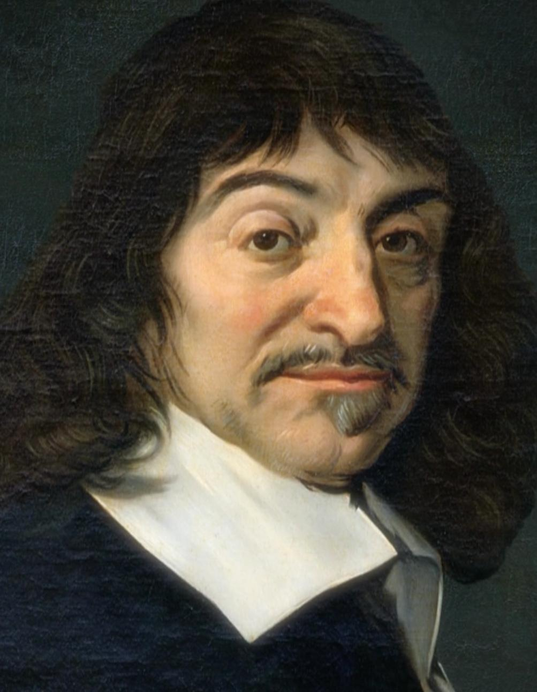

# Life

# Quotes
> Cogito, ergo sum or “I think, therefore I am.”

> Each problem that I solved became a rule that served afterward to solve other problems 
# Main Ideas

# Influences from others

# Influences to others

# Publications

## (title) (year)

### Central idea

# Sources

## Podcasts
[BBC In Our Time](https://www.bbc.co.uk/programmes/p01f0vzr)
## Internet
[Internet Encyclopedia of Philosophy](https://iep.utm.edu/kantview/)