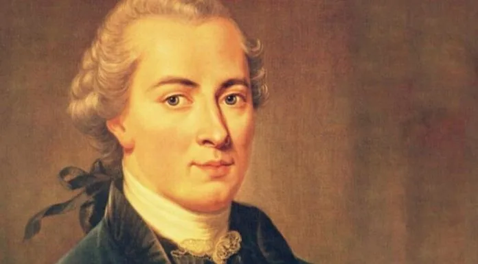

# Life

# Main Ideas

## Categorical Imperative
>The universal ethical principle stating that one should always respect the humanity in others, and that one should only act in accordance with rules that could hold for everyone. Kant argued that the moral law is a truth of reason, and hence that all rational creatures are bound by the same moral law. Thus in answer to the question, “What should I do?” Kant replies that we should act rationally, in accordance with a universal moral law. The universal moral law is what we all know is the right thing to do in all situations. 

Kant says: we are required to do good, even if it is against our happiness. This statement is different from utalitarianism, where the goal in life is happiness.

## Humanity Formulation
>Alternative formulation of the Categorical Imperative.
Everyone uses other people for their own ends, for instance the post office employee to get a postcard posted. Kant says that's ok, but we should never treat other rational beings purely as a means to achieve our own ends. Being a rational being makes you an end in itself, to be respected. Human rights, human dignity etc all stems from this notion. 

## Knowledge
Kant says we can only have knowledge of things we can experience. Accordingly, in answer to the question, “What can I know?” Kant replies that we can know the natural, observable world, but we cannot, however, have answers to many of the deepest questions of metaphysics.

# Influences from others

## David Hume
Human reason is weaker than we think.
Existence of God cannot be proven.
Human reason is the slave of the passions. It cannot tell us what we ought to do. 

## Rousseau
Influences Kant in moral philosophy: 
- All humans are equal. 
- Weakness of human reason: comparing yourself with others can make you unhappy

Kant says human reason cannot be the basis of morality, because it is weak, and can make you unhappy, purely by reasoning.

## Newton

# Influences to others

# Publications

## Critique of Pure Reason (1781)
Huge, monumental work on theoretical philosophy. Very influential. 
Main question that David Hume put to Kant is discussed in this book: how can we have knowledge of the world?

Relevant thoughts of Kant:
- We cannot prove the existence of God, therefore we cannot base ethics in knowledge of God
- We cannot know that we are free. We cannot know that we are not free. 

## Groundwork for the Metaphysics of Morals (1785)

Central questions:
- What is moral value?
- What is moral goodness?

### Central idea
Will is at the core of morality. Every human can discern right from wrong. If there is morality it's unconditional. Kant says: the only thing that can be a source of unconditional value is a good will. The intentions of the individual are the only source for morality.
Morality then does not depend on the consequences of actions, nor does it depend on some divine value. Morality has an inward focus: what are the intentions of the individual. A problem arises from this: how can we obtain objective truth / morality from individual subjective intentions?

Kant's reasoning is: it's not enough to do the right thing. It's not enough to have a plan to do the right things. You should also have the right reasons to do the right thing. This reason should be the principle that it's the right thing to do. 

# Sources

## Podcasts
[BBC In Our Time](https://www.bbc.co.uk/programmes/p01f0vzr)
## Internet
[Internet Encyclopedia of Philosophy](https://iep.utm.edu/kantview/)