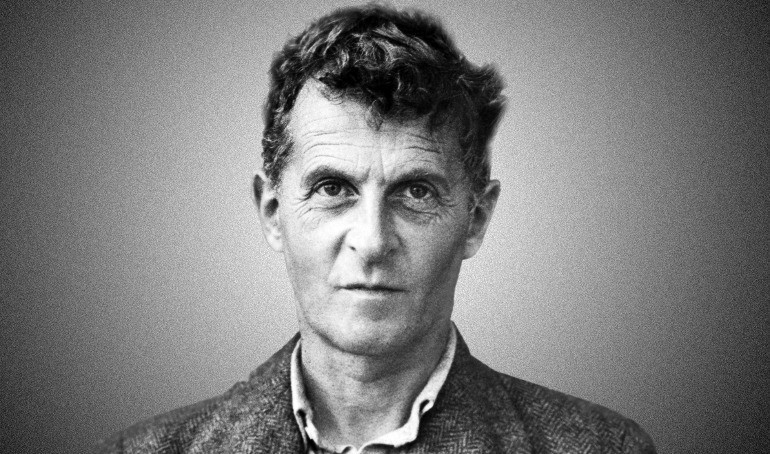

# Life

# Main Questions and Topics
- What is logic?
- 
# Main Ideas
## Meaning is use
The meaning of language does not come from the words themselves. It's all about human beings are using language that give it meaning. 

## Private Language Argument
Descartes said: I think therefore I am. But how about other people's thoughts. How do I know you are thinking? 
Wittgenstein says: the community thinking comes prior to your private thinking. It has to come first. 

# Influences from others
- Bertrand Russel
- Frege

# Influences to others

# Publications

## Tractatus Logico-Philosophicus, translated by D.F. Pears and B.F. McGuinness (Routledge and Kegan Paul, London 1961).
### Central idea
Language is only in existence because human beings using it. Language is bound up with human life. 

## Philosophical Investigations
### Central idea
Meaning is use.

# Sources

## Podcasts
[BBC In Our Time](https://www.bbc.co.uk/programmes/p0054945)
## Internet
[Internet Encyclopedia of Philosophy](https://iep.utm.edu/wittgens/)