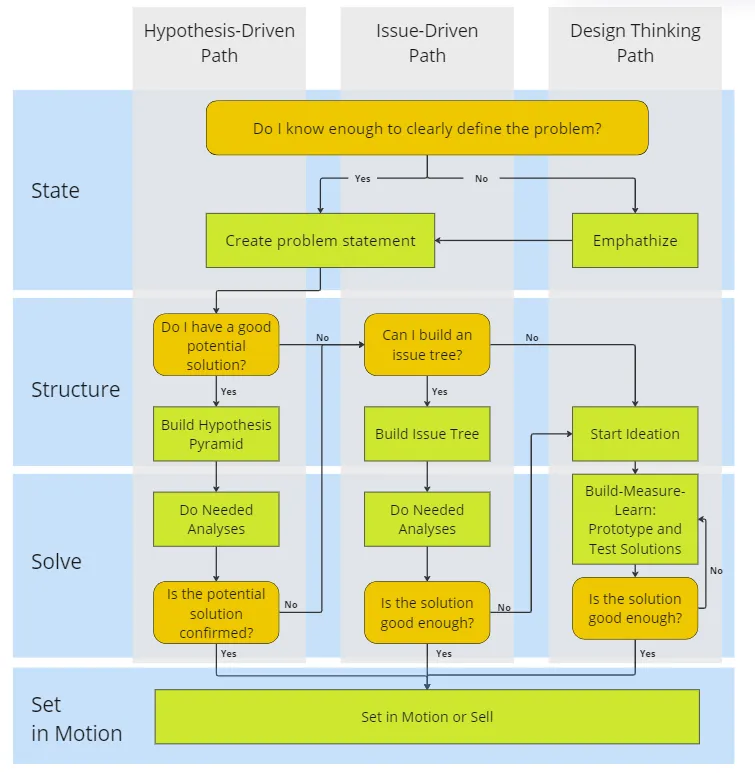

# Generic Approach
- Clearly define the problem from the point of view of the problem owner
- Break the problem down into smaller parts using logic or creativity methods
- Rank those smaller problems by priority
- Analyze each part
- Take the results and synthesize a solution

# Methodologies
- [Design Thinking](./DesignThinking.md)
- [SWOT Analytsis](./SWOTAnalysis.md)
- [Issue Trees](./IssueTrees.md)
- [Hypothesis Pyramids](./HypothesisPyramids.md)

# 3 Problem Solving Strategies
Source: [Better Humans](https://betterhumans.pub/problem-solving-for-anyone-how-to-use-hypotheses-like-top-strategy-consultants-a2419fe60010)

