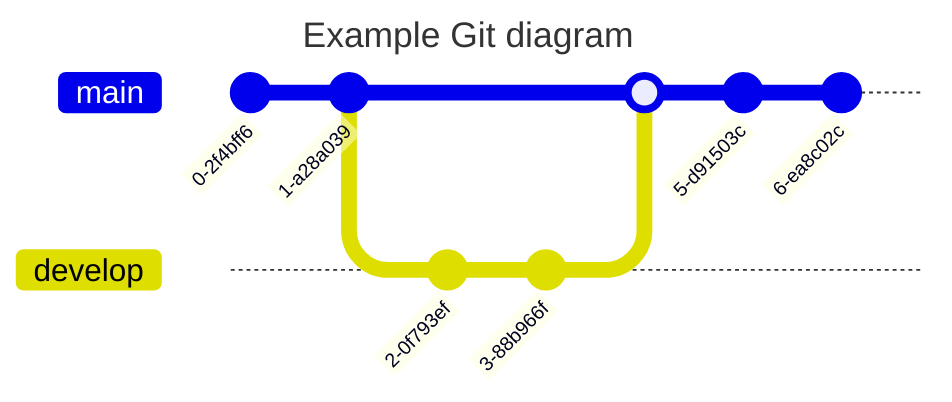

# Uitrollen van environmets Snowflake omgeving
```
trigger:
  branches:
    include:
    - develop
  paths:
    include:
    - snowflake/env/*
    exclude:
    - snowflake/README.md
    - snowflake/README-Automatiseren.md

pool: launchpad-common-vmssagents

variables:
  - name: project
    value: launchpad
  - name: snowflake_account
    value: inergy
  - name: deployTemplate
    value: deploy-snowflake-env-templates.yml
  - name: azureResourceManagerConnectionCommon
    value: launchpad-deploy-devops
  - name: runtype
    value: maintain

stages:
# Setup ENV per environment
  - stage: snowflake_dev
    variables:
      - name: environment
        value: dev
      - name: azureResourceManagerConnection
        value: ${{ variables.project }}-test-devops

    jobs:
    - deployment: "DeployOnDev"
      displayName: Setup snowflake-dev environment
      environment: '${{ variables.project }}-${{ variables.environment }}'
      strategy:
        runOnce:
          deploy:
            steps:
            - template: ${{ variables.deployTemplate }}
              parameters:
                azureResourceManagerConnection: ${{ variables.azureResourceManagerConnection }}
                azureResourceManagerConnectionCommon: ${{ variables.azureResourceManagerConnectionCommon }}
                project: ${{ variables.project }}
                environment: ${{ variables.environment }}
                snowflake_account: ${{ variables.snowflake_account }}

  - stage: snowflake_tst
    condition: and(succeeded('snowflake_dev'),  startsWith(variables['build.sourceBranch'], 'refs/heads/develop'))
    variables:
      - name: environment
        value: tst
      - name: azureResourceManagerConnection
        value: ${{ variables.project }}-test-devops

    jobs:
    - deployment: "DeployOnTest"
      displayName: Setup snowflake-tst environment
      environment: '${{ variables.project }}-${{ variables.environment }}'
      strategy:
        runOnce:
          deploy:
            steps:
            - template: ${{ variables.deployTemplate }}
              parameters: 
                azureResourceManagerConnection: ${{ variables.azureResourceManagerConnection }}
                azureResourceManagerConnectionCommon: ${{ variables.azureResourceManagerConnectionCommon }}
                project: ${{ variables.project }}
                environment: ${{ variables.environment }}
                snowflake_account: ${{ variables.snowflake_account }}

  - stage: snowflake_acc
    condition: and(succeeded('snowflake_tst'),  startsWith(variables['build.sourceBranch'], 'refs/heads/develop'))
    variables:
      - name: environment
        value: acc
      - name: azureResourceManagerConnection
        value: ${{ variables.project }}-deploy-devops

    jobs:
    - deployment: "DeployOnAcc"
      displayName: Setup snowflake-acc environment
      environment: '${{ variables.project }}-${{ variables.environment }}'
      strategy:
        runOnce:
          deploy:
            steps:
            - template: ${{ variables.deployTemplate }}
              parameters: 
                azureResourceManagerConnection: ${{ variables.azureResourceManagerConnection }}
                azureResourceManagerConnectionCommon: ${{ variables.azureResourceManagerConnectionCommon }}
                project: ${{ variables.project }}
                environment: ${{ variables.environment }}
                snowflake_account: ${{ variables.snowflake_account }}

  - stage: snowflake_prd
    condition: and(succeeded('snowflake_acc'),  startsWith(variables['build.sourceBranch'], 'refs/heads/develop'))
    variables:
      - name: environment
        value: prd
      - name: azureResourceManagerConnection
        value: ${{ variables.project }}-deploy-devops

    jobs:
    - deployment: "DeployOnPrd"
      displayName: Setup snowflake-prd environment
      environment: '${{ variables.project }}-${{ variables.environment }}'
      strategy:
        runOnce:
          deploy:
            steps:
            - template: ${{ variables.deployTemplate }}
              parameters: 
                azureResourceManagerConnection: ${{ variables.azureResourceManagerConnection }}
                azureResourceManagerConnectionCommon: ${{ variables.azureResourceManagerConnectionCommon }}
                project: ${{ variables.project }}
                environment: ${{ variables.environment }}
                snowflake_account: ${{ variables.snowflake_account }}
```


