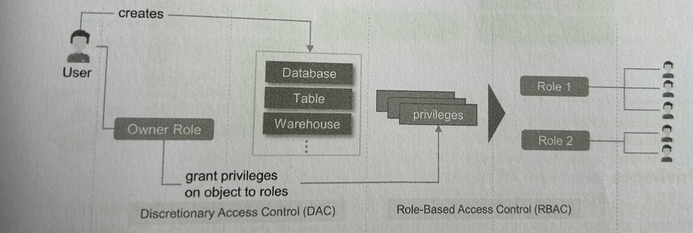

# Chapter 4 

## SnowSQL
Configuration file: `.snowsql/config`
Stores connections and defaults, so you don't have to add them on the command line

```ini
[connections.dev]
accountname = pqdcozt-uj94271
username = renenadorp
password = Inergy!001
rolename = ACCOUNTADMIN
warehousename = COMPUTE_WH
dbname = SNOWFLAKE_SAMPLE_DATA

```

On the command line enter the following to connect to `dev`:
```bash
snowsql -c dev
```

### Create Table
```sql
CREATE TABLE CUSTOMER 
.......
```
Snowflake will automatically create a table stage called `@%customer`
### Upload data 
Upload data to the customer table stage
```sql
PUT 'file:///Users/rnadorp/Downloads/customers.csv' @%customer;
```

Data uploaded to Snowflake is automatically encrypted before the transfer on the client.

### Show contents of table stage
```sql
LIST @%customer;
```
Output:
```bash
+------------------+------+----------------------------------+------------------------------+
| name             | size | md5                              | last_modified                |
|------------------+------+----------------------------------+------------------------------|
| customers.csv.gz | 6192 | fbb295058da2dd15ebd4de8804f02405 | Sat, 4 Nov 2023 11:42:32 GMT |
+------------------+------+----------------------------------+------------------------------+
1 Row(s) produced. Time Elapsed: 0.228s
```

### COPY table stage contents to table
```sql
COPY INTO CUSTOMER 
FROM @%CUSTOMER
FILE_FORMAT = (TYPE = CSV FIELD_DELIMITER = '|' SKIP_HEADER =1 );
```

Output:
```bash
COPY INTO CUSTOMER 
FROM @%CUSTOMER
FILE_FORMAT = (TYPE = CSV FIELD_DELIMITER = '|' SKIP_HEADER =1 );
+------------------+--------+-------------+-------------+-------------+-------------+-------------+------------------+-----------------------+-------------------------+
| file             | status | rows_parsed | rows_loaded | error_limit | errors_seen | first_error | first_error_line | first_error_character | first_error_column_name |
|------------------+--------+-------------+-------------+-------------+-------------+-------------+------------------+-----------------------+-------------------------|
| customers.csv.gz | LOADED |         100 |         100 |           1 |           0 | NULL        |             NULL |                  NULL | NULL                    |
+------------------+--------+-------------+-------------+-------------+-------------+-------------+------------------+-----------------------+-------------------------+
```

### Clean up stage
```sql
REMOVE @%CUSTOMER
```
This will not remove the stage, but clear files in it.

## Upload data to User stage
```sql
PUT 'file:///Users/rnadorp/Downloads/vehicles.csv' @~;
```
### Show contents of user stage
```sql
LIST @~;
```

### Create file format object
```sql
CREATE OR REPLACE FILE FORMAT CSV_NO_HEADER_BLANK_LINES
TYPE = 'CSV'
FIELD_DELIMITER = ','
FIELD_OPTIONALLY_ENCLOSED_BY = '"'
SKIP_HEADER = 0
SKIP_BLANK_LINES = TRUE;
```
### COPY from user stage using file format

```sql
COPY INTO VEHICLE
FROM @~/vehicles.csv.gz
file_format = CSV_NO_HEADER_BLANK_LINES;
```

## Upload data via named stage using file format
### Create file format
```sql
CREATE OR REPLACE FILE FORMAT TSV_NO_HEADERS 
TYPE = 'CSV'
FIELD_DELIMITER = '\t'
SKIP_HEADER = 0;
```

### Create named stage 
```sql
CREATE OR REPLACE STAGE ETL_STAGE FILE_FORMAT = TSV_NO_HEADERS ;
```

### Upload file to named stage
```sql
PUT 'file:///Users/rnadorp/Downloads/locations.csv' @ETL_STAGE;
```

### Copy from named stage to table
```sql
COPY INTO LOCATIONS FROM @ETL_STAGE
```

### Clear data from stage
```sql
REMOVE @ETL_STAGE;
```

## Load data into a table using SELECT statement
Example of loading data from a table stage (already with uploaded data), and selecting columns and transforming a column;
```sql
COPY INTO PROSPECTS
FROM (
    SELECT $1, $2, $3, $4, SUBSTR($5, 1,10), $8
    FROM @PROSPECTS_STAGE
)

```

## External Table

```sql
CREATE OR REPLACE STAGE CUSTOMER_STAGE
URL = 's3://snowpro-core-study-guide/dataloading/external/';

CREATE OR REPLACE EXTERNAL TABLE CUSTOMER_EXT
WITH LOCATION = @CUSTOMER_STAGE
FILE_FORMAT = (TYPE= CSV FIELD_DELIMITER = '|' SKIP_HEADER=1);


select $1:c1 AS NAME, $1:c2 as SSN from CUSTOMER_EXT;


-- Include column mapping in external table definition
CREATE OR REPLACE EXTENRAL TABLE CUSTOMER_EXT
(
    NAME STRING AS (VALUE:C1::string),
    ....
)
with LOCATION
... 
```

## VARIANT
Access first level element called `SSN` from a column called `RJ` of type `VARIANT`
```sql
SELECT RJ:SSN FROM EMPLOYEE
```
## Snowpipe
- Serverless, does not requires a virtual warehouse. Has its own compute
- Load small data chunks that arrives in a continuous stream
- A snowpipe contains a COPY definition
- Snowpipe cannot be run like a SQL command
- Must be triggered by a notification from clousd services or manually triggered via a REST API call
- A triggered snowpipe executes a COPY command contained in its definition and loads data from the source file into the target table, also contained in the definition
- Ensure large files are split up into file sizes of 100 - 250MB

Example
```sql
CREATE OR REPLACE PIPE LOAD_PROSPECTS_PIPE
AUTO_INGEST = TRUE
AS COPY INTO PROSPECTS
FROM @PROSPECTS_STAGHE
FILE_FORMAT = (TYPE = 'CSV', FIELD_DELIMITER=',' FIELD_OPTIONALLY_ENCLOSED_BY = '"' SKIP_HEADER = 0);

```
- 

# Chapter 5 - Data Pipelines
## Tasks
Tasks: 
- Execute SQL statement
- Execute SP
- Used in combination with STREAMS for continuous data processing
- Uses Snowflake managed compute OR a warehouse

```sql
CREATE TASK GENERATE_CUSTOMER_REPORT 
WAREHOUSE = COMPUTE_WH
SCHEDULE = '5 MINUTE'         
AS                            
INSERT INTO CUSTOMER_REPORT
SELECT C.C_NAME AS CUSTOMER_NAME, SUM(O.O_TOTALPRICE) AS TOTAL_PRICE 
FROM SNOWFLAKE_SAMPLE_DATA.TPCH_SF1.ORDERS O
INNER JOIN SNOWFLAKE_SAMPLE_DATA.TPCH_SF1.CUSTOMER C
ON O.O_CUSTKEY = C.C_CUSTKEY
GROUP BY C.C_NAME;

```
### Execute tasks
```sql

USE ROLE ACCOUNTADMIN;
GRANT EXECUTE  TASK ON ACCOUNT TO ROLE SYSADMIN;
```

### Task Execution History
```sql
select name, state, completed_time, scheduled_time, error_code, error_message 
from table(information_schema.task_history(

))

where name = 'GENERATE_CUSTOMER_REPORT';

```
### Task Tree
Setup a task tree by defining a parent task in its definition
'AFTER PREDECESSOR <t>'

### Statements
```sql
alter task generate_customer_report unset schedule;

```
### Serverless Tasks
```sql
CREATE TASK GENERATE_ORDER_COUNT
USER_TASK_MANAGED_INITIAL_WAREHOUSE_SIZE = 'XSMALL'
SCHEDULE = '5 MINUTE'
AS 
INSERT INTO ORDER_COUNT
SELECT CURRENT_TIMESTAMP AS SNAPSHOT_TIME, COUNT(*) AS TOTAL_ORDERS
FROM SNOWFLAKE_SAMPLE_DATA.TPCH_SF1.ORDERS O
GROUP BY 1;

GRANT EXECUTE MANAGED TASK ON ACCOUNT TO SYSADMIN;
```

### Billing
For serverless tasks billing is based on actual compute usage.
For customer managed tasks billing is based on running state of the compute warehouse included in the task definition


## Streams
Used to track data changes on a table: INSERT, UPDATE, DELETE

```SQL
CREATE TABLE DISCOUNT_VOUCHER_LIST
(
    CUSTOMER_EMAIL STRING
);

CREATE STREAM CUSTOMER_CHANGES ON TABLE CUSTOMER;


```
### Query streams
In below statement CUSTOMER_CHANGES is a stream
```sql
SELECT * FROM CUSTOMER_CHANGES
```

### Consume Streams
```sql
INSERT INTO DISCOUNT_VOUCHER_LIST
SELECT EMAIL FROM CUSTOMER_CHANGES
WHERE DISCOUNT_PROMO='Y'
AND METADATA$ACTION='INSERT' 
AND METADATA$ISUPDATE = FALSE;
```
After stream consumption, the stream will be empty.


## Combining Streams and Tasks
```sql
CREATE TASK PROCESS_NEW_CUSTOMERS
USER_TASK_MANAGED_INITIAL_WAREHOUSE_SIZE = 'XSMALL'
SCHEDULE = '5 MIN'
WHEN SYSTEM$STREAM_HAS_DATA('CUSTOMER_CHANGES')
AS
INSERT INTO DISCOUNT_VOUCHER_LIST
SELECT EMAIL FROM CUSTOMER_CHANGES
WHERE DISCOUNT_PROMO='Y'
AND METADATA$ACTION='INSERT' 
AND METADATA$ISUPDATE = FALSE;

ALTER TASK PROCDESS_NEW_CUSTOMER RESUME;
```


# Chapter 6    

## Time Travel
```sql
SELECT ..
FROM ..
AT (TIMESTAMP => <ts>);

-- Offset = difference between now and a certain time
SELECT ..
FROM ..
AT (OFFSET => <time difference>);

SELECT ..
FROM ..
BEFORE (STATEMENT => <query-id>);
--
SELECT * FROM CUSTOMER 
BEFORE (TIMESTAMP =>  '2023-11-11 05:10:33.438 -0800::TIMESTAMP_LTZ');
```

## Temporary and Transient Tables
Temporary: 
- Max 1 day time travel
- No fail safe
- Removed after session end


Transient:
- Max 1 day of time travel
- No fail safe
- Not limited to a session
- Available to other sessions
- Must be dropped explicitly


# Chapter 7 - Cloning
Objects that can be cloned:
- Databases
- Schemas
- Tables
- Streams
- Stages
- File Formats
- Sequences
- Tasks
- Streams


Cloning objects with data
- Cloned objects share micro partitions
- Metadata of cloned objects is tracked independently
- Updates on source or target table do not affect the other

Compute Costs and Cloning
- Cloning does not use a customer compute warehouse, because it's a metadata operation.
- Database and schema clones: Only privileges of the child objects of the cloned object are also cloned. 
- Cloning of internal named stages is not possible
- Snowpipes that reference internal named stages are not cloned when cloning a database or schema

```sql
create table customer_copy clone customer;
CREATE DATABASE SNOWPRO_CLONE CLONE SNOWPRO;

-- Cloning & Time Travel
CREATE TABLE SUPPLIER_CLONE CLONE SUPPLIER
BEFORE (STATEMENT => 'query id');
```

## Secure Data Sharing
Secure data sharing does not move data. It is a metadata operation.
There are no costs for data sharing for the consumer. There are costs for the provider.

### Data Sharing Options
####  Direct: Account to Account sharing

Process Flow
- PROVIDER: Create SHARE Object
- PROVIDER: Add database and tables to the SHARE object
- PROVIDER: Grant SHARE object to another Snowflake account
- CONSUMER: Create read only database on the share
- CONSUMER: Apply security on the read only database
- CONSUMER: Run queries on shared data using own virtual warehouse

Costs:
- Storage costs: PROVIDER
- Compute: CONSUMER

```SQL
USE ROLE ACCOUNTADMIN;
CREATE SHARE CUSTOMER_SHARE;
GRANT USAGE ON DATABASE SNOWPRO TO SHARE CUSTOMER_SHARE;
GRANT USAGE ON SCHEMA SNOWPRO.SNOWPRO TO SHARE CUSTOMER_SHARE;
GRANT SELECT ON TABLE CUSTOMER TO SHARE CUSTOMER_SHARE;
```
Multiple databases cannot be added to a single SHARE. 
If this is needed, creating a SECURE VIEW is an option, because it can span multiple databases,

Reader Account
- To share data to non-Snowflake users
- Storage costs and compute costs are for the provider


#### Data Market Place: Free and paid datasets
- Not available for VPS
#### Data Exchange: A private data marketplace
- Private data sharing
- Invite-only
- Available to all Snowflake editions except VPS

# Chapter 8 - Performance
Partition Pruning: occurred when partitions scanned is less than total number of partitions
Disk Spilling: bytes spilled to local or remote storage. Occurs when data for a query operation does not fit in memory

## Warehouse Scaling Up/Down
Scaling up/down: in/decrease the size of the warehouse.
Scaling up will result in additional nodes added to the compute cluster.

## Warehouse Scaling Out
Used for increased concurrency demands, e.g. more users running queries at the same time.
Supported by multi-cluster virtual warehouses, usually with autoscaling, dynamically adding extra clusters on demand.
Snowflake Enterprise Edition is needed for multi-cluster warehouses.
```sql
CREATE WAREHOUSE <NAME>
WITH WAREHROUSE_SIZE = <SIZE>
MAX_CLUSTER_COUNT = <NUM>
MIN_CLUSTER_COUNT = <NUM>
SCALING_POLICY = STANDARD | ECONOMY -- Sets the scaling speed
AUTO_SUSPEND = <NUM> | NULL
AUTO_RESUME = TRUE | FALSE
INITIALLY_SUSPENDED = TRUE | FALSE;
```

### Scaling Policy
Economy: scaling up will only start when queueing is detected.


## Caching
Types of caches:
1. Cloud Services Layer
   a. Metadata Cache
   b. Query Result Cache; retained for 24 hrs
2. Virtual Warehouse
   a. Warehouse Cache
3. Storage
   a. 

### Query Result Cache
- Fast
- No Query is executed
- No compute costs
- Available to all users
- The query profile will show when the result cache is used: 1 step called `QUERY RESULT REUSE`
- Retainment period of 24 hrs is reset after each reuse, with a maximum of 31 days.


### Virtual Warheouse Cache
Snowflake stores caches on the virtual warehouse when queries are executed:
- Columns
- Partitions

For subsequent queries these caches can be reused, reducing the amount of data to be retrieved from the cloud storage layer.
### Pruning
Pruning means Snowflake ignores micro partitions that are not needed for a certain query, based on the metadata for tables and partitions.
Mirco partitions are created in the order of arrival.Tables can be reclustered as necessary.

```sql
ALTER TABLE CUSTOMER CLUSTER BY (fields)
```

### Clustering depth: 
the averagen depth of the overlapping micro-partitions for a column.
Less depth = better clustering


### Search Optimisation
- Background service that stores search access paths based on the nature of the queries being run.
- Enterprise edition is needed

# Chapter 9 - Security
## Data Encryption at rest
AES-256 encryption
### Key Rotation and Rekeying
- Snowflake managed key; 
- automatic key rotation after 30 days
- Enterprise edition required

### Tri Secret
- Business critical required
- Combination of Snowflake managed key and customer managed key

## Authentication
### MFA
- Enabled for alle user accounts
- Users can enroll into MFA
- Supported for:    
  - SnowSQL,
  - Snowflake ODBC
  - JDBC drivers
  - Python Connector

### Key Pair Authentication
- Uses Private/Public key pairs
- Supported for all connectors (see list above)

### SSO
- AML2.0 Federated Authentication
- Authentication is done through an external identity provider (e.g. AAD)

### Password Policies
- Enforced strong passwords: >= 8 chars, 1 digit, 1 uppercase letter, 1 lowercase letter

### SCIM User Provisioning
- System for Cross Domain Identity Management
- SCIM2.0, which enables integration with AAD, OKTA,..
- Can also sync groups created in an identity provider to roles in Snowflake

### Authorisation
- Object level security
- Row level security
- Column level security
- Privileges are assigned to roles and roles are assigned to users

#### Access Control


#### Securable Objects
- Objects for which privileges can be granted
- Tables, Views, UDFs, Role, User, Resource Monitor, Integration, Database, SP, Stage, Stream, Pipe, Task, File Stream


#### Roles 
Builtin:
- ORGADMIN: organizational level, managing multiple accounts of the same organisation
- ACCOUNTADMIN: full privileges
- USERADMIN: create users and roles
- SECURITYADMIN: manage object grants globally
- SYSADMIN
- PUBLIC

Roles become a role hierarchy when roles are granted to other roles. 
The standard roles already form a role hierarchy.

Supported concepts:
- RBAC
- DAC: the role creating an object owns it and can grant access to other roles
- 

#### Column Level Security
- Dynamic Data Masking: return masked data for certain columns
- External Tokenization: tokenize data before loading it into Snowflake. 


### Row Level Security
- Row access policies


### Secure Views / UDFs
- SQL of the object cannot be retrieved
- Query optimisation is not possible 

### User Access Audit Log
- SNOWFLAKE.ACCOUNT_USAGE schema: 365 days of historical logs
- INFORMATION_SCHEMA: real time, but less history

## Network
### Network policies:
- SECURITYADMIN or higher 
- Blocked ip-addresses
- Allowed ip-addresses

### Private Connectivity
Supported by
- AWS PrivateLink
- Azure Private Link
- Google Cloud Private Service Connect

### Network Encryption
- TLS1.2
- HTTPS


### Compliance
- SOC2 Type II
- SOC1 Type II
- PCI DSS
- HIPAA
- ISO/IEC 27001
- FedRAMP Moderate
- GxP
- ITAR
- IRAP Protected


# Chapter 10 - Account & Resource Management

## Resource Monitors
- Monitor compute costs
- Single warehouse, a group of virtual warehouse or a complete account
- A virtual warehouse cannot be monitored by multiple resource monitors
- Credit quota can be defined on a resource monitor.

```SQL
create resource monitor "vw_10" with credit_quota = 10, frequency = 'WEEKLY', 
START_TIMESTAMP = 'IMMEDIATELY', END_TIMESTAMP = NULL
TRIGGERS 
ON 95 PERCENT DO SUSPEND_IMMEDIATE
ON 50 PERCENT DO NOTIFY;
```

## System Usage and Billing
Usage information is available in:
- INFORMATION_SCHEMA: real time, but
- SNOWFLAKE database: not real time (lag up to 45 minutes), 365 days

### SNOWFLAKE SCHEMAs
- ACCOUNT_USAGE: 
- READER_ACCOUNT_USAGE
- ORGANIZATION_USAGE: usage info for all accounts belonging to the organisation
- DATA_SHARING_USAGE:

### SNOWFLAKE.ACCOUNT_USAGE schema
- ACCESS_HISTORY: Enteprise Edition required. Shows info about who accessed which objects
- AUTOMATIC_CLUSTERING_HISTORY
- COPY_HISTORY: Both `COPY INTO` and `SNOWPIPE` history
- DATABASE_STORAGE_USAGE_HISTORY: Storage for tables, time travel and fail safe
- DATA_TRANSFER_HISTORY
- LOAD_HISTORY
- LOGIN_HISTORY: Succesful and unsuccessful login attempts
- MATERIALIZED_VIEW_REFRESH_HISTORY
- METRING_DAILY_HISTORY: Daily compute credit usage
- METERING_HISTORY
- PIPE_USAGE_HISTORY: data loaded and credits used by snowpipe 
- QUYERY_HISTORY
- REPLICATION_USAGE_HISTORY
- SEARCH_OPTIMIZATION_HISTORY
- SERVERLESS_TASK_HISTORY
- SESSIONS
- STAGE_STORAGE_USAGE_HISTORY
- STORAGE_USAGE
- TASK_HISTORY
- WAREHOUSE_EVENTS_HISTORY
- WARERHOUSE_LOAD_HISTORY: Workload history for a warehouse for a specified date range. Number of queries, queued queries
- WAREHOUSE_METERING_HISTORY


### Credit Usage - SNOWFLAKE database
```SQL
SELECT WAREHOUSE_NAME,
SUM(CREDITS_USED) AS TOTAL_CREDIT_USED,
SUM(CREDITS_USED_COMPUTE) AS TOTAL_WH_CREDIT_USED,
SUM(CREDITS_USED_CLOUD_SERVICES) AS TOTAL_CREDITS_USED_CLOUD_SERVICES
FROM SNOWFLAKE.ACCOUNT_USAGE.WAREHOUSE_METERING_HISTORY
GROUP BY ALL;
```
### Credit Usage - <DB>.INFORMATION_SCHEMA schema
Some information overlaps with the SNOWFLAKE.ACCOUNT_USAGE schema.
Differences for information schema
- No data latency
- Retention 7 days - 6 months, depending on the view
- Dropped objects not included

Example query in the <db>.INFORMATION_SCHEMA.
```sql
SELECT *
FROM TABLE(INFORMATION_SCHEMA.WAREHOUSE_METERING_HISTORY(DATEADD('DAYS',-10, CURRENT_DATE())));
```

### Storage Usage
```sql
select USAGE_DATE,
DATABASE_ID,
DATABASE_NAME,
DELETED,
AVERAGE_DATABASE_BYTES / 1024 / 1024 AS AVERAGE_DATABASE_MB,
AVERAGE_FAILSAFE_BYTES / 1024 / 1024 AS AVERAGE_FALSAFE_MB
FROM SNOWFLAKE.ACCOUNT_USAGE.DATABASE_STORAGE_USAGE_HISTORY
WHERE DATABASE_NAME='SNOWPRO'
ORDER BY USAGE_DATE  DESC;
```
```SQL
SELECT TABLE_CATALOG AS DATABASE_NAME,
TABLE_SCHEMA,
TABLE_NAME,
ACTIVE_BYTES,
TIME_TRAVEL_BYTES,
FAILSAFE_BYTES
FROM SNOWFLAKE.ACCOUNT_USAGE.TABLE_STORAGE_METRICS
WHERE TABLE_CATALOG='SNOWPRO';
```
# Questions and Answers
## Questions
### Chapter 1
1. Which of the following are Snowflake editions (select all that apply)
   
   A. Standard

   B. Enterprise
   
   C. Basic
   
   D. Advanced
   
   E. Business Critical
2. What is the minimum edition of Snowflake that supports multi-cluster virtual warehouse capability?
   
   A. Standard

   B. Enterprise

   C. Business Critical

   D. Virtual Private Snowflake

3. The Standard edition of Snowflake provides how many days of Time Travel?
   
   A. 90

   B. 1

   C. 45

   D. 30

4. What is the minimum Snowflake edition required for applying masking policies on columns?

    A. Standard

    B. Enterprise

    C. Business Critical

    D. Virtual Private Snowflake 

5. What si the minimum Snowflake edition required for data shariung
   
   A. Standard

   B. Enterprise

   C. Business Critical

   D. Virtual Private Snowflake

6. Snowflake is sup0ported on which of the following cloud platforms? Select all that apply
   
   A. Amazon Web Services

   B. Oracle Cloud

   C. Microsoft Azure

   D. Google Cloud Platform

   E. IBM Cloud Services

7. What minimum Snowflake edition supports databvase replication between Snowflake accounts (within an organisation)?

    A. Standard
    
    B. Enterprise

    C. business Critical

    D. Virtual Private Snowflake

8. What is the minimum Snowflake edition required to utilize the search optimisation feture for point lookup querries?
   
   A. Standard

   B. Enterprise

   C. Business Critical

   D. Virtual Private Snowflake


### Chapter 10
1. When configuring a resource monitor, which of the following are actions that can be configured? Choose all that apply.
   
   A. Notify

   B. Suspend and Notify

   C. Susend Immediately and Notify

2. Which of the following statements are true regarding resource monitors? Choose all that apply.

    A. Resource monitors acnnot be deleted once they have been created 

    B. If a resource monitor monitors a virtual warehouse, another resource monitor cannot monitor the same virtual warehouse

    C. Resource mopnitors can be configured to track multiple virtual warehouses.

    D. A resource monitor can be created at an account level, which means that the monitor tracks the credit usage at the whole accounbt level, inlcuding all virtual warehouses' credit usage

    E. Only account administrators can create new resource monitors.

3. True or false: resource monitors can be used to control credit usage for serverless services such as Snowpipe, or Autoclustering

    A. True
    
    B. False

4. Which of the following privleiges must be granted to other roles by the account administrator for other roles to see and modify resource monitors? Choose all that apply.
   
   A. READ

   B. modify

   C. MONITOR

   D. WRITE

5. Which of the following are valid methods through which account administrators can receive notifications gernerated by resource monitors? Choose all that apply.

    A. SQL notification

    B. Snowflake web interface

    C. Email

    D. SMS notification

6. Which of  the following can you use to view the last 365 days of the history of warehouse credit usage?

    A. The WAREHOUSE_METERING_HISTORY view in the ACCOUNT_USAGE schema

    B. The TABLE_STORAGE_METRICS view in th account_usage schema

    C. The WAREHOUSE_METERING_HISTORY table function in the INFORMATION_SCHEMA shema
    D./ The TABLE_STORAGE_METRICS view in the INFORMAITON_SCHEMA schema.


## Answers
### Chapter 1
1. A, B, E.

    Snowflake provides 4 editions. Each edition builds opn the features abnd capabilities of the previous edition. Editions: Standard, Enterpirse, Business Critical, Virtual Private Snowflake
2. B
    The Entterprise edition provid3es all the capabilities of the Standard edition but adds 90 days of Time Travel, multi-clusterr virutal warehousees, materialized viess, dynamic data mnasking, and external data tokenization

3. B

    The Standard edition of Snowflake provides nly one day of Time Travel capability. Starting with the Enteprise editioon, 90 days of Time Travel is available.

4. B

    The Enterprise edition provides all teh capabilities of the Standard editions but adds dynamic data masking, 90 days of Time Travel, multi-cluster virtual warehouses, materialized views and external data tokenization

5. A
   
   Data sharing capabilities are available starting with tghe Standard edition

6. A, C, D

    Amazon, Google, Azure 
 
7. A

    Data replication is available in the Standard edition

8. B

    Search optimization is avialable starting with the Enterprise edition 


### Chapter 9
1. A,C,D
2. C
3. C,D
4. A,B,C
5. A,C
6. A,B,D
7. B,
8. A,B,C,D
9. B,C
10. A,C,D
11. B,D
12. B
13. C
14. A
15. A,C,D,E

### Chapter 10 
1. A, B, C
2. B, C, D, E
3. B
4. B,C
5. B,C
6. A
7. C, D
8. B,C,D
9. A
10. C 
11. B
12. D

# Assessment Test
## Questions
1. Which is the term used for Snowflake's architecture composed of shared storage and muliotple compute engines?

    A. Multii-cluster shared data
    
    B. Hybrid architecture
    
    C. Multicompute architectture
    
    D. Shared Storazge, multicompute

2. Which of the following are layers in Snowflake architecture? Select all that apply.

    A. On-Premise Layer

    B. Database Storage
    
    C. Querty Processing
    
    D. Cloud Services

3. Which of the following ius true regarding micro-partitions? Select all that apply
   A. Each micro-partition contains 50MB to 500MB of uncompressed data

   B. Micro-partitions are immutable

   C. Snowflake automatically compresses data in a micro-partition

   D. Each micro-partition contains 1MB to 5MB of uncompressed data

4. Which of the following is true regarding data clustering in Snowflake? Select all that apply.
   A. Data in a Snowflake table cannot be reclustered.

   B. Snowflake automatically clusters data in a table.

   C. If required, clustering keys can be defined to recluster the data

   D. Snowflake does not automatically cluster data in a table

5. Which of the following are Snowflake's Data Integration partners? Select all that apply
   A. Collibra
   B. Matillion
   C. Informatica
   D. Power BI

6. What is the command-line tool for connecting tot Snowflake
   
   A. Snowpipe
   
   B. SnowSQL
   
   C. SnowCD

   D. Snow Mobile

7. You are required to load data from a named internal stage into a Snowflake table. Which command should you use?
   A. GET
   b. validate
   C. COPY
   D. PUT

8. You need to upload data from an on-premise system to a named internal stage. Which command should you use?
   A. GET
   B. PUT
   C. COPY
   D. VALIDATE
9. Which of the following can be used to load streaming or real-time data in Snowflake?
    A. GET
    B. SNOWPIPE
    C. COPY
    D. PUT

10. Snowflake supports which semi-structured file formatis? Select all that apply
    A. DOM
    B. AVRO
    C. ORC
    D. XML

11. True or False: Data in an internal stage contributes to overall storage costs
    A. False

    B. True

12. True or False: The VARIANT data type can store any type of data
    A. False
    B. True

13. True or False: Snmowpipe can load data from an internal or an external stage
    A. True
    B. False

14. Snowflake tasks can execute which of the following? Select all that apply
    A. A single SQL statement
    B. Snowpipe
    C. A call to a stored procedure
    D. Automatic clustering

15. Which of the following correctly describes streams in Snowflake? Select all that appl;y
    A. They are used to track data changes made to a table, including inserts, updates, and deletes
    B. They are used as a queuing mechanism for user queries.
    C. They are used for change data capture (CDC)
    D. They are used to load data in a real-time manner
16. What is the minimum Snowflake edition that allows up to 90 days of Time Travel?
    A. Standard
    B. Virtual Private Snowflake
    C. Enterprise
    D. Business Critical

17. Which of the following commands wiull let you recover droipped tables, schemas and databases?
    A. UNDROP
    B. RECOVER
    C. CREATE
    D. TIME TRAVEL

18. True or False: Cloning and Time Travel can be combined to create clones of darta that exist at a certain time
    A. False
    B. True

19. Which layer in Snowflake architecture ius responsible for data sharing?
    A. Query Processing
    B. Data Sharing
    C. Cloud Services
    D. Cloud Storage

20. True or False: The compute charges are billed to the data consumer when sharing data with another Snowflake account
    A. Truew
    B. False

21. True or False: Dat Exchange is your own private data sharing hub where you can share data with an invite-only ghroup of people
    A. True
    b. False
22. Which scaling policy ensuresbnmaci9mum performance
    A. Standards
    B. Economy
    C. Performance
    D. Maximum

23. True or False: If a query has been run before and the underlying data hasn't changed, the query result cache is used to fulfill results for a semantically similar query.
    A. True
    B. False

24. What is the name of the service responsible for redistributing data according to the clustering key?
    A. Redistribution Engine
    B. Snowflake Optimizer
    C. Automatic Clustering
    D. Clustering Engine
25. True or False: All data at rest in Snowflake is encrypted using AES 256 bit encryption
    A. True
    B. False
26. What of the following roles are built into Snowflake roles? Select all that apply
    A. SECURITYADMIN
    B. PUBLIC
    C. SYSADMIN
    D. SNOWFLAKEADMIN
27. True or False: Network policies can be used to allow or deny access to specific IP addresses.
    A. True 
    B. False

28. Which of the following is true regarding resource monitors?
    A. They help manage user workload on the system
    B. They help manage costs and avoid uncexpected credit usage by virtual warehouses
    C. They help manage costs and avoid unexpected storage usage
    D. They are used to allow or deny users access to Snowflake

29. Which of the following statements are correct regarding data retention and latency for the ACCOUNT_USAGE schema? Select all that apply
    A. It has no latency
    B. It has 365 days of retentionn
    C. It has 45 minutes to 3 hours of latency
    D. It has 30 days of retention

30. How often does Snowflake release new software
    A. Fortnightly
    B. Yearly
    C. Weekly
    D. Monthly


## Answers
1. A
2. B,C,D
3. A,B,C
4. B,C
5. B,C
6. B
7. C
8. B
9. B
10. B,C,D
11. B
12. B
13. A
14. A,C
15. A,C
16. C
17. A
18. B
19. C
20. A
21. A
22. A
23. A
24. C
25. A
26. A,B,C
27. A
28. B
29. B,C
30. C
31. 


